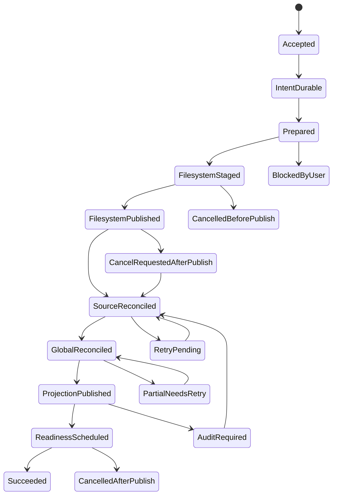

# Wavecrate End-to-End I/O Architecture Target

Status: target design; documentation-only proposal. No implementation, schema, dependency,
migration, behavior, or test change is implied by this document.

## Scope, authority, and reading order

This document describes the ideal end-to-end ownership and ordering of Wavecrate's
filesystem I/O, source-database I/O, global-library persistence, Harvest persistence,
rating/history persistence, browser projection, readiness/source processing, and
rebuildable artifacts. It is the detailed I/O authority for those concerns.

It is subordinate to the product principles and user-visible direction in
[`docs/TARGET.md`](TARGET.md). Read `docs/TARGET.md` first for product intent, filesystem
source-of-truth, protected-source policy, no-follow requirements, GUI boundaries, and
readiness meaning. [`docs/DATABASE_MIGRATIONS.md`](DATABASE_MIGRATIONS.md) remains
authoritative for schema versions, DDL, compatibility opens, migration tests, and the
mechanics of shipping a schema change. This document may define a journal or identity
concept without authorizing a schema change; any eventual schema work follows the
migration contract.

The target covers:

- extraction, copy, create, duplicate, import, export, and handoff artifacts;
- move, rename, trash, delete, destructive edit, undo, and redo;
- external Finder or Explorer changes and watcher recovery;
- source-database commits and revisions;
- the global library, Harvest, rating, listen-history, and transaction-history writes;
- browser and folder projection publication;
- readiness, metadata, analysis, waveform and other cache artifacts;
- cancellation, admission, backpressure, fairness, retries, shutdown, and crash recovery;
- busy databases, partial failures, diagnostics, and user-facing status.

It does not authorize implementing all of these flows in one change. Delivery is phased
in [Phased delivery](#phased-delivery).

## Current evidence and target recommendations

The following are deliberately separated. The first table records evidence available at
the design head `a982c4844c1d098a079ebc3d172db23dd29540d`; it is not a claim that every
path has the same behavior. The second table is a recommendation for the target system,
not a description of current production behavior.

### Established or explicitly reported current evidence

| Evidence | Boundary and implication |
| --- | --- |
| Source-database connection profiles currently use a 5,000 ms busy timeout for background, job, user-metadata, and maintenance roles; UI reads use 25 ms and playback-history writes use 100 ms (`crates/wavecrate-library/src/sample_sources/db/open_profiles.rs`, with role tests under `tests/unit/source_db_mod_tests/opening/`). | A busy open/write can wait roughly five seconds and then yield `Database is busy`. Busy handling is therefore a scheduling concern as well as an error-display concern. |
| A successful extraction can publish its filesystem output before source reconciliation succeeds, after which browser visibility is delayed. | Filesystem publish and source registration are not yet one universally recoverable ordered contract. A design must make the partial state explicit and retryable. |
| Watcher publication can be deferred while a scan is already running (`src/native_app/sample_library/folder_scan_actions/filesystem_refresh.rs` and the source watcher/scan lifecycle). | A watcher event is not itself publication authority. It must be retained as evidence and reconciled after the current committed revision is known. |
| PR #980's real native-app run confirmed Finder creation/duplication and exposed event-shape and performance differences from synthetic path fixtures; its known limitations still require fresh real-app acceptance for rename, cross-parent move, and deletion. Per-event full metadata snapshots and recursive hydration regress performance. | The target Finder contract must preserve raw events, normalize affected regions conservatively, and use bounded revisioned deltas. It must not turn each event into a full source snapshot. See [Finder contract](#finder-and-external-filesystem-contract). |
| UI starvation has not been established as the root cause of the current interaction reports. | The target still prohibits UI-thread I/O, but this document does not claim that all observed stalls are caused by UI starvation. Scheduler, persistence, and operation paths need separate measurements. |
| Retained-visual waveform behavior is a separate concern. | Waveform retained visuals and their correctness are out of scope here except for the rule that waveform/cache work is an artifact consumer and must not own source publication. |

These observations are current evidence for designing recovery boundaries. They are not
acceptance claims for the target and must be re-verified before implementation work relies
on their exact timings or messages.

### Target recommendations

| Recommendation | Required target property |
| --- | --- |
| One I/O coordinator admits every durable user operation and every external-source reconciliation. | No operation can silently bypass journaling, source revision publication, status, or recovery. |
| A durable app-local journal records accepted intent before any application-owned filesystem mutation. | Power loss after intent but before filesystem work is recoverable and user-visible. |
| Filesystem work is performed outside SQLite transactions, then source and global databases are reconciled through bounded commits. | SQLite locks never span copying, hashing, decoding, recursive traversal, or arbitrary file latency. |
| Watchers are evidence; a committed source revision and its structured delta are publication authority. | Duplicate, late, reordered, incomplete, and overflow events cannot roll back a newer browser projection. |
| Every result carries operation, source, lifecycle, and revision fences. | Stale workers may finish safely but cannot overwrite newer state. |
| Caches are rebuildable and best effort. | Cache loss cannot make source metadata, user intent, or source readiness disappear. |

## Terminology

- **Physical source**: one configured filesystem root and its source-local `.wavecrate.db`.
- **Source identity**: a stable identity for the physical root, not merely its current path.
- **Source revision**: a monotonically increasing committed revision for source membership,
  path, identity, and structural directory truth. It is assigned only by the source DB
  writer owner after a bounded transaction commits.
- **Committed delta**: the bounded, revisioned description of what changed in a source;
  it may contain exact entries, subtree effects, directory truth, deletions, or an audit
  requirement.
- **Artifact identity**: the tuple that proves what a derived payload represents: source
  or sample identity, content/path generation, artifact kind, algorithm/schema version,
  settings, and producer version.
- **Operation**: one user command or external reconciliation saga with one durable
  operation ID, intent, phases, disposition, status, and recovery record.
- **Publication**: making a committed source revision and its bounded projection visible
  to downstream consumers. A filesystem write or watcher callback is not publication.
- **Readiness**: durable desired/observed artifact state for a source identity and revision;
  cache availability alone is never readiness.
- **Region**: the smallest filesystem area whose truth may have changed. Regions widen from
  exact entries to subtrees to a source audit when evidence is uncertain.
- **Routine maintenance**: low-value work that may be deferred or skipped under contention
  and must not own foreground user progress.
- **Physical owner**: the serialized component allowed to perform a named class of side
  effects. A task may request work but may not perform another owner's side effect directly.

## Principles and invariants

These are normative target invariants.

1. The UI thread performs no filesystem I/O, SQLite I/O, schema or migration work,
   recursive hydration, hashing, cache writes, or logging flushes that can block. It may
   capture lightweight command intent, render optimistic state, and apply already-prepared,
   bounded results.
2. Filesystem work always occurs outside SQLite transactions. Transactions are bounded by
   known row/page work and never span copy, move, hashing, decoding, recursive traversal,
   user prompts, watcher debounce, or retry sleep.
3. Accepted user operations have durable intent before application-owned filesystem change.
   Once filesystem state changes, reconciliation remains recoverable until a terminal
   disposition is durably recorded.
4. A filesystem publish before source reconciliation is a recoverable partial operation,
   not an implicit success and not a reason to make the user repeat the command blindly.
5. Watchers provide raw evidence. The committed source revision, source identity, and
   structured delta from the per-physical-source DB writer are publication authority.
6. Every asynchronous result is fenced by operation ID, source identity, source revision
   (or expected revision), lifecycle generation, and where relevant sample/content
   generation and artifact key. Late results are dropped or converted into a retry/audit
   request; they never mutate newer state.
7. Caches and analysis artifacts are rebuildable and best effort. They can be missing,
   stale, evicted, or corrupt without deleting user metadata or making the source appear
   uncommitted.
8. Cross-database work is an idempotent saga. No transaction pretends SQLite can atomically
   commit a source DB and the global library DB; each participant has an idempotent step,
   durable intent, a retry disposition, and a reconciliation query.
9. One writer owner serializes writes for each physical source DB. Other code sends typed
   commands to that owner and cannot open competing writable connections for the same
   physical database during ordinary operation.
10. Busy/locked is a scheduler and retry condition. After a filesystem publish, it is not
    a user-visible terminal error until bounded retries, recovery, and a deliberate
    diagnostic disposition have been exhausted.
11. No-follow, capability-relative root access, canonical containment, protected-source
    restrictions, and database-sidecar safety apply to every filesystem path, including
    journal paths, staging, trash, cache references, watcher-derived paths, and recovery.
12. Cancellation stops admission and future work where safe; it does not erase durable
    intent, abandon a published file, or claim that a partial operation never happened.
13. Bounded deltas are the normal publication path. A gap, uncertainty, overflow, failed
    verification, or missing directory truth widens the affected region and eventually
    requests a conservative source audit.
14. User status describes the operation's durable disposition, not the last worker callback.
    It remains actionable across retries, restart, and partial failure.

## Identities, lifecycle, and revision fences

### Typed identities

The target APIs should make these values distinct types, even if an initial implementation
uses wrappers over strings or integers:

| Identity | Contents | Used to fence |
| --- | --- | --- |
| `OperationId` | Durable UUID | All phases, retries, watcher echo acknowledgement, status, and recovery. |
| `PhysicalSourceId` | Stable root/database identity plus validated root capability | Source writer ownership and cross-process recovery. |
| `SourceRevision` | Monotonic committed source revision | Manifest, directory truth, browser delta, and readiness wake. |
| `LifecycleGeneration` | Source/session generation | Removed/replaced roots, shutdown, and reopened source instances. |
| `SampleIdentity` | Stable Wavecrate sample identity where available | Metadata, rating, history, Harvest, and artifact ownership across path changes. |
| `ContentGeneration` | Content identity/fingerprint plus file generation | Hash, metadata, waveform, analysis, and cache validity. |
| `ArtifactKey` | Kind, identity, generation, algorithm/version/settings | Rebuildable artifact storage and deduplication. |
| `ProjectionRevision` | Projection version plus source revision | Browser application and gap fallback. |
| `JournalSequence` | Durable append/update sequence | Recovery ordering and diagnostics, not source publication authority. |

Path is a locator, not a durable sample identity. A path-only rename changes location
generation and directory truth but may retain content-derived readiness. A content change
creates a new content generation and invalidates content-derived artifacts. A delete retires
the live membership while retaining recovery metadata as policy allows.

### Fencing rule

Every command carries the source identity, expected lifecycle generation, and an optional
expected source revision. The writer owner accepts a command when the physical source is
still current and the revision precondition is satisfied. It commits the next revision and
returns the exact delta. If the precondition is stale, it returns `Superseded` or requests
an audit; it does not merge a stale snapshot opportunistically.

## Logical and physical ownership

The following owners are the target side-effect boundaries. “Owner” means serialized
authority, not necessarily one OS thread.

| Owner | Owns | Must not own |
| --- | --- | --- |
| **I/O coordinator** | Admission, operation IDs, dependency ordering, priorities, cancellation, retry leases, saga progression, terminal disposition, status publication. | Direct filesystem or SQL work. |
| **Durable app-local journal** | Durable operation intent, phase/disposition records, recovery hints, status history, and append/update durability. | Source manifest truth or arbitrary user metadata. |
| **File operation owner** | Capability-relative staging, copy/create/write, rename/move, trash/delete, destructive edit replacement, fsync/atomic publish, and filesystem verification. | SQLite transactions or browser projection. |
| **Per-physical-source DB writer owner** | One writable SQLite connection/queue, bounded transactions, source manifest/identity/directory revision, source-local metadata, readiness rows, and source journal steps. | Filesystem traversal, copy, hashing, cache payload writes, or another source. |
| **Global-library owner** | `library.db` source registry, global metadata/index references, global operation links, and global cache/artifact references. | Source-local manifest truth or physical file mutation. |
| **Harvest owner** | Harvest derivation identity, origin/destination relationship, routing, and idempotent derivation persistence. | Rendering or copying bytes. |
| **Projection publisher** | Bounded revisioned browser/folder/status projection assembly and application. | Filesystem/SQLite reads during UI application. |
| **Artifact store** | Atomic cache/artifact payload writes, identity validation, retention, eviction, and rebuild requests. | Durable user metadata or source membership. |

Read owners may use separate read-only connections or prepared snapshots, but they never
become hidden write owners. A caller submits a typed request; the owner returns a typed
result or a durable retry disposition.

## Universal operation journal

The journal is app-local and universal. Source-local file-operation journal state may remain
for source-local compatibility, but it is a participant in this larger operation rather than
the sole record of extraction, global persistence, or projection state.

### Record shape

An operation record contains at least:

- operation ID, parent/compound operation ID, command kind, actor (`User` or `ExternalFs`),
  creation and last-progress timestamps;
- source identity and lifecycle generation for every participant;
- validated before/after paths or region descriptors, sample/content identities, and
  collision policy;
- intended side effects and inherited metadata snapshot references, without embedding
  unbounded file contents or full source snapshots;
- phase, disposition, retry count/lease, cancellation request, and user-status key;
- participant checkpoints for filesystem, source DB, global DB, Harvest, projection,
  readiness, and artifacts;
- recovery hints that are relative/capability-bound and are revalidated against live state;
- error class, stable diagnostic code, bounded context, and redaction-safe details.

Durable intent is committed before application-owned filesystem mutation. Journal updates
are small and bounded; large metadata snapshots live in a separately managed durable record
or are re-read from authoritative owners during recovery.

### Phases and dispositions

The normal phase order is:

1. `Accepted`: command validated and assigned an operation ID.
2. `IntentDurable`: journal intent is durable; no application filesystem mutation has run.
3. `Prepared`: capabilities, collision plan, source participants, and safe staging paths
   are resolved without touching the UI.
4. `FilesystemStaged`: bytes or edit output are in an app-owned staging location and
   verified enough to publish.
5. `FilesystemPublished`: final path/rename/trash/delete boundary is durable and verified.
6. `SourceReconciled`: each affected physical source has committed its manifest, identity,
   directory, and source-local metadata delta.
7. `GlobalReconciled`: global-library and Harvest participants have applied idempotent
   updates or recorded deferred retry.
8. `ProjectionPublished`: the bounded projection for the committed revision is visible;
   a gap may instead record `AuditRequired`.
9. `ReadinessScheduled`: exact desired artifact deficits are durable and a coordinator wake
   is published after source publication.
10. `Terminal`: a success, cancelled, rolled-back, blocked, or manual-recovery disposition
    is durable. A retryable participant checkpoint is durable but remains resumable until
    it reaches a terminal disposition.

Resumable dispositions are `RetryPending`, `PartialNeedsRetry`, `AuditRequired`, and
`CancelRequestedAfterPublish`.
Terminal dispositions are `Succeeded`, `SucceededWithDeferredArtifacts`,
`CancelledBeforePublish`, `CancelledAfterPublish`, `RolledBack`, `BlockedByUser`,
`FailedPreservingData`, and `FailedDataLossRisk`.
The last disposition is a diagnostic escalation, not permission to delete uncertain data.

After `FilesystemPublished`, a resumable disposition stores the failed participant and
cursor. Retrying a source commit resumes that source participant; retrying a global or
Harvest step resumes that participant; a projection gap reruns audit/republication. None
of these paths returns to `Prepared`, repeats filesystem staging, or publishes a second
copy/move. Only a pre-publish failure may return to `Prepared`/`FilesystemStaged`, and only
after the recovery worker has proved that no final filesystem publish occurred.

Cancellation after `FilesystemPublished` is recorded first as the resumable request
`CancelRequestedAfterPublish`, not as a terminal result. Recovery continues the missing
source reconciliation (then any required global, Harvest, projection, or readiness
checkpoint) without repeating filesystem work, and emits terminal `CancelledAfterPublish`
only after the durable operation has a complete required recovery record.

### Power-loss properties

- Before `IntentDurable`, no app-owned durable side effect is promised.
- After `IntentDurable` and before staging, recovery either cancels safely or resumes using
  the recorded operation and newly validated paths.
- A staged file is never presented as the final user file until the atomic publish boundary
  and verification succeed.
- After `FilesystemPublished`, recovery never simply deletes the output because a later DB
  step failed. It reconciles the output into the source or retains it as an explicitly
  visible orphan/recovery item.
- A source DB commit without global DB completion is a retryable saga checkpoint, not a
  second filesystem operation.
- A global DB commit without projection completion is repaired by republishing from the
  authoritative source revision.
- A cache write may be discarded or rebuilt at any point after its atomic payload publish;
  it cannot downgrade durable source state.
- Recovery inspects live filesystem and DB state. Journal stage is a hint and ordering aid,
  never proof that a side effect occurred.

## Operation state machines

### Extract, copy, create, duplicate, and export

1. Validate selection, destination source, protected-source/Harvest policy, output format,
   collision policy, and capability-relative destination.
2. Persist intent with source/content identity, destination, inherited rating/lock/metadata
   policy, and expected output fingerprint.
3. The file-operation owner delegates bounded rendering/copying to a worker that writes to
   staging outside all SQLite transactions. The worker verifies container/header/length; it
   does not register the file directly in SQLite and does not become a separate physical
   owner.
4. Atomically publish to the final path, verify identity and safe containment, then record
   `FilesystemPublished`.
5. Ask each affected source writer to discover/reconcile the exact path and commit a new
   source revision. A new file is visible directory truth even if it is unsupported for
   audio indexing.
6. Reconcile global library and Harvest derivation relationship by operation ID and exact
   identities. Apply rating/lock inheritance exactly once and keep user intent separate from
   copy/extract mechanics.
7. Publish a bounded browser delta, acknowledge only matching watcher evidence, schedule
   readiness and artifacts, and report success or deferred artifacts.

If source reconciliation is busy or unavailable after publish, status is “Created; finishing
library registration” with retry progress, not “failed”. If repeated retries cannot establish
source truth, status is “Created; library registration needs attention” with reveal/retry/audit
actions.

### Move, rename, trash, and delete

- **Rename/move** records before/after path and stable sample identity, then uses an atomic
  filesystem rename where the platform permits. Source writers commit path and directory
  truth; content-derived readiness remains valid when content identity is unchanged.
- **Cross-source move** is an idempotent saga: durable intent, source staging, destination
  publish, destination commit, source retirement commit, global/Harvest rekey, projection,
  and readiness. Re-running a step uses identities and operation ID to avoid duplicate rows.
- **Trash** is a move into an app-owned or OS-approved recovery location with a durable
  restore record. It is not a metadata-only hide. Source membership retires only after the
  physical move is verified.
- **Permanent delete** requires explicit policy and user confirmation. Its journal retains
  enough evidence for a clear terminal result; uncertain deletion never becomes silent
  success.
- **Destructive edit** writes a verified replacement to staging, preserves session recovery
  material, atomically replaces the audio file, then commits content generation and
  invalidates only content-derived artifacts. Undo and redo are new journaled operations,
  not direct reversal outside the coordinator.

### External filesystem operations

External changes do not have a Wavecrate operation ID at capture time. The watcher assigns
an evidence batch ID, retains raw events, and the coordinator creates a reconciliation
operation whose actor is `ExternalFs`. The operation never claims to know whether a
filesystem event was atomic or complete; it observes current truth within the affected
region, commits a source revision, and widens to an audit when evidence is insufficient.

## Finder and external filesystem contract

### Raw capture

The watcher callback does only bounded capture: backend event kind, all raw paths, event
flags/cookies where available, timestamp, watcher generation, root identity, and overflow or
error markers. It does not query SQLite, enumerate recursively, hash, hydrate metadata, or
publish UI state. Raw evidence remains durable or retained until a reconciliation result
acknowledges it or explicitly widens to a source audit.

Real Finder copy/rename/delete events must be treated as the contract. Synthetic path-only
fixtures are useful unit inputs but cannot define event shape, ordering, parent coverage, or
cookie behavior.

### Conservative normalization

The normalizer coalesces a bounded time window by physical source and watcher generation,
deduplicates exact evidence, preserves event order/cookies as diagnostics, and emits one or
more of:

- `ExactEntry`: an exact path or before/after identity is sufficiently evidenced;
- `Subtree`: a directory and descendants may have changed, so targeted traversal is needed;
- `SourceAudit`: overflow, unsupported event shape, missing root identity, revision gap,
  failed verification, or uncertainty requires a conservative source-wide audit.

The following rules are mandatory:

- uncertainty widens, never narrows, the affected region;
- unsupported-only files and empty folders are directory truth and remain visible in the
  folder projection even when they produce no audio row;
- a missing event path may still require checking its parent and former ancestors;
- copy events require destination existence and identity verification, not just a path add;
- rename/reparent events verify both old and new regions and do not infer content identity
  from a name;
- delete events retire only what current traversal proves absent within the region;
- symlinks/reparse points are not followed, and uncertain path resolution requests an audit;
- normalization has bounded work and emits an overflow/escalation result rather than growing
  an unbounded queue.

### Revisioned directory truth and projection

The source writer commits directory truth and supported-file truth together at one source
revision. The delta includes added, changed, moved, retired, and directory-only entries plus
the affected ancestors needed to reparent the browser tree. The projection publisher prepares
rows off the UI thread and applies only a bounded delta whose base revision is the currently
visible revision. A missing base revision or a non-contiguous delta retains the last good
projection and requests a full authoritative snapshot or audit.

There is no per-event full metadata snapshot, recursive browser hydration, or UI-thread I/O.
Full snapshots are a gap/initialization path, prepared off-thread and published atomically.

## SQLite runtime and transaction rules

### One writer owner per physical DB

Every physical source database has one writer owner with a serialized command queue and one
long-lived writable connection, or one explicitly serialized equivalent. Read-only queries
may use bounded read connections, but a read path must not opportunistically write ratings,
history, readiness, or migrations. The global-library DB has the same single-owner rule.

The owner provides typed operations such as `CommitManifestDelta`, `UpdateMetadata`,
`PersistRatingIntent`, `RecordHistory`, `CommitReadiness`, `ReconcileFileJournal`, and
`ReadProjectionSnapshot`. It returns the committed revision, row count, delta, retry class,
and diagnostics. It never returns a success result before commit has completed.

### Open, busy, and transaction policy

- UI-read opens use read-only connections and short bounded busy handling. A busy read
  returns stale retained data plus “refresh delayed” where appropriate.
- Writer opens and write commands use bounded retry with jitter, a scheduler lease, and
  cancellation checks between attempts. A 5-second connection timeout is not a universal
  operation timeout.
- Busy and locked errors are classified as transient contention unless the database is
  corrupt, unavailable, or structurally incompatible. Do not turn a post-filesystem busy
  result into terminal user-visible failure before recovery has run.
- Transactions contain only prepared bounded SQL and no filesystem calls. Large manifest
  or projection updates are chunked with a checkpointed operation and explicit revision
  policy; a chunk either belongs to a defined commit contract or triggers an audit.
- Readiness claims, leases, revision increments, and source manifest mutations that must be
  observed together are one bounded source transaction.
- Schema/migration work is admitted as maintenance by the owner and follows
  `docs/DATABASE_MIGRATIONS.md`; UI-read and background-read roles never migrate.
- WAL/SHM, `.wavecrate.db`, legacy DB names, and recovery sidecars stay inside verified
  source/database roots and obey the same no-follow/capability rules.

### Source revision commit contract

The writer receives a normalized region and current observations prepared by a worker. In a
bounded transaction it verifies the source identity/generation, applies idempotent changes,
increments the appropriate source revision only when authoritative source truth changed,
records watcher checkpoint evidence separately, and returns a structured delta. Metadata-only
updates do not advance path/identity revision unless they actually change source truth.

## Integration of metadata, ratings, history, Harvest, readiness, and artifacts

The coordinator keeps one operation's ordering visible while allowing independent owners to
use their own durable stores:

1. Source membership/path/content identity is committed first for a created or changed file.
2. Source-local metadata, rating, lock, tags, and curation state are applied using stable
   sample identity and lifecycle fencing. Optimistic UI state may appear before persistence,
   but the desired overlay is retained until the matching commit or a terminal error.
3. Global-library references and source configuration are reconciled by operation ID. A
   global update cannot create a phantom source row when the source commit is absent.
4. Harvest derivation relationships are written after both origin and destination identities
   are known. Repeated delivery is an idempotent upsert keyed by operation and derivation
   identity; destination routing and rendered bytes remain file-operation concerns.
5. Transaction history records the user command and recovery handles. It does not claim an
   undoable success until the operation reaches its durable terminal disposition. Undo/redo
   submits a new operation with the prior operation as its parent.
6. Browser projection publishes from the committed source revision and bounded snapshot.
7. Readiness wakes only after source publication, and computes exact deficits from identity,
   content generation, algorithm version, and lifecycle. A path-only move does not requeue
   content analysis merely because its path changed.
8. The artifact store writes waveform, metadata, analysis, similarity, display-name, and
   handoff artifacts atomically by `ArtifactKey`. Artifact failure produces deferred-artifact
   status and a retryable readiness deficit, never source rollback.

### Ratings and listen history

Rating changes retain immediate optimistic feedback, latest-intent coalescing, lifecycle and
revision fencing, undo/redo semantics, and auto-trash policy. They are serialized through the
source or global owner selected by the authoritative sample identity. Listen history is lower
priority: it may skip and retry under contention and must never delay selection, playback,
source publication, or an explicit user operation.

## Admission, cancellation, backpressure, and fairness

The coordinator uses typed lanes and bounded queues:

1. playback/device safety and shutdown;
2. current user operation and recovery of a published user operation;
3. source publication and committed external reconciliation;
4. visible browser/readiness work;
5. metadata, Harvest, rating/history persistence;
6. artifact preparation and analysis;
7. routine maintenance and cache cleanup.

Admission is rejected or coalesced before side effects when a queue is full. A rejected
low-priority request becomes `Deferred` with a retry cause; it is not silently dropped. Same
sample/source keys coalesce only when the contract says the latest intent subsumes earlier
intent. Distinct user operations retain distinct IDs.

Cancellation rules:

- before `IntentDurable`: cancel without a durable filesystem side effect;
- after intent and before filesystem publish: stop before the next safe boundary and record
  `CancelledBeforePublish`;
- after publish: finish or compensate the durable saga; cancellation becomes
  `CancelledAfterPublish`/`PartialNeedsRetry`, never disappearance;
- watcher cancellation only stops a worker; raw evidence remains until acknowledged or
  widened to audit;
- shutdown stops new admission, drains durable high-value work within a bounded grace
  period, and records remaining retry leases for startup.

Fairness is per source and per user operation: one large source audit cannot monopolize all
workers, and routine maintenance cannot starve an accepted foreground operation. Traversal,
hashing, SQL batches, projection deltas, and artifact writes each have byte/row/time budgets.

## Error classification and user status

Every error has a stable class, retry policy, diagnostic context, and user message key.

| Class | Examples | Scheduler disposition | User-facing status |
| --- | --- | --- | --- |
| `TransientContention` | SQLite busy/locked, temporary sharing violation | Backoff, retry lease, preserve intent | “Waiting for library access…” |
| `TransientAvailability` | Source temporarily offline, removable volume absent | Retry on source availability | “Waiting for source…” |
| `CapabilityDenied` | Protected source policy, unsafe symlink/path, permission | No blind retry; request user action | “Wavecrate cannot safely access this location.” |
| `Collision` | Destination exists or changed during plan | Re-plan with explicit policy | “Choose how to handle the existing file.” |
| `InputInvalid` | Invalid range/name/format or unsupported audio | Terminal before publish | Specific correction; no fake progress. |
| `VerificationFailed` | Output identity, size, or containment mismatch | Preserve staged data; audit/retry | “Output needs verification.” |
| `SourceReconciliationDelayed` | Filesystem published; source commit busy/failed | Retry and retain published path | “Created; finishing library registration.” |
| `ProjectionGap` | Delta base/revision gap, incomplete hydration | Retain last good view; full snapshot/audit | “Library view is catching up.” |
| `ArtifactDeferred` | Cache or analysis write failed/evicted | Retryable readiness deficit | “Available; analysis is pending.” |
| `IntegrityFailure` | Corrupt DB, malformed journal, duplicate identity | Preserve data, isolate, escalate | “Recovery needs attention.” |
| `Cancelled` | User cancellation at a safe boundary | Roll back or continue reconciliation | “Cancelled” plus whether a file was published. |

Status is attached to the operation ID and participant counts, not just a transient spinner.
The UI may show optimistic result, waiting, retrying, partial success, complete, or needs
attention. A terminal status always offers the next safe action when one exists: retry,
reveal, restore, audit, choose destination, or dismiss after preserving evidence.

## Startup, shutdown, and crash recovery

### Startup

1. Open the app-local journal through its owner; validate records and bounded recovery hints.
2. Discover configured physical sources by stable identity and re-establish capabilities.
3. For each source, start its writer owner, run required compatible open/maintenance policy,
   reconcile source-local journal rows and expired leases, and compare durable watcher
   checkpoint with current watcher coverage.
4. Recover operations in order of durable phase, but inspect filesystem and DB truth instead
   of trusting stage. Resume idempotent steps, adopt published outputs, restore safe staged
   data, or mark `Manual`/`AuditRequired` with preserved evidence.
5. Publish retained browser projections only when their source revision remains valid. Start
   audits and readiness catch-up as bounded background work.
6. Reattach UI statuses to in-flight/retry operations; do not reset a user-visible operation
   to idle because the process restarted.

### Normal shutdown

Stop admission, signal cancellation to disposable work, and keep the UI responsive while
owners finish or checkpoint high-value work. Flush the journal, accepted rating intents,
source/global commits, and recovery records before releasing capabilities. Do not claim that
cancellation is durability. If grace expires, write retry leases and leave enough journal
state for startup to resume.

### Power loss or crash

Startup recovery is idempotent and repeatable. A repeated crash cannot duplicate a copy,
double-apply a rating, or move a file twice because every participant checks operation ID,
identity, generation, and live state. Ambiguity widens to audit and preserves both possible
user-owned files where necessary.

## Compatibility and migrations

This design does not change schema. Future implementation must:

- update base DDL, existing-database migration/repair, compatibility reads, data-preservation
  fixtures, and contract tests together as required by `docs/DATABASE_MIGRATIONS.md`;
- keep read-only source opens migration-free and safe for older DBs;
- treat journal rows, source revisions, watcher checkpoints, readiness leases, rating state,
  Harvest relationships, and cache references as user-trust data during migration;
- define versioned serialization for journal records and recovery hints before changing their
  shape, with unknown phases preserved as recoverable/manual rather than discarded;
- support old records by an adapter that produces the new typed operation view, not by
  pretending old stages prove new publication phases;
- ensure a compatibility failure blocks only the affected participant and remains visible
  as a recoverable status rather than deleting source files or metadata.

## Observability and provisional SLOs

Each operation and worker span includes operation ID, source identity, lifecycle generation,
source revision before/after, journal phase, owner, queue wait, attempt, SQL transaction
duration, rows/bytes, filesystem path class (redacted where needed), artifact key, and
disposition. Logs distinguish queue wait, filesystem latency, SQLite busy time, transaction
time, projection preparation, UI apply time, and readiness/artifact work.

Provisional targets for implementation benchmarking, not current guarantees:

- UI event and projection-apply work: p99 under 16 ms per frame budget, with no I/O;
- journal intent durability for a normal command: p95 under 100 ms on a healthy local disk;
- bounded source DB transactions: p99 under 250 ms for ordinary deltas, excluding explicit
  migration/audit work;
- normal exact watcher reconciliation: p95 under 1 s after debounce for a small affected
  region, excluding unavailable volumes;
- no unbounded queue, recursive hydration, or full-source metadata snapshot on the healthy
  exact-delta path;
- accepted user operations show a durable status within 250 ms and remain observable until
  terminal disposition;
- every busy retry records count, wait, owner, source, and final disposition;
- source-wide audits expose discovered count, committed chunks, gaps, and remaining work.

Metrics must be split by operation kind, source size, region kind, watcher backend, database
contention, and cache/artifact kind. Do not infer UI starvation from end-to-end latency alone.

## Failure and recovery matrix

| Failure point | Required recovery | User result |
| --- | --- | --- |
| Crash before durable intent | No app-owned mutation to recover | Command may be retried. |
| Crash after intent, before staging | Resume or cancel intent safely | Pending/recovering status. |
| Copy/render fails in staging | Remove only verified staging payload | Failed before publish; source unchanged. |
| Publish succeeds, source DB busy | Keep published file; retry source reconciliation | Created/changed; registration pending. |
| Source commit succeeds, global DB busy | Retry global participant by operation ID | Source visible; global links pending. |
| Global commit succeeds, projection worker dies | Republish from committed revision | Last good view retained until catch-up. |
| Watcher echo is late or duplicated | Match operation/path/identity; ignore after acknowledgement | No duplicate operation or refresh storm. |
| Watcher has uncertain/overflow evidence | Widen to subtree/source audit; retain raw evidence | View catching up; no false deletion. |
| Scan and watcher overlap | Queue evidence and reconcile after committed revision | No claim that scan completion is watcher authority. |
| Directory contains only unsupported files or is empty | Commit directory truth independently of audio rows | Folder remains visible until proven absent. |
| Path-only rename | Rekey path/directory ownership, retain content readiness | Browser moves without unnecessary re-analysis. |
| Content identity changes | New content generation, invalidate derived artifacts | File remains visible; artifacts pending. |
| Rating/history write is busy | Coalesce/retry by stable identity; preserve desired overlay | Immediate UI state; persistence pending. |
| Harvest participant fails | Retry idempotent relationship after identities are durable | File exists; derivation status pending. |
| Cache write fails | Mark artifact deferred and schedule retry | Core source/browser state remains usable. |
| DB corrupt or schema incompatible | Isolate participant, preserve files and journal, request repair/audit | Recovery needs attention; no destructive guess. |
| Cancellation after publish | Complete reconciliation or expose partial retry | User is told whether output remains. |
| Shutdown grace expires | Durable retry lease and journal checkpoint | Startup resumes; no false success. |

## Test and benchmark matrix

Tests should be contract-oriented and run against deterministic fixtures plus real platform
event captures where available.

| Area | Required coverage |
| --- | --- |
| Journal | Power loss at every phase, torn/truncated records, duplicate recovery, unknown phase, retry lease, cancellation before/after publish. |
| File owner | No-follow roots, protected sources, collisions, copy/create, cross-device move fallback, atomic replacement, trash/restore, delete uncertainty, hash/identity verification. |
| Source writer | One-writer serialization, bounded transactions, busy/locked backoff, stale revision, lifecycle replacement, idempotent manifest delta, directory-only entries, metadata-only revision neutrality. |
| Finder contract | Real copy/rename/reparent/delete event shapes, empty folders, unsupported-only folders, duplicate/reordered events, missing ancestors, overflow, watcher restart, scan overlap, raw evidence retention. |
| Cross-DB saga | Source success/global retry, global success/projection retry, Harvest retry, duplicate operation delivery, destination/source rekey, rating and history coalescing. |
| Projection | Exact contiguous delta, stale delta, gap fallback, bounded preparation, last-good retention, no UI-thread file/SQLite calls, no per-event full hydration. |
| Readiness/artifacts | Path-only vs content change, cache eviction, artifact version change, failure/deferred state, source revision wake ordering, lease reclamation. |
| Scheduler | Queue saturation, fairness across sources, priority inversion, cancellation at each phase, busy backoff, shutdown drain, no dropped accepted intent. |
| Status/diagnostics | Stable codes, partial wording, retry/reveal/restore actions, restart status continuity, redacted path context, metrics cardinality. |
| Compatibility | Old source/global DB opens, migration-free read-only roles, journal adapters, schema failure preservation; follow `docs/DATABASE_MIGRATIONS.md`. |

Benchmarks must compare at least:

- exact one-file and one-directory Finder batches against a full-source audit;
- bounded delta projection against per-event full metadata snapshots and recursive browser
  hydration;
- small/large extraction with source DB contention;
- rating/history traffic during copy, scan, and playback;
- one large source versus many small sources under mixed priorities;
- cache artifact writes under disk pressure and restart recovery.

Record queue wait, filesystem time, hashing time, SQLite busy/transaction time, projection
preparation/apply time, rows/bytes, and final disposition separately. A benchmark that only
measures total wall time cannot distinguish scheduler contention from UI starvation.

## Phased delivery

1. **Contracts and instrumentation**: introduce typed IDs/fences at API boundaries,
   operation/status telemetry, and tests that prove UI handlers do not perform I/O. Preserve
   existing file journal compatibility.
2. **Coordinator and journal**: make accepted user file operations durable before mutation;
   add bounded retry, cancellation, startup recovery, and user status. Keep physical owners
   behind adapters.
3. **Source writer and committed deltas**: serialize one writer per physical DB, publish
   source revisions/structured deltas, and separate watcher checkpoints from manifest truth.
4. **Finder reconciliation and projection**: retain raw events, add conservative region
   normalization, directory truth, bounded revisioned browser deltas, and gap fallback. Use
   real event captures in validation.
5. **Cross-database sagas**: route global library, Harvest, rating, history, and transaction
   records through idempotent participant steps with rekey and restart coverage.
6. **Readiness and artifacts**: integrate exact content/path generations, rebuildable artifact
   store, deferred artifact status, and bounded cache cleanup.
7. **Hardening and performance**: tune leases, fairness, busy retry, source-size scaling,
   crash injection, migration compatibility, and provisional SLOs. Revalidate any remaining
   current-evidence claims against real sources and platform event logs.

Each phase must leave the previous phase's recovery contract intact. No phase may make a
filesystem write without a durable intent or make a UI projection authoritative from a
watcher callback alone.

## Non-goals, risks, and open decisions

### Non-goals

- changing product principles, source-of-truth policy, or protected-source rules;
- introducing a managed central sample library or cloud synchronization;
- making SQLite transactions span filesystem work;
- treating caches, decoded playback buffers, or browser projections as durable source truth;
- making the UI a filesystem/database worker;
- redesigning Radiant or the audio-thread/runtime contract;
- solving retained-visual waveform behavior;
- asserting that current interaction stalls are caused by UI starvation;
- shipping schema changes as part of this documentation PR.

### Risks

- A universal journal can become a second source of truth if its stages are treated as proof;
  recovery must always inspect live state.
- Too-conservative Finder widening can make large libraries expensive; region budgets,
  deduplication, and measured audit thresholds are required.
- Cross-database saga retries can expose temporary partial states; status and idempotent
  rekeying are product behavior, not incidental logging.
- One writer owner can become a bottleneck if transactions are not bounded or if read paths
  accidentally enter the writer queue.
- Stable identity and content hashing can be expensive or unavailable on some filesystems;
  unknown identity must widen recovery rather than silently reuse metadata.
- App-local journal durability and filesystem durability differ across platforms; the file
  owner must document the exact fsync/rename guarantees for each supported OS.

### Open decisions before implementation

1. What app-local journal format and durability primitive are portable across macOS and
   Windows while preserving bounded recovery and safe upgrades?
2. Which filesystem durability boundary is required for each operation class: directory
   fsync, file fsync, atomic rename, or platform-specific equivalent?
3. Should source revisions be one global manifest sequence or independent membership/path,
   directory, and metadata sequences with a composite projection cursor?
4. What exact stable physical-source identity survives root replacement, volume remount, and
   user relocation without incorrectly adopting a different folder?
5. Which global-library and Harvest records are authoritative versus rebuildable references,
   and what compatibility adapter is required for existing rows?
6. How much raw watcher evidence can be retained durably, and what privacy/redaction policy
   applies to paths and operation diagnostics?
7. What are the platform-specific Finder event captures and overflow semantics needed for
   real acceptance, beyond synthetic fixtures?
8. What audit thresholds keep worst-case scan cost bounded for very large sources while
   preserving the no-false-deletion rule?
9. Which user actions may be coalesced, and which must retain separate operation IDs for
   undo/redo and auditability?
10. What provisional SLOs survive real local-disk, removable-volume, antivirus, and database
    contention measurements?

Until these decisions are resolved, implementation should use conservative recovery,
preserve data, retain evidence, and surface a retry/audit status rather than infer success.
