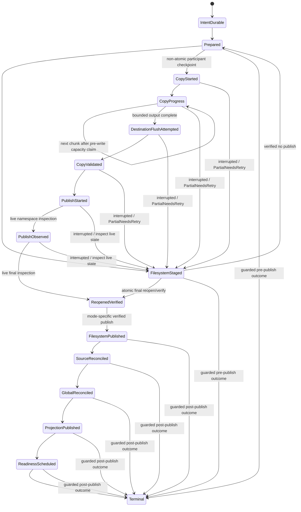

# Wavecrate End-to-End I/O Architecture Target

Status: target design; documentation-only proposal. No implementation, schema, dependency,
migration, behavior, or test change is implied by this document.

## Scope, authority, and reading order

This document describes the ideal end-to-end ownership and ordering of Wavecrate's
filesystem I/O, source-database I/O, global-library persistence, Harvest persistence,
rating/history persistence, browser projection, readiness/source processing, and
rebuildable artifacts. It is the detailed I/O authority for those concerns.

It is subordinate to the product principles and user-visible direction in
[`docs/TARGET.md`](TARGET.md). Read `docs/TARGET.md` first for product intent, filesystem
source-of-truth, protected-source policy, no-follow requirements, GUI boundaries, and
readiness meaning. [`docs/DATABASE_MIGRATIONS.md`](DATABASE_MIGRATIONS.md) remains
authoritative for schema versions, DDL, compatibility opens, migration tests, and the
mechanics of shipping a schema change. This document may define a journal or identity
concept without authorizing a schema change; any eventual schema work follows the
migration contract.

The target covers:

- extraction, copy, create, duplicate, import, export, and handoff artifacts;
- move, rename, trash, delete, destructive edit, undo, and redo;
- external Finder or Explorer changes and watcher recovery;
- source-database commits and revisions;
- the global library, Harvest, rating, listen-history, and transaction-history writes;
- browser and folder projection publication;
- readiness, metadata, analysis, waveform and other cache artifacts;
- cancellation, admission, backpressure, fairness, retries, shutdown, and crash recovery;
- busy databases, partial failures, diagnostics, and user-facing status.

It does not authorize implementing all of these flows in one change. Delivery is phased
in [Phased delivery](#phased-delivery).

## Current evidence and target recommendations

The following are deliberately separated. The first table records evidence available at
the design head `a982c4844c1d098a079ebc3d172db23dd29540d`; it is not a claim that every
path has the same behavior. The second table is a recommendation for the target system,
not a description of current production behavior.

### Established or explicitly reported current evidence

| Evidence | Boundary and implication |
| --- | --- |
| Source-database connection profiles currently use a 5,000 ms busy timeout for background, job, user-metadata, and maintenance roles; UI reads use 25 ms and playback-history writes use 100 ms (`crates/wavecrate-library/src/sample_sources/db/open_profiles.rs`, with role tests under `tests/unit/source_db_mod_tests/opening/`). | A busy open/write can wait roughly five seconds and then yield `Database is busy`. Busy handling is therefore a scheduling concern as well as an error-display concern. |
| A successful extraction can publish its filesystem output before source reconciliation succeeds, after which browser visibility is delayed. | Filesystem publish and source registration are not yet one universally recoverable ordered contract. A design must make the partial state explicit and retryable. |
| The current source-operation journal uses `staged_relative_for_target` to derive a staging name beside the destination final path. | This is destination-local staging only when the resolved staging and final paths are on the same filesystem; the helper itself does not establish same-device or rename durability. |
| Write-capable source and global-library databases use `wal_autocheckpoint=4096` and `journal_size_limit=67108864`. Passive checkpointing is considered at 32 MiB, throttled to once per database every 15 seconds, uses `PASSIVE`, has a 250 ms busy timeout, and logs `wal_bytes_before/after`, `busy`, `log_frames`, `checkpointed_frames`, and elapsed time. | Active reader snapshots can still retain WAL frames, so these settings are bounded maintenance policy, not a guarantee of an unbounded-WAL-safe system. |
| Source DBs expose `maybe_checkpoint_wal` for non-read-only roles. Global-library opens are guarded by the process-local `LIBRARY_LOCK`. | The helper and mutex are current in-process mechanisms; neither is cross-process writable ownership or cross-database saga coordination. |
| Watcher publication can be deferred while a scan is already running (`src/native_app/sample_library/folder_scan_actions/filesystem_refresh.rs` and the source watcher/scan lifecycle). | A watcher event is not itself publication authority. It must be retained as evidence and reconciled after the current committed revision is known. |
| PR #980's real native-app run confirmed Finder creation/duplication and exposed event-shape and performance differences from synthetic path fixtures; its known limitations still require fresh real-app acceptance for rename, cross-parent move, and deletion. Per-event full metadata snapshots and recursive hydration regress performance. | The target Finder contract must preserve raw events, normalize affected regions conservatively, and use bounded revisioned deltas. It must not turn each event into a full source snapshot. See [Finder contract](#finder-and-external-filesystem-contract). |
| UI starvation has not been established as the root cause of the current interaction reports. | The target still prohibits UI-thread I/O, but this document does not claim that all observed stalls are caused by UI starvation. Scheduler, persistence, and operation paths need separate measurements. |
| Retained-visual waveform behavior is a separate concern. | Waveform retained visuals and their correctness are out of scope here except for the rule that waveform/cache work is an artifact consumer and must not own source publication. |

These observations are current evidence for designing recovery boundaries. They are not
acceptance claims for the target and must be re-verified before implementation work relies
on their exact timings or messages.

### Target recommendations

| Recommendation | Required target property |
| --- | --- |
| One I/O coordinator admits every durable user operation and every external-source reconciliation. | No operation can silently bypass journaling, source revision publication, status, or recovery. |
| A durable app-local journal records accepted intent before any application-owned filesystem mutation. | Power loss after intent but before filesystem work is recoverable and user-visible. |
| Atomic filesystem publication requires destination-local staging beside the final destination and a same-filesystem rename. | Cross-device or unavailable atomic rename uses a separately journaled, verified non-atomic copy/publish protocol with explicit partial recovery and status; it never claims atomicity. |
| Filesystem work is performed outside SQLite transactions, then source and global databases are reconciled through bounded commits. | SQLite locks never span copying, hashing, decoding, recursive traversal, or arbitrary file latency. |
| One profile-wide process owner protects writable access for a profile, with a per-source lease/epoch as defense in depth. | A second process gets safe read-only access or typed actionable ownership status; SQLite commit serialization alone cannot coordinate a multi-database saga. |
| A non-UI WAL maintenance owner runs passive, throttled checkpoints and bounds reader snapshots. | Interactive paths never block on checkpointing; WAL retention, incomplete maintenance, and disk pressure remain observable and recoverable. |
| Watchers are evidence; a committed source revision and its structured delta are publication authority. | Duplicate, late, reordered, incomplete, and overflow events cannot roll back a newer browser projection. |
| Every result carries operation, source, lifecycle, and revision fences. | Stale workers may finish safely but cannot overwrite newer state. |
| Caches are rebuildable and best effort. | Cache loss cannot make source metadata, user intent, or source readiness disappear. |

## Terminology

- **Physical source**: one configured filesystem root and its source-local `.wavecrate.db`.
- **Source identity**: a stable identity for the physical root, not merely its current path.
- **Source revision**: a monotonically increasing committed revision for source membership,
  path, identity, and structural directory truth. It is assigned only by the source DB
  writer owner after a bounded transaction commits.
- **Committed delta**: the bounded, revisioned description of what changed in a source;
  it may contain exact entries, subtree effects, directory truth, deletions, or an audit
  requirement.
- **Artifact identity**: the tuple that proves what a derived payload represents: source
  or sample identity, content/path generation, artifact kind, algorithm/schema version,
  settings, and producer version.
- **Operation**: one user command or external reconciliation saga with one durable
  operation ID, intent, phases, disposition, status, and recovery record.
- **Publication**: making a committed source revision and its bounded projection visible
  to downstream consumers. A filesystem write or watcher callback is not publication.
- **Readiness**: durable desired/observed artifact state for a source identity and revision;
  cache availability alone is never readiness.
- **Region**: the smallest filesystem area whose truth may have changed. Regions widen from
  exact entries to subtrees to a source audit when evidence is uncertain.
- **Routine maintenance**: low-value work that may be deferred or skipped under contention
  and must not own foreground user progress.
- **Physical owner**: the serialized component allowed to perform a named class of side
  effects. A task may request work but may not perform another owner's side effect directly.
- **RejectedBeforeIntent**: a typed, non-durable coordinator admission result returned when
  validation, ownership, bounded-queue, or initial-capacity admission fails before journal
  intent commits. It creates no durable `OperationId`, journal record, participant checkpoint,
  retry lease, or restart-visible status. It carries a stable cause, user message, retry
  condition, and safe action; retry is a new attempt.

## Principles and invariants

These are normative target invariants.

1. The UI thread performs no filesystem I/O, SQLite I/O, schema or migration work,
   recursive hydration, hashing, cache writes, or logging flushes that can block. It may
   capture lightweight command intent, render optimistic state, and apply already-prepared,
   bounded results.
2. Filesystem work always occurs outside SQLite transactions. Transactions are bounded by
   known row/page work and never span copy, move, hashing, decoding, recursive traversal,
   user prompts, watcher debounce, or retry sleep.
3. An operation is accepted only after `IntentDurable`. Validation, ownership, bounded-queue,
   and initial-capacity admission all precede every application-owned journal, filesystem,
   SQLite, WAL, or SHM side effect. Once filesystem state changes, reconciliation remains
   recoverable until a terminal disposition is durably recorded.
4. A filesystem publish before source reconciliation is a recoverable partial operation,
   not an implicit success and not a reason to make the user repeat the command blindly.
5. Watchers provide raw evidence. The committed source revision, source identity, and
   structured delta from the per-physical-source DB writer are publication authority.
6. Every asynchronous result is fenced by operation ID, source identity, source revision
   (or expected revision), lifecycle generation, and where relevant sample/content
   generation and artifact key. Late results are dropped or converted into a retry/audit
   request; they never mutate newer state.
7. Caches and analysis artifacts are rebuildable and best effort. They can be missing,
   stale, evicted, or corrupt without deleting user metadata or making the source appear
   uncommitted.
8. Cross-database work is an idempotent saga. No transaction pretends SQLite can atomically
   commit a source DB and the global library DB; each participant has an idempotent step,
   durable intent, a retry disposition, and a reconciliation query.
9. One writer owner serializes writes for each physical source DB across all Wavecrate
   processes sharing a profile. The initial durable policy is one profile-wide process lock
   plus a per-source lease/epoch as defense in depth. Other code sends typed commands to that
   owner and cannot open competing writable connections for the same physical database.
10. Busy/locked is a scheduler and retry condition. After a filesystem publish, it is not
    a user-visible terminal error until bounded retries, recovery, and a deliberate
    diagnostic disposition have been exhausted.
11. No-follow, capability-relative root access, canonical containment, protected-source
    restrictions, and database-sidecar safety apply to every filesystem path, including
    journal paths, staging, trash, cache references, watcher-derived paths, and recovery.
12. Cancellation stops admission and future work where safe; it does not erase durable
    intent, abandon a published file, or claim that a partial operation never happened.
13. Bounded deltas are the normal publication path. A gap, uncertainty, overflow, failed
    verification, or missing directory truth widens the affected region and eventually
    requests a conservative source audit.
14. User status describes the operation's durable disposition, not the last worker callback.
    It remains actionable across retries, restart, and partial failure. A pre-intent
    `RejectedBeforeIntent` result instead says that work was not started and is not durable;
    it has no restart-visible operation status.
15. Protected recovery capacity is a separate admission invariant. For every distinct
    affected writable volume, the initial target preserves a non-sparse 256 MiB protected
    floor. Before any application-owned journal, filesystem, SQLite, WAL, or SHM side
    effect, admission aggregates and claims a conservative peak allocation on each such
    volume for destination staging, a final/direct non-atomic destination, the journal,
    source and global databases plus their WAL/SHM, and any coexisting backup, replacement,
    or recovery payload. A same-volume rename does not double-count one identical
    allocation; coexisting allocations do count separately. Unbounded output requires an
    initial bounded claim and a bounded claim before each chunk write. If the initial claim
    fails, the coordinator releases provisional claims and returns `RejectedBeforeIntent`
    with `RecoveryReserveLow` or `DiskPressureRecoveryOnly`; it creates no journal or
    disposition. After `IntentDurable`, a failed claim is `RetryPending` when no incomplete
    participant is known, or `PartialNeedsRetry` only when a durable participant checkpoint
    proves incomplete work. It never borrows the protected floor.

## Identities, lifecycle, and revision fences

### Typed identities

The target APIs should make these values distinct types, even if an initial implementation
uses wrappers over strings or integers:

| Identity | Contents | Used to fence |
| --- | --- | --- |
| `OperationId` | Durable UUID | All phases, retries, watcher echo acknowledgement, status, and recovery. |
| `PhysicalSourceId` | Stable root/database identity plus validated root capability | Source writer ownership and cross-process recovery. |
| `SourceRevision` | Monotonic committed source revision | Manifest, directory truth, browser delta, and readiness wake. |
| `LifecycleGeneration` | Source/session generation | Removed/replaced roots, shutdown, and reopened source instances. |
| `SampleIdentity` | Stable Wavecrate sample identity where available | Metadata, rating, history, Harvest, and artifact ownership across path changes. |
| `ContentGeneration` | Content identity/fingerprint plus file generation | Hash, metadata, waveform, analysis, and cache validity. |
| `ArtifactKey` | Kind, identity, generation, algorithm/version/settings | Rebuildable artifact storage and deduplication. |
| `ProjectionRevision` | Projection version plus source revision | Browser application and gap fallback. |
| `JournalSequence` | Durable append/update sequence | Recovery ordering and diagnostics, not source publication authority. |

Path is a locator, not a durable sample identity. A path-only rename changes location
generation and directory truth but may retain content-derived readiness. A content change
creates a new content generation and invalidates content-derived artifacts. A delete retires
the live membership while retaining recovery metadata as policy allows.

### Fencing rule

Every command carries the source identity, expected lifecycle generation, and an optional
expected source revision. The writer owner accepts a command when the physical source is
still current and the revision precondition is satisfied. It commits the next revision and
returns the exact delta. If the precondition is stale, it returns `Superseded` or requests
an audit; it does not merge a stale snapshot opportunistically.

## Logical and physical ownership

The following owners are the target side-effect boundaries. “Owner” means serialized
authority, not necessarily one OS thread.

| Owner | Owns | Must not own |
| --- | --- | --- |
| **I/O coordinator** | Admission, operation IDs, dependency ordering, priorities, cancellation, retry leases, saga progression, terminal disposition, status publication. | Direct filesystem or SQL work. |
| **Durable app-local journal** | Durable operation intent, phase/disposition records, recovery hints, status history, and append/update durability. | Source manifest truth or arbitrary user metadata. |
| **File operation owner** | Capability-relative staging, copy/create/write, rename/move, trash/delete, destructive edit replacement, fsync, atomic or explicitly non-atomic publication, and filesystem verification. | SQLite transactions or browser projection. |
| **Per-physical-source DB writer owner** | One writable SQLite connection/queue, bounded transactions, source manifest/identity/directory revision, source-local metadata, readiness rows, and source journal steps. | Filesystem traversal, copy, hashing, cache payload writes, or another source. |
| **Global-library owner** | `library.db` source registry, global metadata/index references, global operation links, and global cache/artifact references. | Source-local manifest truth or physical file mutation. |
| **Harvest owner** | Harvest derivation identity, origin/destination relationship, routing, and idempotent derivation persistence. | Rendering or copying bytes. |
| **Projection publisher** | Bounded revisioned browser/folder/status projection assembly and application. | Filesystem/SQLite reads during UI application. |
| **Artifact store** | Atomic cache/artifact payload writes, identity validation, retention, eviction, and rebuild requests. | Durable user metadata or source membership. |

The universal journal, its recovery records, and every writable participant are profile-owned.
The durable writable-owner scope is the profile, not the process. The required acquisition
order is: (1) acquire the profile-wide process lock, (2) open and validate the universal
journal writable, (3) mutate journal recovery state and admit durable operations, (4) open the
global-library writer and acquire source leases/epochs, and (5) admit source/DB writer work.
No step may be reordered to let a process inspect-and-repair the writable journal, recover
operations, accept durable intent, open a writable database, or acquire a source lease before
the profile lock is held.

The first policy acquires one profile-wide process lock before opening any writable global or
source database, then acquires a per-source lease with a monotonically fenced epoch before
source writes. Stale owner recovery covers both the profile-wide process owner and each
per-source lease/epoch: takeover requires the profile lock to be demonstrably released or its
owner demonstrably not live, the source lease to be expired, and live filesystem and database
verification to agree that takeover is safe. An active owner is never taken over. A process
that cannot acquire the profile lock must not open the journal writable, mutate recovery,
admit durable work, open writable database connections, or acquire source leases. It remains a
bounded read-only process, or forwards a typed command to the owner, and surfaces the distinct
profile status `ProfileOwnedByAnotherProcess`. A source lease conflict is evaluated only after
this process has established profile ownership and surfaces
`WritableSourceOwnedByAnotherProcess`. These statuses are non-aliasing: the profile status
means exclusively failure to acquire the live profile lock, while the source status means
exclusively an independently live source lease/epoch conflict after profile ownership is
established. A process that has not established profile ownership must never report the
source status, and a process with profile ownership must not relabel an independent source
lease conflict as profile ownership failure. SQLite's own commit serialization does not
coordinate these locks, leases, or the app-local multi-database saga.

The profile lock is released last: after admission is closed, high-value journal and
participant checkpoints are durable, source leases/epochs are released, the writable journal
is closed, and ownership state is recorded. A losing process may render bounded retained data
and observe status, but it cannot silently become a write owner.

Read owners may use separate read-only connections or prepared snapshots, but they never
become hidden write owners. A caller submits a typed request; the owner returns a typed
result or a durable retry disposition.

## Universal operation journal

The journal is app-local and universal. Source-local file-operation journal state may remain
for source-local compatibility, but it is a participant in this larger operation rather than
the sole record of extraction, global persistence, or projection state.

### Record shape

No operation record shape exists until both bounded-queue and initial-capacity admission
have passed. The coordinator may hold only provisional, non-durable claims while evaluating
those gates. Once they pass, the capacity plan and claims are included in the journal record
shape and committed together with `IntentDurable`. A request rejected at either gate is
`RejectedBeforeIntent` and has no operation record, durable ID, or disposition.

An operation record contains at least:

- operation ID, parent/compound operation ID, command kind, actor (`User` or `ExternalFs`),
  creation and last-progress timestamps;
- source identity and lifecycle generation for every participant;
- validated before/after paths or region descriptors, sample/content identities, and
  collision policy;
- intended side effects and inherited metadata snapshot references, without embedding
  unbounded file contents or full source snapshots;
- a per-distinct-volume capacity plan containing the protected floor, conservative peak
  allocation classes and amounts, existing/coexisting claims, claim/release state, and
  volume identity for every affected writable volume;
- publication mode (`AtomicDestinationRename` or `NonAtomicCopyValidatePublish`), visibility
  boundary (`VisibilityVerified` or `VisibilityUnverified`), namespace result
  (`AtomicNamespace` or `NonAtomicNamespace`),
  synchronization evidence (`PowerLossSynchronized`, `BestEffortSync`, or
  `SyncUnsupportedOrUnverified`), and the ordered verification/synchronization checkpoints
  required by that mode;
- phase, disposition, retry count/lease, cancellation request, and user-status key;
- participant checkpoints for filesystem, source DB, global DB, Harvest, projection,
  readiness, and artifacts;
- recovery hints that are relative/capability-bound and are revalidated against live state;
- error class, stable diagnostic code, bounded context, and redaction-safe details.

Durable intent is committed before application-owned filesystem mutation. Journal updates
are small and bounded; large metadata snapshots live in a separately managed durable record
or are re-read from authoritative owners during recovery. `Accepted` may acknowledge the
request at an API boundary only after `IntentDurable`; it is not a journal phase.

### Publication durability contract

Publication has three deliberately separate claims. `VisibilityVerified` means that the
destination namespace was observed after the operation and the reopened final object passed
the selected identity/length or hash verification. `AtomicNamespace` means that the final
name became visible through one same-filesystem/volume replace or rename, with no observable
destination interval containing a partially copied final object. `PowerLossSynchronized`
means that the platform-specific file and namespace synchronization sequence below completed
and produced evidence; it is not implied by visibility or namespace atomicity. A faulty,
remote, removable, or otherwise unverified medium can acknowledge a flush without making a
guarantee about the medium's actual power-loss behavior, so Wavecrate never turns a flush call
into a claim about faulty or remote media.

The semantic boundary is resolved as follows: `FilesystemPublished` is entered only after
visibility and content verification. Its record must state the namespace result and the
synchronization evidence separately. Local supported filesystems may additionally record
`AtomicNamespace` and `PowerLossSynchronized`; unsupported or unverified filesystems enter
only with `VisibilityVerified` and an explicit durability downgrade. Platform benchmarking,
fault injection, and the exact set of filesystems that qualify for the stronger evidence remain
implementation-time validation, not an undecided semantic boundary.

For a destination classified as local and supported, the target sequences are:

| Profile | Ordered target sequence and resulting claims |
| --- | --- |
| macOS/local POSIX | 1. Create the staging file beside the final path on the destination filesystem. 2. Write all bytes and validate staged identity/length or hash. 3. Synchronize the staged file with `F_FULLFSYNC` where supported; if unavailable or rejected, use `fsync` and record downgraded synchronization evidence. 4. Replace/rename staged to final on the same filesystem. 5. Synchronize destination directory metadata where the platform supports it and record unsupported-directory-sync evidence otherwise. 6. Reopen the final path and verify identity/length or hash. The same-filesystem rename permits `AtomicNamespace`; only the completed supported synchronization sequence permits `PowerLossSynchronized`. |
| Windows/local | 1. Create the staging file on the destination volume, beside the final path. 2. Write all bytes and validate staged identity/length or hash. 3. Call `FlushFileBuffers` on the staged file. 4. Replace/move on the same volume with the platform's write-through option; never fall back to a cross-volume copy while claiming an atomic publish. 5. Reopen the final path, flush/verify it, and record that directory metadata durability is unsupported unless a tested platform primitive proves it. Same-volume replace/move permits `AtomicNamespace`; `PowerLossSynchronized` requires the tested file/replace sequence and is never inferred for an untested volume. |
| Unsupported, remote, or removable filesystem | Attempt the separately journaled non-atomic protocol below only when the operation is allowed. Record `VisibilityVerified` after reopen/content verification and an explicit downgrade such as `NamespaceAtomicityUnavailable` and `PowerLossSynchronizationUnverified`. Never record `AtomicNamespace` or `PowerLossSynchronized`, even when a flush-like call succeeds. |

The non-atomic path is not a weaker spelling of atomic rename. `NonAtomicCopyValidatePublish`
has seven participant checkpoints, not seven journal phases. The normative mapping is:

| Participant checkpoint | Journal phase after the checkpoint | Interruption or advancement guard |
| --- | --- | --- |
| `CopyStarted` | `FilesystemStaged` | Capture source/destination identities; interruption leaves `PartialNeedsRetry` at this checkpoint. |
| `CopyProgress` | `FilesystemStaged` | Record bounded byte offsets; interruption leaves `PartialNeedsRetry` at the last durable offset and the next chunk requires a fresh pre-write capacity claim. |
| `DestinationFlushAttempted` | `FilesystemStaged` | Record the actual flush result and media caveat; interruption leaves `PartialNeedsRetry`. |
| `CopyValidated` | `FilesystemStaged` | Verify identity/length or hash; interruption leaves `PartialNeedsRetry`. |
| `PublishStarted` | `FilesystemStaged` | Interruption leaves `PartialNeedsRetry`; live inspection of final and staging paths must guard any resume or discard decision. |
| `PublishObserved` | `FilesystemStaged` | Observe the destination namespace; interruption leaves `PartialNeedsRetry`; live inspection must guard whether publication occurred. |
| `ReopenedVerified` | `FilesystemPublished` | Reopen and verify the final object. Only this checkpoint advances the non-atomic operation, with `VisibilityVerified`, `NonAtomicNamespace`, and downgraded synchronization evidence. |

The first six checkpoints therefore remain `FilesystemStaged` even when a direct final
destination exists; that phase does not imply atomicity for the fallback and the fallback
branch contains no `AtomicNamespace` or `PowerLossSynchronized` claim. A crash or verification
failure leaves the record at the last checkpoint with `PartialNeedsRetry`; recovery compares
both source and destination live state before resuming, replacing, retaining as an explicit
partial/orphan, or requesting user action. It never upgrades this path to atomicity or
power-loss durability. If a destination cannot be reopened or verified, it remains partial
and does not enter `FilesystemPublished`.

On either path, a failed synchronization call is evidence of a failed or downgraded step, not
permission to continue with a stronger claim. The journal retains the attempted primitive,
result, filesystem classification, and verification observation so later recovery can narrow
or widen the claim without guessing.

### Phases and dispositions

The durable phase machine begins at `IntentDurable`; `Accepted` is not a phase. The normal
phase order is:

1. `IntentDurable`: queue and initial-capacity admission passed, the journal record shape,
   capacity plan, and claims are durable, and no application filesystem mutation has run.
2. `Prepared`: capabilities, collision plan, source participants, and safe staging paths
   are resolved without touching the UI.
3. `FilesystemStaged`: bytes or edit output are in an app-owned staging location on the
   destination filesystem when atomic publication is selected, and are verified enough to
   publish. For the non-atomic fallback, this phase is only the participant-checkpoint
   container described above; it does not imply `AtomicNamespace` or completed publication.
   The required platform sequence is recorded before advancing.
4. `FilesystemPublished`: the final namespace is visible and the reopened final object is
   verified. The record separately reports namespace atomicity and power-loss synchronization
   evidence according to [Publication durability contract](#publication-durability-contract).
5. `SourceReconciled`: each affected physical source has committed its manifest, identity,
   directory, and source-local metadata delta.
6. `GlobalReconciled`: all required global-library and Harvest participants are `Applied` or
   `NotApplicable`; only optional rebuildable artifact work may remain deferred, represented
   by the later `SucceededWithDeferredArtifacts` terminal disposition.
7. `ProjectionPublished`: the bounded projection for the committed revision is visible;
   a gap may instead record `AuditRequired`.
8. `ReadinessScheduled`: exact desired artifact deficits are durable and a coordinator wake
   is published after source publication.
9. `Terminal`: a success, cancelled, rolled-back, blocked, or manual-recovery disposition
    is durable. A retryable participant checkpoint is durable but remains resumable until
    it reaches a terminal disposition.

Resumable dispositions are `RetryPending`, `PartialNeedsRetry`, `AuditRequired`,
`CancelRequestedBeforePublish`, and `CancelRequestedAfterPublish`.
Terminal dispositions are `Succeeded`, `SucceededWithDeferredArtifacts`,
`CancelledBeforePublish`, `CancelledAfterPublish`, `RolledBack`, `BlockedByUser`,
`FailedPreservingData`, and `FailedDataLossRisk`.
The last disposition is a diagnostic escalation, not permission to delete uncertain data.

Phase and disposition are independent fields, but their combinations are guarded. A
nonterminal phase has zero or one resumable disposition; it never carries a terminal
disposition. A terminal disposition is legal only with `Terminal`, and `Terminal` always has
exactly one terminal disposition. The following table is normative; a disposition transition
must name the guard and the participant checkpoint that proved it.

| Phase | Legal resumable overlay | Guard to advance or terminate |
| --- | --- | --- |
| `IntentDurable`, `Prepared` | None, `RetryPending`, `CancelRequestedBeforePublish` | Admission/retry may continue. `CancelledBeforePublish` or `BlockedByUser` may enter `Terminal` only after no filesystem mutation or publish evidence is found. |
| `FilesystemStaged` | None, `RetryPending`, `PartialNeedsRetry`, `CancelRequestedBeforePublish` | Resume or discard only after live staging/final inspection proves whether publication occurred. No terminal success is legal here. |
| `FilesystemPublished` | None, `RetryPending`, `PartialNeedsRetry`, `AuditRequired`, `CancelRequestedAfterPublish` | Source reconciliation must consume the verified output without repeating filesystem work. Cancellation remains resumable until required reconciliation completes. |
| `SourceReconciled` | None, `RetryPending`, `PartialNeedsRetry`, `AuditRequired`, `CancelRequestedAfterPublish` | Required global/Harvest work deferred or failed stays `SourceReconciled + PartialNeedsRetry`; it must not be called globally reconciled or successful. A source/projection evidence gap stays auditable. |
| `GlobalReconciled` | None, `RetryPending`, `AuditRequired`, `CancelRequestedAfterPublish` | Every required global and Harvest participant is `Applied` or `NotApplicable`; otherwise the phase cannot advance. |
| `ProjectionPublished`, `ReadinessScheduled` | None, `RetryPending`, `AuditRequired`, `CancelRequestedAfterPublish` | A projection gap remains `AuditRequired` until the authoritative revision is republished. Optional artifact deficits may remain deferred, but required participants must be complete. |
| `Terminal` | None | `Succeeded` requires all required participants `Applied`/`NotApplicable` and no unresolved audit. `SucceededWithDeferredArtifacts` permits only optional rebuildable artifacts to be deferred. `CancelledBeforePublish` requires no publish evidence; `CancelledAfterPublish` requires verified publish plus complete required reconciliation. `RolledBack` requires verified compensating work. `BlockedByUser`, `FailedPreservingData`, and `FailedDataLossRisk` require their explicit safe-state/escalation guards and preserve evidence. |

`RejectedBeforeIntent` is outside this phase/disposition table: it is a non-durable
coordinator result, not a journal phase or durable disposition. Pre-intent cancellation is
also non-durable and returns no operation record. `RetryPending` requires `IntentDurable`, a
transient error, and a durable retry lease. `PartialNeedsRetry` requires `IntentDurable` plus
a known incomplete participant or non-atomic publication checkpoint; the checkpoint must be
durable and prove incomplete work, so an initial admission denial can never select it.
`AuditRequired` requires uncertain evidence or a revision gap and forbids success until the
audit closes; `CancelRequestedBeforePublish` requires a cancel request before any verified
publish; and `CancelRequestedAfterPublish` requires a verified publish with unfinished
required reconciliation. `Succeeded` requires every required participant to be `Applied` or
`NotApplicable` and every projection gap closed.
`SucceededWithDeferredArtifacts` permits only optional rebuildable artifacts to be deferred.
`CancelledBeforePublish` requires a live-state proof of no publish, `CancelledAfterPublish`
requires verified publish plus complete required reconciliation, `RolledBack` requires
verified compensation, `BlockedByUser` requires an explicit user decision or capability
action, `FailedPreservingData` requires bounded recovery exhaustion with preserved evidence,
and `FailedDataLossRisk` requires unresolved safety ambiguity with escalation and no destructive
cleanup. These guards apply on every transition to the corresponding overlay or terminal
record.

Success therefore cannot be emitted while required Global or Harvest work is deferred. A
projection gap is never converted to success by a stale view; it remains `AuditRequired` until
the committed source revision is reconciled and republished.

After `FilesystemPublished`, a resumable disposition stores the failed participant and
cursor. Retrying a source commit resumes that source participant; retrying a global or
Harvest step resumes that participant; a projection gap reruns audit/republication. None
of these paths returns to `Prepared`, repeats filesystem staging, or publishes a second
copy/move. Only a pre-publish failure may return to `Prepared`/`FilesystemStaged`, and only
after the recovery worker has proved that no final filesystem publish occurred.

Cancellation after `FilesystemPublished` is recorded first as the resumable request
`CancelRequestedAfterPublish`, not as a terminal result. Recovery continues the missing
source reconciliation (then any required global, Harvest, projection, or readiness
checkpoint) without repeating filesystem work, and emits terminal `CancelledAfterPublish`
only after the durable operation has a complete required recovery record.

The diagram uses `ReopenedVerified` as the shared participant checkpoint for the atomic path's
final reopen/verify convergence as well as for the non-atomic path. The atomic path retains its
`AtomicNamespace` and applicable synchronization evidence from the platform sequence; the
non-atomic mapping above is the only path that assigns `NonAtomicNamespace` and downgraded sync
evidence.

### Power-loss properties

- Before `IntentDurable`, no app-owned durable side effect is promised.
- After `IntentDurable` and before staging, recovery either cancels safely or resumes using
  the recorded operation and newly validated paths.
- A staged file is never presented as the final user file until the atomic publish boundary,
  or the verified completion of the explicitly non-atomic publication protocol, succeeds.
  A copy that is interrupted or cannot be verified remains partial/recoverable and is not
  presented as an atomically published result.
- After `FilesystemPublished`, recovery never simply deletes the output because a later DB
  step failed. It reconciles the output into the source or retains it as an explicitly
  visible orphan/recovery item.
- A source DB commit without global DB completion is a retryable saga checkpoint, not a
  second filesystem operation.
- A global DB commit without projection completion is repaired by republishing from the
  authoritative source revision.
- A cache write may be discarded or rebuilt at any point after its atomic payload publish;
  it cannot downgrade durable source state.
- Recovery inspects live filesystem and DB state. Journal stage is a hint and ordering aid,
  never proof that a side effect occurred.

## Operation state machines

### Extract, copy, create, duplicate, and export

1. Validate selection, destination source, protected-source/Harvest policy, output format,
   collision policy, and capability-relative destination.
2. Pass bounded queue admission and then initial capacity admission before any
   application-owned side effect. Build and provisionally claim the per-volume plan for
   source/destination staging, final/direct fallback, journal, source/global DB plus WAL/SHM,
   and coexisting recovery payloads. Validation, ownership, queue saturation, or an initial
   claim failure returns `RejectedBeforeIntent` with no journal record or disposition; release
   provisional claims. Only after both gates pass does the coordinator commit the record shape,
   capacity plan, claims, and source/content identity, destination, inherited rating/lock/
   metadata policy, and expected output fingerprint as `IntentDurable`. For unbounded output,
   claim the initial bounded amount at that boundary and claim each bounded chunk before
   writing it.
3. The file-operation owner delegates bounded rendering/copying to a worker. For atomic
   publication it writes to destination-local staging beside the final path, outside all
   SQLite transactions. If that path or atomic rename is unavailable, the worker enters the
   separately journaled non-atomic protocol rather than silently changing publication mode.
   It verifies container/header/length; it does not register the file directly in SQLite and
   does not become a separate physical owner.
4. When staging and final destination share a supported local filesystem/volume, run the
   platform sequence in [Publication durability contract](#publication-durability-contract):
   synchronize the staged file, same-filesystem/volume replace or rename, synchronize
   directory metadata where supported, then reopen and verify. Record the resulting
   `VisibilityVerified`, `AtomicNamespace`, and synchronization-evidence fields separately.
   Otherwise run `NonAtomicCopyValidatePublish` with its copy, flush attempt, validation,
   publish-observation, and reopen checkpoints; recover from live state after a crash and
   expose `PartialNeedsRetry` when final publication cannot be proven. Record
   `FilesystemPublished` only after the selected visibility verification; never claim
   atomicity or power-loss durability for the fallback.
5. Ask each affected source writer to discover/reconcile the exact path and commit a new
   source revision. A new file is visible directory truth even if it is unsupported for
   audio indexing.
6. Reconcile global library and Harvest derivation relationship by operation ID and exact
   identities. Apply rating/lock inheritance exactly once and keep user intent separate from
   copy/extract mechanics.
7. Publish a bounded browser delta, acknowledge only matching watcher evidence, schedule
   readiness and artifacts, and report success or deferred artifacts.

If source reconciliation is busy or unavailable after publish, status is “Created; finishing
library registration” with retry progress, not “failed”. If repeated retries cannot establish
source truth, status is “Created; library registration needs attention” with reveal/retry/audit
actions.

### Move, rename, trash, and delete

- **Rename/move** records before/after path and stable sample identity, then uses the selected
  local platform sequence and records namespace atomicity separately from synchronization
  evidence. Cross-device, remote, removable, or otherwise unavailable renames use the
  separately journaled non-atomic copy/validate/publish protocol and retain partial status
  until visibility is verified. Source writers commit path and directory truth;
  content-derived readiness remains valid when content identity is unchanged.
- **Cross-source move** is an idempotent saga: durable intent, source staging, destination
  publish, destination commit, source retirement commit, global/Harvest rekey, projection,
  and readiness. Re-running a step uses identities and operation ID to avoid duplicate rows.
- **Trash** is a move into an app-owned or OS-approved recovery location with a durable
  restore record. It is not a metadata-only hide. Source membership retires only after the
  physical move is verified.
- **Permanent delete** requires explicit policy and user confirmation. Its journal retains
  enough evidence for a clear terminal result; uncertain deletion never becomes silent
  success.
- **Destructive edit** writes a verified replacement to staging, preserves session recovery
  material, atomically replaces the audio file, then commits content generation and
  invalidates only content-derived artifacts. Undo and redo are new journaled operations,
  not direct reversal outside the coordinator.

### External filesystem operations

External changes do not have a Wavecrate operation ID at capture time. The watcher assigns
an evidence batch ID, retains raw events, and the coordinator creates a reconciliation
operation whose actor is `ExternalFs`. The operation never claims to know whether a
filesystem event was atomic or complete; it observes current truth within the affected
region, commits a source revision, and widens to an audit when evidence is insufficient.

## Finder and external filesystem contract

### Raw capture

The watcher callback does only bounded capture: backend event kind, all raw paths, event
flags/cookies where available, timestamp, watcher generation, root identity, and overflow or
error markers. It does not query SQLite, enumerate recursively, hash, hydrate metadata, or
publish UI state. Raw evidence remains durable or retained until a reconciliation result
acknowledges it or explicitly widens to a source audit.

Real Finder copy/rename/delete events must be treated as the contract. Synthetic path-only
fixtures are useful unit inputs but cannot define event shape, ordering, parent coverage, or
cookie behavior.

### Conservative normalization

The normalizer coalesces a bounded time window by physical source and watcher generation,
deduplicates exact evidence, preserves event order/cookies as diagnostics, and emits one or
more of:

- `ExactEntry`: an exact path or before/after identity is sufficiently evidenced;
- `Subtree`: a directory and descendants may have changed, so targeted traversal is needed;
- `SourceAudit`: overflow, unsupported event shape, missing root identity, revision gap,
  failed verification, or uncertainty requires a conservative source-wide audit.

The following rules are mandatory:

- uncertainty widens, never narrows, the affected region;
- unsupported-only files and empty folders are directory truth and remain visible in the
  folder projection even when they produce no audio row;
- a missing event path may still require checking its parent and former ancestors;
- copy events require destination existence and identity verification, not just a path add;
- rename/reparent events verify both old and new regions and do not infer content identity
  from a name;
- delete events retire only what current traversal proves absent within the region;
- symlinks/reparse points are not followed, and uncertain path resolution requests an audit;
- normalization has bounded work and emits an overflow/escalation result rather than growing
  an unbounded queue.

### Revisioned directory truth and projection

The source writer commits directory truth and supported-file truth together at one source
revision. The delta includes added, changed, moved, retired, and directory-only entries plus
the affected ancestors needed to reparent the browser tree. The projection publisher prepares
rows off the UI thread and applies only a bounded delta whose base revision is the currently
visible revision. A missing base revision or a non-contiguous delta retains the last good
projection and requests a full authoritative snapshot or audit.

There is no per-event full metadata snapshot, recursive browser hydration, or UI-thread I/O.
Full snapshots are a gap/initialization path, prepared off-thread and published atomically.

## SQLite runtime and transaction rules

### One writer owner per physical DB

Every physical source database has one writer owner with a serialized command queue and one
long-lived writable connection, or one explicitly serialized equivalent. Read-only queries
may use bounded read connections, but a read path must not opportunistically write ratings,
history, readiness, or migrations. The global-library DB has the same single-owner rule.

This owner boundary applies across processes through the profile-wide process lock and
source lease/epoch described in [Logical and physical ownership](#logical-and-physical-ownership).
If another process owns the profile, the process-wide journal/writer actions are rejected with
`ProfileOwnedByAnotherProcess`; if a source lease is independently unavailable, that source
returns `WritableSourceOwnedByAnotherProcess`. Neither case relies on SQLite commit
serialization. Read-only/external access remains safe when possible, subject to the reader
classes and budgets below.

The owner provides typed operations such as `CommitManifestDelta`, `UpdateMetadata`,
`PersistRatingIntent`, `RecordHistory`, `CommitReadiness`, `ReconcileFileJournal`, and
`ReadProjectionSnapshot`. It returns the committed revision, row count, delta, retry class,
and diagnostics. It never returns a success result before commit has completed.

### Open, busy, and transaction policy

- UI-read opens use read-only connections and short bounded busy handling. A busy read
  returns stale retained data plus “refresh delayed” where appropriate.
- Writer opens and write commands use bounded retry with jitter, a scheduler lease, and
  cancellation checks between attempts. A 5-second connection timeout is not a universal
  operation timeout.
- Busy and locked errors are classified as transient contention unless the database is
  corrupt, unavailable, or structurally incompatible. Do not turn a post-filesystem busy
  result into terminal user-visible failure before recovery has run.
- Transactions contain only prepared bounded SQL and no filesystem calls. Large manifest
  or projection updates are chunked with a checkpointed operation and explicit revision
  policy; a chunk either belongs to a defined commit contract or triggers an audit.
- Readiness claims, leases, revision increments, and source manifest mutations that must be
  observed together are one bounded source transaction.
- Schema/migration work is admitted as maintenance by the owner and follows
  `docs/DATABASE_MIGRATIONS.md`; UI-read and background-read roles never migrate.
- WAL/SHM, `.wavecrate.db`, legacy DB names, and recovery sidecars stay inside verified
  source/database roots and obey the same no-follow/capability rules.

### WAL maintenance and reader snapshots

A non-UI WAL maintenance owner is responsible for observing WAL health and scheduling
checkpoint work for each source and global database. The current evidence remains the
reported `wal_autocheckpoint=4096`, `journal_size_limit=67108864`, passive 32 MiB trigger,
15-second per-database throttle, `PASSIVE` mode, and 250 ms busy timeout. These are facts
about current code, not target acceptance claims. In particular, `journal_size_limit` is a
SQLite WAL cleanup/size hint; it is not a reader-retention cap and cannot bound a WAL held by
an active snapshot.

The initial target policy keeps a soft 32 MiB WAL watermark and adds a hard 64 MiB
write-admission watermark per writable database. At the soft watermark the non-UI owner
queues one passive checkpoint subject to the 15-second throttle and records the result. It
never blocks an interactive reader. At or above the hard watermark, new work that would grow
that WAL is paused or rejected until a checkpoint/retry succeeds; already-admitted required
foreground and recovery work may proceed only when its bounded commit reservation fits above
the protected volume reserve. Routine maintenance and rebuildable artifact work is paused
first. This is a target default that implementation benchmarking may tune; the semantic guard
and status are not optional.

Readers have explicit classes and different guarantees:

| Reader class | Target budget and behavior | Status when it prevents progress |
| --- | --- | --- |
| Owner Wavecrate reader | Bounded and cancellable; initial budget is 2 seconds, 100,000 rows, or 16 MiB per snapshot, whichever comes first. It closes at a safe boundary and resumes from a new snapshot. | `WalReaderBudgetExpired` or `WalCheckpointCatchUp` with the last good view retained. |
| Losing-process Wavecrate reader | Read-only and subject to the same bounded lifetime/row/byte budgets. It cannot open the journal writable, recover, admit durable work, or retain a snapshot across waits. | `ProfileOwnedByAnotherProcess` plus `WalReaderBudgetExpired`/`WalCheckpointCatchUp` as applicable; continue read-only with stale data. |
| External/unknown reader | Ungoverned by Wavecrate; it may retain a WAL snapshot indefinitely. Wavecrate uses passive checkpoints, never blocks or kills the reader, and measures the retained frames. | `ExternalReaderRetainingWal` and, at the hard watermark, `WalHardWatermark`; pause/reject WAL-growing work while preserving recovery capacity. |

The initial target also reserves a non-sparse 256 MiB recovery reserve on every distinct
affected writable volume. The reserve is not available to routine work: the capacity plan in
each journal record accounts for destination staging, a final/direct non-atomic destination,
the journal, source/global DB plus WAL/SHM, and coexisting backup/replacement/recovery
payloads before any side effect. Identical allocation is counted once for a same-volume
rename, while coexisting allocations are counted separately. If free capacity reaches the
reserve floor or a required reservation cannot fit, new user operations and background writes
are rejected with `RecoveryReserveLow` or `DiskPressureRecoveryOnly`; only bounded journal,
recovery, ownership-release, and required already-admitted commit work may run. If the hard
WAL watermark is reached while capacity remains above the protected reserve, new WAL-growing
admission is paused/retried and routine work is rejected first. This reserve is a target
default and must be provisioned as real non-sparse capacity, not merely a quota or sparse
file. Capacity failure never borrows the floor.

WAL telemetry records WAL size (`wal_bytes_before/after`), soft/hard watermark crossings,
retained frames (where `log_frames - checkpointed_frames` is available), reader class and
oldest snapshot age when observable, busy/incomplete checkpoint count, checkpoint latency,
write-admission outcome, reserved/free bytes, and disk-pressure state. It also retains the
current diagnostic fields `log_frames`, `checkpointed_frames`, and elapsed time. An
uncooperative external reader is never silently treated as bounded; its status remains
actionable and passive maintenance continues without making an unsafe durability claim.

### Source revision commit contract

The writer receives a normalized region and current observations prepared by a worker. In a
bounded transaction it verifies the source identity/generation, applies idempotent changes,
increments the appropriate source revision only when authoritative source truth changed,
records watcher checkpoint evidence separately, and returns a structured delta. Metadata-only
updates do not advance path/identity revision unless they actually change source truth.

## Integration of metadata, ratings, history, Harvest, readiness, and artifacts

The coordinator keeps one operation's ordering visible while allowing independent owners to
use their own durable stores:

1. Source membership/path/content identity is committed first for a created or changed file.
2. Source-local metadata, rating, lock, tags, and curation state are applied using stable
   sample identity and lifecycle fencing. Optimistic UI state may appear before persistence,
   but the desired overlay is retained until the matching commit or a terminal error.
3. Global-library references and source configuration are reconciled by operation ID. A
   global update cannot create a phantom source row when the source commit is absent.
4. Harvest derivation relationships are written after both origin and destination identities
   are known. Repeated delivery is an idempotent upsert keyed by operation and derivation
   identity; destination routing and rendered bytes remain file-operation concerns.
5. Transaction history records the user command and recovery handles. It does not claim an
   undoable success until the operation reaches its durable terminal disposition. Undo/redo
   submits a new operation with the prior operation as its parent.
6. Browser projection publishes from the committed source revision and bounded snapshot.
7. Readiness wakes only after source publication, and computes exact deficits from identity,
   content generation, algorithm version, and lifecycle. A path-only move does not requeue
   content analysis merely because its path changed.
8. The artifact store writes waveform, metadata, analysis, similarity, display-name, and
   handoff artifacts atomically by `ArtifactKey`. Artifact failure produces deferred-artifact
   status and a retryable readiness deficit, never source rollback.

### Ratings and listen history

Rating changes retain immediate optimistic feedback, latest-intent coalescing, lifecycle and
revision fencing, undo/redo semantics, and auto-trash policy. They are serialized through the
source or global owner selected by the authoritative sample identity. Listen history is lower
priority: it may skip and retry under contention and must never delay selection, playback,
source publication, or an explicit user operation.

## Admission, cancellation, backpressure, and fairness

The coordinator uses typed lanes and bounded queues:

1. playback/device safety and shutdown;
2. current user operation and recovery of a published user operation;
3. source publication and committed external reconciliation;
4. visible browser/readiness work;
5. metadata, Harvest, rating/history persistence;
6. artifact preparation and analysis;
7. routine maintenance and cache cleanup.

Queue admission and initial capacity admission are independent, ordered gates. A queue slot
does not imply that the per-volume peak allocation can fit above the protected floor, and
available capacity does not bypass a bounded queue, lane, priority, or fairness limit. A
validation, ownership, queue-saturation, or initial-capacity denial returns
`RejectedBeforeIntent` with a stable cause, retry condition, and safe action; it creates no
durable operation ID, journal record, participant checkpoint, retry lease, or restart-visible
status. Provisional claims are released. Same sample/source keys coalesce only when the
contract says the latest intent subsumes earlier intent. Distinct accepted user operations
retain distinct durable IDs.

After `IntentDurable`, a capacity claim that cannot be made within the retry policy becomes
`RetryPending` with `RecoveryReserveLow` or `DiskPressureRecoveryOnly` when no incomplete
participant is known. It becomes `PartialNeedsRetry` only when a durable participant
checkpoint proves incomplete work. It never borrows the protected floor. A full queue does
not create a durable rejection or disposition; a low-priority request may be described as
deferred with its retry cause, but the typed result remains `RejectedBeforeIntent`.

Cancellation rules:

- before `IntentDurable`: cancel as a non-durable `RejectedBeforeIntent` result, without a
  durable filesystem side effect or operation record;
- after intent and before filesystem publish: stop before the next safe boundary and record
  `CancelledBeforePublish`;
- after publish: first record the resumable `CancelRequestedAfterPublish` checkpoint; recovery
  finishes or compensates the durable saga before resolving to `CancelledAfterPublish` or
  `PartialNeedsRetry`, never disappearance;
- watcher cancellation only stops a worker; raw evidence remains until acknowledged or
  widened to audit;
- shutdown stops new admission, drains durable high-value work within a bounded grace
  period, and records remaining retry leases for startup.

Fairness is per source and per user operation: one large source audit cannot monopolize all
workers, and routine maintenance cannot starve an accepted foreground operation. Traversal,
hashing, SQL batches, projection deltas, and artifact writes each have byte/row/time budgets.

## Error classification and user status

Every error has a stable class, retry policy, diagnostic context, and user message key. Before
`IntentDurable`, validation, ownership, queue, and initial-capacity errors use the typed
non-durable result `RejectedBeforeIntent`; after `IntentDurable`, the same cause uses only a
legal durable overlay such as `RetryPending`, `PartialNeedsRetry`, or `AuditRequired`.

| Class | Examples | Coordinator result / durable disposition | User-facing status |
| --- | --- | --- | --- |
| `TransientContention` | SQLite busy/locked, temporary sharing violation | Before intent: `RejectedBeforeIntent`; after intent: backoff with durable retry lease and `RetryPending` | “Waiting for library access…” |
| `QueueSaturated` | Bounded lane or coordinator queue is full | `RejectedBeforeIntent`; coalesce only when the latest intent subsumes the earlier request | “Not started; Wavecrate is busy.” with Retry |
| `ProfileOwnedByAnotherProcess` | Universal journal/profile lock held by a live owner | `RejectedBeforeIntent`; do not open the journal writable, mutate recovery, admit durable work, open writers, or acquire source leases; remain bounded read-only or forward a typed command | “This profile is writable in another Wavecrate process.” with retry/read-only actions |
| `WritableSourceOwnedByAnotherProcess` | Independently live source lease/epoch conflict after this process established profile ownership | `RejectedBeforeIntent`; do not open that source writable; retry ownership or continue with read-only access | “Source is writable in another Wavecrate process.” with retry/read-only actions |
| `TransientAvailability` | Source temporarily offline, removable volume absent | Before intent: `RejectedBeforeIntent`; after intent: retry on source availability with `RetryPending` | “Waiting for source…” |
| `CapabilityDenied` | Protected source policy, unsafe symlink/path, permission | `RejectedBeforeIntent`; no blind retry; request user action | “Wavecrate cannot safely access this location.” |
| `Collision` | Destination exists or changed during plan | Before intent: `RejectedBeforeIntent` and re-plan with explicit policy; after intent: legal retry/audit overlay | “Choose how to handle the existing file.” |
| `InputInvalid` | Invalid range/name/format or unsupported audio | `RejectedBeforeIntent`; specific correction and no fake progress | Specific correction; no fake progress. |
| `VerificationFailed` | Output identity, size, or containment mismatch | After intent, preserve staged data and use `RetryPending`, `PartialNeedsRetry` only with a durable incomplete checkpoint, or `AuditRequired` | “Output needs verification.” |
| `NamespaceAtomicityUnavailable` | Remote, removable, cross-device, or untested replace/rename | After intent, use `NonAtomicCopyValidatePublish` with a legal retry/partial overlay and retain the explicit downgrade | “File is visible, but atomic replacement was unavailable.” |
| `PowerLossSynchronizationUnverified` | `fsync`/`FlushFileBuffers` unavailable, downgraded, or medium not classifiable | After intent, retain visibility result and evidence with a legal retry/partial overlay; never claim power-loss durability | “File is visible; storage durability could not be verified.” |
| `SourceReconciliationDelayed` | Filesystem published; source commit busy/failed | `RetryPending` and retain the published path | “Created; finishing library registration.” |
| `ProjectionGap` | Delta base/revision gap, incomplete hydration | `AuditRequired`; retain last good view and use full snapshot/audit | “Library view is catching up.” |
| `ArtifactDeferred` | Cache or analysis write failed/evicted | Retryable readiness deficit | “Available; analysis is pending.” |
| `ExternalReaderRetainingWal` | External/unknown reader prevents passive WAL checkpoint progress | Before intent: `RejectedBeforeIntent`; after intent: never block or kill the reader, pause WAL-growing work at the hard watermark, and retain recovery reserve with a legal retry overlay | “Another process is retaining database history.” with retry/close-other-process guidance |
| `WalHardWatermark` | WAL reaches the initial 64 MiB write-admission watermark | Before intent: `RejectedBeforeIntent`; after intent: pause/reject new WAL-growing work and allow only already-admitted bounded commits that fit reserved capacity and recovery-only work | “Database maintenance is catching up; new work is paused.” |
| `WalReaderBudgetExpired` | Governed Wavecrate snapshot exceeds its time/row/byte budget | Cancel/close at a safe boundary and resume from a new snapshot | “Library view is catching up.” |
| `RecoveryReserveLow` | Writable-volume free space reaches the non-sparse 256 MiB reserve floor or cannot fit an existing required reservation | Before intent: `RejectedBeforeIntent` after provisional-claim release; after intent: recovery-only admission with `RetryPending` unless a durable incomplete checkpoint proves `PartialNeedsRetry` | “Storage is reserved for recovery; new work is paused.” |
| `DiskPressureRecoveryOnly` | A conservative per-volume peak claim cannot fit without borrowing the protected floor | Before intent: `RejectedBeforeIntent` after provisional-claim release; after intent: allow only bounded recovery or already-admitted work whose claim fits, with `RetryPending` unless a durable incomplete checkpoint proves `PartialNeedsRetry` | “Storage is reserved for recovery; new work is paused.” |
| `DiskPressure` | Insufficient space above the reserve for staging, journal, database, or artifacts | Before intent: `RejectedBeforeIntent`; after intent: pause low-priority writes, preserve durable data, and use a legal retry/partial overlay after safe checkpoint/space recovery | “Storage is low; background work is paused.” with recovery guidance |
| `IntegrityFailure` | Corrupt DB, malformed journal, duplicate identity | Before intent: `RejectedBeforeIntent`; after intent: preserve data, isolate, and use `FailedPreservingData` or another guarded durable disposition | “Recovery needs attention.” |
| `Cancelled` | User cancellation at a safe boundary | Before intent: `RejectedBeforeIntent`; after intent: legal cancellation overlay or terminal disposition | “Cancelled” plus whether a file was published. |

Status is attached to the operation ID and participant counts, not just a transient spinner.
The UI may show optimistic result, waiting, retrying, partial success, complete, or needs
attention. Whenever the coordinator result is `RejectedBeforeIntent`, the user-facing status
must say that work was not started and offer a safe retry/action; any ordinary waiting message
in a class row applies only after `IntentDurable`. A terminal status always offers the next
safe action when one exists: retry,
reveal, restore, audit, choose destination, or dismiss after preserving evidence.

## Startup, shutdown, and crash recovery

### Startup

1. Attempt the profile-wide process lock before opening the universal journal writable. If
   another live owner holds it, do not mutate journal recovery or admit durable work; open
   only bounded read-only views, forward typed commands where supported, and surface the
   distinct `ProfileOwnedByAnotherProcess` status. The process must not use a source-only
   status to hide this profile ownership failure.
2. After acquiring the profile lock, open and validate the universal journal writable, then
   perform bounded journal recovery mutation and durable-operation admission. Only this owner
   may create/update retry leases, recovery checkpoints, or operation status records.
3. Open the global-library writer and, for each source, acquire its lease/epoch before starting
   the source writer owner. Run compatible open/maintenance policy, reconcile source-local
   journal rows and leases, and compare durable watcher checkpoint with current watcher
   coverage. Recover a stale lease only after liveness/expiry checks and live filesystem/DB
   verification; never take over an active owner.
4. Recover operations in order of durable phase, but inspect filesystem and DB truth instead
   of trusting stage. Resume idempotent steps, adopt published outputs, restore safe staged
   data, or mark `FailedPreservingData`/`AuditRequired` with preserved evidence.
5. Publish retained browser projections only when their source revision remains valid. Start
   audits and readiness catch-up as bounded background work.
6. Reattach UI statuses to in-flight/retry operations; do not reset a user-visible operation
   to idle because the process restarted.

### Normal shutdown

Stop durable admission first, signal cancellation to disposable work, and keep the UI
responsive while owners finish or checkpoint high-value work. Stop WAL maintenance after its
current bounded attempt. Flush accepted rating intents, source/global commits, and recovery
records through the profile-owned journal, then durably record retry leases for any work left
at the grace boundary. Release source leases/epochs, close writable source/global databases,
close the writable journal, and release the profile lock last. Do not claim that cancellation
is durability. A losing process only closes its bounded read-only snapshots and never performs
shutdown recovery mutation.

### Power loss or crash

Startup recovery is idempotent and repeatable. A repeated crash cannot duplicate a copy,
double-apply a rating, or move a file twice because every participant checks operation ID,
identity, generation, and live state. Ambiguity widens to audit and preserves both possible
user-owned files where necessary.

## Compatibility and migrations

This design does not change schema. Future implementation must:

- update base DDL, existing-database migration/repair, compatibility reads, data-preservation
  fixtures, and contract tests together as required by `docs/DATABASE_MIGRATIONS.md`;
- keep read-only source opens migration-free and safe for older DBs;
- treat journal rows, source revisions, watcher checkpoints, readiness leases, rating state,
  Harvest relationships, and cache references as user-trust data during migration;
- define versioned serialization for journal records and recovery hints before changing their
  shape, with unknown phases preserved as recoverable/manual rather than discarded;
- support old records by an adapter that produces the new typed operation view, not by
  pretending old stages prove new publication phases;
- ensure a compatibility failure blocks only the affected participant and remains visible
  as a recoverable status rather than deleting source files or metadata.

## Observability and provisional SLOs

Each operation and worker span after `IntentDurable` includes operation ID, source identity,
lifecycle generation, source revision before/after, journal phase, owner, queue wait, attempt,
SQL transaction duration, rows/bytes, filesystem path class (redacted where needed), artifact
key, and disposition. Pre-intent admission telemetry uses only a bounded request correlation
and records `RejectedBeforeIntent`, stable cause, retry condition, safe action, and the
asserted absence of journal/filesystem/SQLite/WAL/SHM side effects; it has no operation ID or
restart-visible status. Filesystem publication telemetry additionally records destination
classification, staging/final device or volume comparison, publication mode, visibility
verification result, namespace atomicity result, synchronization primitive/result,
directory-sync support, and reopen verification. Logs distinguish queue wait, filesystem
latency, SQLite busy time, transaction time, projection preparation, UI apply time, and
readiness/artifact work.

Provisional targets for implementation benchmarking, not current guarantees:

- UI event and projection-apply work: p99 under 16 ms per frame budget, with no I/O;
- journal intent durability for a normal command: p95 under 100 ms on a healthy local disk;
- bounded source DB transactions: p99 under 250 ms for ordinary deltas, excluding explicit
  migration/audit work;
- normal exact watcher reconciliation: p95 under 1 s after debounce for a small affected
  region, excluding unavailable volumes;
- no unbounded queue, recursive hydration, or full-source metadata snapshot on the healthy
  exact-delta path;
- operations reaching `IntentDurable` show a durable status within 250 ms and remain observable
  until terminal disposition; `RejectedBeforeIntent` reports that work was not started and is
  not durable without creating restart-visible status;
- every busy retry records count, wait, owner, source, and final disposition;
- source-wide audits expose discovered count, committed chunks, gaps, and remaining work;
- WAL metrics expose soft/hard watermark crossings, reader class, retained frames, oldest
  governed snapshot age, external-reader retention when observable, and protected/free reserve
  bytes;
- profile ownership metrics distinguish lock acquisition, read-only fallback, recovery
  mutation, journal admission, source-lease acquisition, final release order, and
  pre-intent ownership rejections.

Metrics must be split by operation kind, source size, region kind, watcher backend, database
contention, and cache/artifact kind. Per-volume telemetry also records the capacity plan,
allocation class, peak/current claim, claim/release outcome, protected-floor headroom, and
whether a same-volume allocation was deduplicated or coexisted. Do not infer UI starvation
from end-to-end latency alone.

## Failure and recovery matrix

| Failure point | Required recovery | User result |
| --- | --- | --- |
| Crash before durable intent | No app-owned mutation to recover | Command may be retried. |
| Validation, ownership, queue, or initial-capacity admission fails before durable intent | Release provisional claims and perform no journal, filesystem, SQLite, WAL, or SHM mutation | `RejectedBeforeIntent`; work was not started and is not durable, with a new-attempt retry action. |
| Crash after intent, before staging | Resume or cancel intent safely | Pending/recovering status. |
| Copy/render fails in staging | Remove only verified staging payload | Failed before publish; source unchanged. |
| Staged-file or namespace synchronization fails | Record the primitive/result, stop the stronger claim, reopen/verify if safe, and downgrade or retain `PartialNeedsRetry` | Visibility, atomicity, and power-loss status remain distinct; no false durability claim. |
| Destination filesystem cannot provide atomic rename | Run journaled non-atomic copy/validate/publish recovery | Explicit non-atomic partial or completed status; never an atomicity claim. |
| Capacity claim fails after `IntentDurable` before a durable participant checkpoint proves incomplete work | Retain the durable record, release only proven unused claims, and retry only after the per-volume plan fits above the protected floor | `RetryPending` plus `RecoveryReserveLow` or `DiskPressureRecoveryOnly`; never borrow the reserve. |
| Capacity claim fails after a durable participant checkpoint proves incomplete work | Retain the last durable checkpoint, release only proven unused claims, and retry only after the per-volume plan fits above the protected floor | `PartialNeedsRetry` plus `RecoveryReserveLow` or `DiskPressureRecoveryOnly`; never borrow the reserve. |
| Remote/removable output is visible but synchronization is unverified | Reopen and verify content, record `VisibilityVerified` plus explicit downgrade, and retain evidence | File is visible; no atomic or power-loss guarantee. |
| Publish succeeds, source DB busy | Keep published file; retry source reconciliation | Created/changed; registration pending. |
| Source commit succeeds, global DB busy | Retry global participant by operation ID | Source visible; global links pending. |
| Global commit succeeds, projection worker dies | Republish from committed revision | Last good view retained until catch-up. |
| Watcher echo is late or duplicated | Match operation/path/identity; ignore after acknowledgement | No duplicate operation or refresh storm. |
| Watcher has uncertain/overflow evidence | Widen to subtree/source audit; retain raw evidence | View catching up; no false deletion. |
| Scan and watcher overlap | Queue evidence and reconcile after committed revision | No claim that scan completion is watcher authority. |
| Directory contains only unsupported files or is empty | Commit directory truth independently of audio rows | Folder remains visible until proven absent. |
| Path-only rename | Rekey path/directory ownership, retain content readiness | Browser moves without unnecessary re-analysis. |
| Content identity changes | New content generation, invalidate derived artifacts | File remains visible; artifacts pending. |
| Rating/history write is busy | Coalesce/retry by stable identity; preserve desired overlay | Immediate UI state; persistence pending. |
| Another process owns writable profile access | Do not open journal writable or mutate recovery/admit durable work; remain bounded read-only or forward | `ProfileOwnedByAnotherProcess` with retry/read-only actions. |
| Another process owns a writable source lease | Keep this process read-only for that source and retry after verified owner release | `WritableSourceOwnedByAnotherProcess`; profile status remains distinct. |
| Reader snapshots retain WAL or checkpoint is busy/incomplete | Cancel governed readers at budget, measure external retention, retain last good view, retry passive maintenance | `WalReaderBudgetExpired`, `ExternalReaderRetainingWal`, or catch-up status; no interactive checkpoint wait. |
| WAL reaches hard watermark | Pause/reject new WAL-growing admission, preserve required reservations, and run recovery/passive maintenance | `WalHardWatermark`; recovery-only if reserve is threatened. |
| Disk pressure reaches the recovery reserve | Reject new durable work and routine writes; allow only bounded journal/recovery and already-admitted required commits | `RecoveryReserveLow`/`DiskPressureRecoveryOnly`; no deletion of recovery data. |
| Harvest participant fails | Retry idempotent relationship after identities are durable | File exists; derivation status pending. |
| Cache write fails | Mark artifact deferred and schedule retry | Core source/browser state remains usable. |
| DB corrupt or schema incompatible | Isolate participant, preserve files and journal, request repair/audit | Recovery needs attention; no destructive guess. |
| Cancellation after publish | Complete reconciliation or expose partial retry | User is told whether output remains. |
| Shutdown grace expires | Durable retry lease and journal checkpoint | Startup resumes; no false success. |

## Test and benchmark matrix

Tests should be contract-oriented and run against deterministic fixtures plus real platform
event captures where available.

| Area | Required coverage |
| --- | --- |
| Journal | Profile lock before writable journal open, recovery mutation, and durable admission; pre-intent validation/ownership/queue/initial-capacity rejection with no operation ID, record, checkpoint, retry lease, or restart status; acceptance exactly at `IntentDurable` with capacity plan/claims committed; no `Accepted` phase; per-volume capacity plans and claims for every allocation class and order; power loss at every phase, torn/truncated records, duplicate recovery, unknown phase, retry lease, cancellation before/after publish. |
| File owner | No-follow roots, protected sources, collisions, macOS `F_FULLFSYNC`/`fsync` downgrade evidence, Windows `FlushFileBuffers`/write-through replace, directory-sync support, destination-local same-device staging/rename, cross-device/remote/removable non-atomic fallback, reopen verification, crash recovery, partial status, trash/restore, delete uncertainty, and hash/identity verification. |
| Source writer | One-writer serialization across processes, profile-lock rejection, distinct profile/source ownership statuses, source lease/epoch fencing and verified stale recovery, bounded transactions, busy/locked backoff, stale revision, lifecycle replacement, idempotent manifest delta, directory-only entries, metadata-only revision neutrality. |
| WAL/readers | Current evidence versus target soft 32 MiB/hard 64 MiB watermarks, `journal_size_limit` non-cap semantics, 15 s throttle, 250 ms busy timeout, passive/incomplete checkpoints, all three reader classes, retained-frame metrics, bounded owner/losing-process snapshots, uncooperative external readers, non-sparse 256 MiB reserve on each affected volume, WAL/SHM capacity claims and per-chunk claims, admission/pause/reject/recovery-only behavior, and no interactive checkpoint wait. |
| Finder contract | Real copy/rename/reparent/delete event shapes, empty folders, unsupported-only folders, duplicate/reordered events, missing ancestors, overflow, watcher restart, scan overlap, raw evidence retention. |
| Cross-DB saga | Source success/global retry, global success/projection retry, Harvest retry, duplicate operation delivery, destination/source rekey, rating and history coalescing. |
| Projection | Exact contiguous delta, stale delta, gap fallback, bounded preparation, last-good retention, no UI-thread file/SQLite calls, no per-event full hydration. |
| Readiness/artifacts | Path-only vs content change, cache eviction, artifact version change, failure/deferred state, source revision wake ordering, lease reclamation. |
| Scheduler | Queue saturation distinct from capacity exhaustion, `RejectedBeforeIntent` for pre-intent denials, post-intent `RetryPending` versus checkpoint-proven `PartialNeedsRetry`, per-volume allocation ordering, fairness across sources, priority inversion, cancellation at each phase, busy backoff, shutdown drain, no dropped accepted intent, and output chunk claims before writes. |
| Status/diagnostics | Stable profile/source ownership codes, `RejectedBeforeIntent` wording that work was not started and is not durable, visibility/atomicity/power-loss downgrade wording, WAL watermark/external-reader/reserve statuses, partial wording, retry/reveal/restore actions, restart status continuity, redacted path context, metrics cardinality. |
| Compatibility | Old source/global DB opens, migration-free read-only roles, journal adapters, schema failure preservation; follow `docs/DATABASE_MIGRATIONS.md`. |

Benchmarks must compare at least:

- exact one-file and one-directory Finder batches against a full-source audit;
- bounded delta projection against per-event full metadata snapshots and recursive browser
  hydration;
- small/large extraction with source DB contention;
- rating/history traffic during copy, scan, and playback;
- one large source versus many small sources under mixed priorities;
- cache artifact writes under disk pressure and restart recovery.

Record queue wait, filesystem time, hashing time, SQLite busy/transaction time, projection
preparation/apply time, rows/bytes, and final disposition separately. A benchmark that only
measures total wall time cannot distinguish scheduler contention from UI starvation.

## Phased delivery

1. **Contracts and instrumentation**: introduce typed IDs/fences at API boundaries,
   operation/status telemetry, and tests that prove UI handlers do not perform I/O. Preserve
   existing file journal compatibility.
2. **Coordinator and journal**: make accepted user file operations durable before mutation;
   add bounded retry, cancellation, startup recovery, and user status. Keep physical owners
   behind adapters.
3. **Source writer and committed deltas**: serialize one writer per physical DB, publish
   source revisions/structured deltas, and separate watcher checkpoints from manifest truth.
4. **Finder reconciliation and projection**: retain raw events, add conservative region
   normalization, directory truth, bounded revisioned browser deltas, and gap fallback. Use
   real event captures in validation.
5. **Cross-database sagas**: route global library, Harvest, rating, history, and transaction
   records through idempotent participant steps with rekey and restart coverage.
6. **Readiness and artifacts**: integrate exact content/path generations, rebuildable artifact
   store, deferred artifact status, and bounded cache cleanup.
7. **Hardening and performance**: tune leases, fairness, busy retry, source-size scaling,
   crash injection, migration compatibility, and provisional SLOs. Revalidate any remaining
   current-evidence claims against real sources and platform event logs.

Each phase must leave the previous phase's recovery contract intact. No phase may make a
filesystem write without a durable intent or make a UI projection authoritative from a
watcher callback alone.

## Non-goals, risks, and open decisions

### Non-goals

- changing product principles, source-of-truth policy, or protected-source rules;
- introducing a managed central sample library or cloud synchronization;
- making SQLite transactions span filesystem work;
- treating caches, decoded playback buffers, or browser projections as durable source truth;
- making the UI a filesystem/database worker;
- redesigning Radiant or the audio-thread/runtime contract;
- solving retained-visual waveform behavior;
- asserting that current interaction stalls are caused by UI starvation;
- shipping schema changes as part of this documentation PR.

### Risks

- A universal journal can become a second source of truth if its stages are treated as proof;
  recovery must always inspect live state.
- Too-conservative Finder widening can make large libraries expensive; region budgets,
  deduplication, and measured audit thresholds are required.
- Cross-database saga retries can expose temporary partial states; status and idempotent
  rekeying are product behavior, not incidental logging.
- One writer owner can become a bottleneck if transactions are not bounded or if read paths
  accidentally enter the writer queue.
- Stable identity and content hashing can be expensive or unavailable on some filesystems;
  unknown identity must widen recovery rather than silently reuse metadata.
- App-local journal durability and filesystem durability differ across platforms; the file
  owner must preserve the explicit visibility/atomicity/synchronization evidence fields and
  must not let a benchmark failure silently widen a claim.
- External readers and hostile or faulty media can defeat retention and flush expectations;
  recovery must protect reserved capacity and report those observations rather than promise
  guarantees Wavecrate cannot control.

### Open decisions before implementation

1. What app-local journal format and durability primitive are portable across macOS and
   Windows while preserving bounded recovery and safe upgrades?
2. Which exact filesystems and volumes qualify for the local macOS/POSIX or Windows sequence
   in [Publication durability contract](#publication-durability-contract), and what benchmark
   and fault-injection evidence is required before recording `PowerLossSynchronized`? The
   semantic boundary and downgrade behavior are resolved; qualification evidence remains
   open.
3. Should source revisions be one global manifest sequence or independent membership/path,
   directory, and metadata sequences with a composite projection cursor?
4. What exact stable physical-source identity survives root replacement, volume remount, and
   user relocation without incorrectly adopting a different folder?
5. Which global-library and Harvest records are authoritative versus rebuildable references,
   and what compatibility adapter is required for existing rows?
6. How much raw watcher evidence can be retained durably, and what privacy/redaction policy
   applies to paths and operation diagnostics?
7. What are the platform-specific Finder event captures and overflow semantics needed for
   real acceptance, beyond synthetic fixtures?
8. What audit thresholds keep worst-case scan cost bounded for very large sources while
   preserving the no-false-deletion rule?
9. Which user actions may be coalesced, and which must retain separate operation IDs for
   undo/redo and auditability?
10. What provisional SLOs survive real local-disk, removable-volume, antivirus, and database
   contention measurements?

Until the remaining decisions are resolved, implementation should use the defined platform
classification and conservative recovery, preserve data, retain evidence, and surface a
retry/audit status rather than infer success. No remaining decision may collapse
`VisibilityVerified`, `AtomicNamespace`, and power-loss synchronization evidence into one
unqualified “durable publish” claim.
