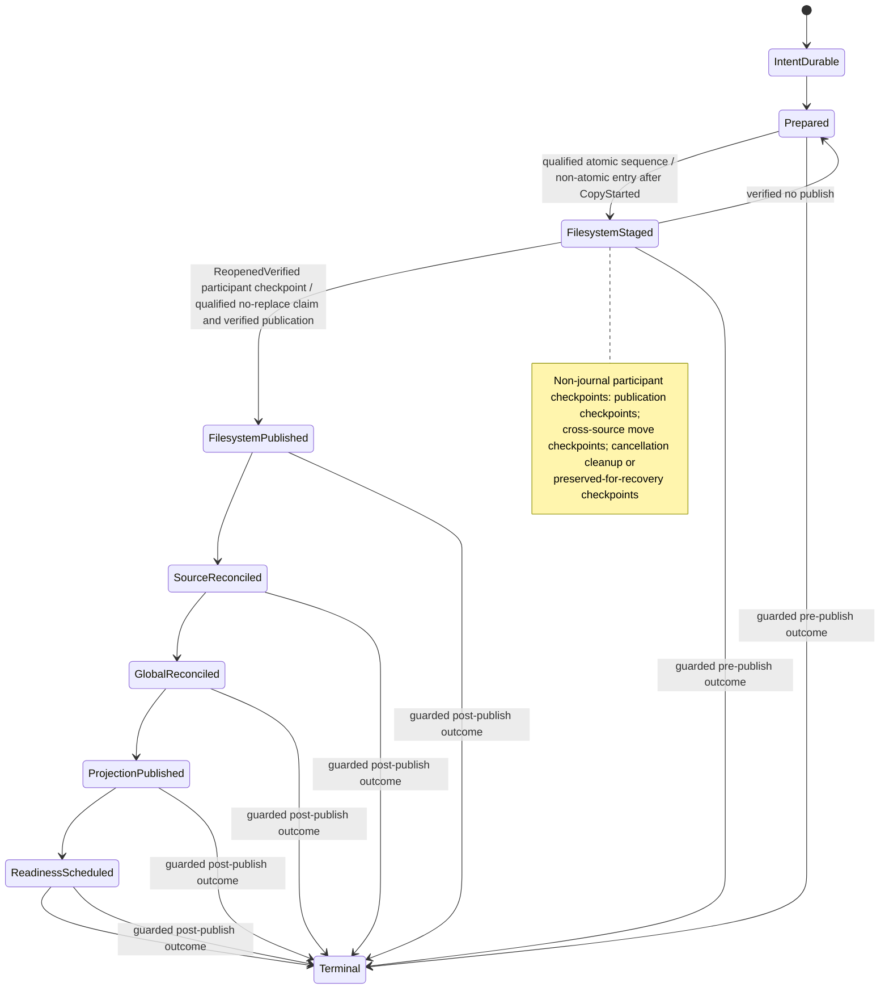

# Wavecrate End-to-End I/O Architecture Target

Status: target design; documentation-only proposal. No implementation, schema, dependency,
migration, behavior, or test change is implied by this document.

## Scope, authority, and reading order

This document describes the ideal end-to-end ownership and ordering of Wavecrate's
filesystem I/O, source-database I/O, global-library persistence, Harvest persistence,
rating/history persistence, browser projection, readiness/source processing, and
rebuildable artifacts. It is the detailed I/O authority for those concerns.

It is subordinate to the product principles and user-visible direction in
[`docs/TARGET.md`](TARGET.md). Read `docs/TARGET.md` first for product intent, filesystem
source-of-truth, protected-source policy, no-follow requirements, GUI boundaries, and
readiness meaning. [`docs/DATABASE_MIGRATIONS.md`](DATABASE_MIGRATIONS.md) remains
authoritative for schema versions, DDL, compatibility opens, migration tests, and the
mechanics of shipping a schema change. This document may define a journal or identity
concept without authorizing a schema change; any eventual schema work follows the
migration contract.

The target covers:

- extraction, copy, create, duplicate, import, export, and handoff artifacts;
- move, rename, trash, delete, destructive edit, undo, and redo;
- external Finder or Explorer changes and watcher recovery;
- source-database commits and revisions;
- the global library, Harvest, rating, listen-history, and transaction-history writes;
- browser and folder projection publication;
- readiness, metadata, analysis, waveform and other cache artifacts;
- cancellation, admission, backpressure, fairness, retries, shutdown, and crash recovery;
- busy databases, partial failures, diagnostics, and user-facing status.

It does not authorize implementing all of these flows in one change. Delivery is phased
in [Phased delivery](#phased-delivery).

## Current evidence and target recommendations

The following are deliberately separated. The first table records evidence available at
the design head `a982c4844c1d098a079ebc3d172db23dd29540d`; it is not a claim that every
path has the same behavior. The second table is a recommendation for the target system,
not a description of current production behavior.

### Established or explicitly reported current evidence

| Evidence | Boundary and implication |
| --- | --- |
| Source-database connection profiles currently use a 5,000 ms busy timeout for background, job, user-metadata, and maintenance roles; UI reads use 25 ms and playback-history writes use 100 ms (`crates/wavecrate-library/src/sample_sources/db/open_profiles.rs`, with role tests under `tests/unit/source_db_mod_tests/opening/`). | A busy open/write can wait roughly five seconds and then yield `Database is busy`. Busy handling is therefore a scheduling concern as well as an error-display concern. |
| A successful extraction can publish its filesystem output before source reconciliation succeeds, after which browser visibility is delayed. | Filesystem publish and source registration are not yet one universally recoverable ordered contract. A design must make the partial state explicit and retryable. |
| The current source-operation journal uses `staged_relative_for_target` to derive a staging name beside the destination final path. | This is destination-local staging only when the resolved staging and final paths are on the same filesystem; the helper itself does not establish same-device or rename durability. |
| Write-capable source and global-library databases use `wal_autocheckpoint=4096` and `journal_size_limit=67108864`. Passive checkpointing is considered at 32 MiB, throttled to once per database every 15 seconds, uses `PASSIVE`, has a 250 ms busy timeout, and logs `wal_bytes_before/after`, `busy`, `log_frames`, `checkpointed_frames`, and elapsed time. | Active reader snapshots can still retain WAL frames, so these settings are bounded maintenance policy, not a guarantee of an unbounded-WAL-safe system. |
| Source DBs expose `maybe_checkpoint_wal` for non-read-only roles. Global-library opens are guarded by the process-local `LIBRARY_LOCK`. | The helper and mutex are current in-process mechanisms; neither is cross-process writable ownership or cross-database saga coordination. |
| Watcher publication can be deferred while a scan is already running (`src/native_app/sample_library/folder_scan_actions/filesystem_refresh.rs` and the source watcher/scan lifecycle). | A watcher event is not itself publication authority. It must be retained as evidence and reconciled after the current committed revision is known. |
| PR #980's real native-app run confirmed Finder creation/duplication and exposed event-shape and performance differences from synthetic path fixtures; its known limitations still require fresh real-app acceptance for rename, cross-parent move, and deletion. Per-event full metadata snapshots and recursive hydration regress performance. | The target Finder contract must preserve raw events, normalize affected regions conservatively, and use bounded revisioned deltas. It must not turn each event into a full source snapshot. See [Finder contract](#finder-and-external-filesystem-contract). |
| UI starvation has not been established as the root cause of the current interaction reports. | The target still prohibits UI-thread I/O, but this document does not claim that all observed stalls are caused by UI starvation. Scheduler, persistence, and operation paths need separate measurements. |
| Retained-visual waveform behavior is a separate concern. | Waveform retained visuals and their correctness are out of scope here except for the rule that waveform/cache work is an artifact consumer and must not own source publication. |

These observations are current evidence for designing recovery boundaries. They are not
acceptance claims for the target and must be re-verified before implementation work relies
on their exact timings or messages.

### Target recommendations

| Recommendation | Required target property |
| --- | --- |
| One I/O coordinator admits every durable user operation and every external-source reconciliation. | No operation can silently bypass journaling, source revision publication, status, or recovery. |
| A durable app-local journal records accepted intent before any application-owned filesystem mutation. | Power loss after intent but before filesystem work is recoverable and user-visible. |
| Atomic namespace publication requires a verified no-follow target-root capability, live staging/final co-location, and a qualified descriptor/handle-bound atomic no-replace final claim. | Whole-publication atomicity additionally requires every applicable source/input-to-staging transfer and the final claim to use a qualified atomic sequence; any bytewise or otherwise unqualified transfer is `WholePublicationNonAtomic`, including on one volume. Cross-device or otherwise unavailable same-filesystem publication copies completely into destination-local same-folder staging, then uses the same qualified no-replace final claim. |
| Filesystem work is performed outside SQLite transactions, then source and global databases are reconciled through bounded commits. | SQLite locks never span copying, hashing, decoding, recursive traversal, or arbitrary file latency. |
| One profile-wide process owner protects writable access for a profile, with a per-source lease/epoch as defense in depth. | A second process gets safe read-only access or typed actionable ownership status; SQLite commit serialization alone cannot coordinate a multi-database saga. |
| A non-UI WAL maintenance owner runs passive, throttled checkpoints and bounds reader snapshots. | Interactive paths never block on checkpointing; WAL retention, incomplete maintenance, and disk pressure remain observable and recoverable. |
| Watchers are evidence; a committed source revision and its structured delta are publication authority. | Duplicate, late, reordered, incomplete, and overflow events cannot roll back a newer browser projection. |
| Every result carries operation, source, lifecycle, and revision fences. | Stale workers may finish safely but cannot overwrite newer state. |
| Caches are rebuildable and best effort. | Cache loss cannot make source metadata, user intent, or source readiness disappear. |

## Terminology

- **Physical source**: one configured filesystem root and its source-local `.wavecrate.db`.
- **Source identity**: a stable identity for the physical root, not merely its current path.
- **Source revision**: a monotonically increasing committed revision for source membership,
  path, identity, and structural directory truth. It is assigned only by the source DB
  writer owner after a bounded transaction commits.
- **Committed delta**: the bounded, revisioned description of what changed in a source;
  it may contain exact entries, subtree effects, directory truth, deletions, or an audit
  requirement.
- **Artifact identity**: the tuple that proves what a derived payload represents: source
  or sample identity, content/path generation, artifact kind, algorithm/schema version,
  settings, and producer version.
- **Operation**: one user command or external reconciliation saga with one durable
  operation ID, intent, phases, disposition, status, and recovery record.
- **Participant checkpoint**: durable evidence from one owner that permits the coordinator
  to advance an operation without adding a journal phase. Cross-source move, watcher
  continuity, reserve recovery, and pre-publish cancellation checkpoints are participant
  evidence, not Mermaid state nodes.
- **Publication**: making a committed source revision and its bounded projection visible
  to downstream consumers. A filesystem write or watcher callback is not publication.
- **Watcher continuity proof**: the tuple of source/root identity, backend stream identity,
  watcher generation, durable last-ack cursor/token, and contiguous replay coverage from that
  cursor to the evidence batch boundary.
- **Recovery reserve charge**: a durable, serialized per-volume recovery-only reservation
  with an exact bounded byte budget, control-plane margin, spend/reconstitution state, and
  operation linkage. It is not ordinary capacity.
- **Readiness**: durable desired/observed artifact state for a source identity and revision;
  cache availability alone is never readiness.
- **Region**: the smallest filesystem area whose truth may have changed. Regions widen from
  exact entries to subtrees to a source audit when evidence is uncertain.
- **Routine maintenance**: low-value work that may be deferred or skipped under contention
  and must not own foreground user progress.
- **Physical owner**: the serialized component allowed to perform a named class of side
  effects. A task may request work but may not perform another owner's side effect directly.
- **RejectedBeforeIntent**: a typed, non-durable coordinator admission result returned when
  validation, ownership, bounded-queue, or initial-capacity admission fails before journal
  intent commits. It creates no durable `OperationId`, journal record, participant checkpoint,
  retry lease, or restart-visible status. It carries a stable cause, user message, retry
  condition, and safe action; retry is a new attempt.
- **Verified target-root capability**: a live, no-follow capability for the destination root
  that proves root identity, protected-source policy, and canonical containment. It is the
  authority for every destination final-name claim, recovery publication, cleanup, rollback,
  unlink, move, link, disposition, and adoption; a pathname or recovery hint is not that
  capability.
- **Atomic no-replace final claim**: the qualified platform/filesystem primitive that, relative
  to the verified target-root capability or an equivalent bound handle, installs a complete
  staged entry at an absent final name and fails if any entry already exists. It never replaces,
  deletes, or modifies the existing entry. The target requires equivalent semantics, not a
  particular platform API name.
- **Transaction-owned object**: an object whose filesystem identity was recorded by this
  operation after a successful claim or creation and whose reopened handle/content passed the
  operation's verification. A matching pathname or journal stage alone never establishes
  ownership.

## Principles and invariants

These are normative target invariants.

1. The UI thread performs no filesystem I/O, SQLite I/O, schema or migration work,
   recursive hydration, hashing, cache writes, or logging flushes that can block. It may
   capture lightweight command intent, render optimistic state, and apply already-prepared,
   bounded results.
2. Filesystem work always occurs outside SQLite transactions. Transactions are bounded by
   known row/page work and never span copy, move, hashing, decoding, recursive traversal,
   user prompts, watcher debounce, or retry sleep.
3. An operation is accepted only after `IntentDurable`. Validation, ownership, bounded-queue,
   and initial-capacity admission all precede every application-owned journal, filesystem,
   SQLite, WAL, or SHM side effect. Once filesystem state changes, reconciliation remains
   recoverable until a terminal disposition is durably recorded.
4. A filesystem publish before source reconciliation is a recoverable partial operation,
   not an implicit success and not a reason to make the user repeat the command blindly.
5. Watchers provide raw evidence. The committed source revision, source identity, and
   structured delta from the per-physical-source DB writer are publication authority.
6. Every asynchronous result is fenced by operation ID, source identity, source revision
   (or expected revision), lifecycle generation, and where relevant sample/content
   generation and artifact key. Late results are dropped or converted into a retry/audit
   request; they never mutate newer state.
7. Caches and analysis artifacts are rebuildable and best effort. They can be missing,
   stale, evicted, or corrupt without deleting user metadata or making the source appear
   uncommitted.
8. Cross-database work is an idempotent saga. No transaction pretends SQLite can atomically
   commit a source DB and the global library DB; each participant has an idempotent step,
   durable intent, a retry disposition, and a reconciliation query.
9. One writer owner serializes writes for each physical source DB across all Wavecrate
   processes sharing a profile. The initial durable policy is one profile-wide process lock
   plus a per-source lease/epoch as defense in depth. Other code sends typed commands to that
   owner and cannot open competing writable connections for the same physical database.
10. Busy/locked is a scheduler and retry condition. After a filesystem publish, it is not
    a user-visible terminal error until bounded retries, recovery, and a deliberate
    diagnostic disposition have been exhausted.
11. No-follow, capability-relative root access, canonical containment, protected-source
    restrictions, and database-sidecar safety apply to every filesystem path, including
    journal paths, staging, trash, cache references, watcher-derived paths, and recovery.
12. Cancellation stops admission and future work where safe; it does not erase durable
    intent, abandon a published file, or claim that a partial operation never happened.
13. Bounded deltas are the normal publication path. A gap, uncertainty, overflow, failed
    verification, or missing directory truth widens the affected region and eventually
    requests a conservative source audit.
14. User status describes the operation's durable disposition, not the last worker callback.
    It remains actionable across retries, restart, and partial failure. A pre-intent
    `RejectedBeforeIntent` result instead says that work was not started and is not durable;
    it has no restart-visible operation status.
15. Protected recovery capacity is a separate admission invariant. For every distinct
    affected writable volume, the initial target preserves a non-sparse 256 MiB protected
    floor. Before any application-owned journal, filesystem, SQLite, WAL, or SHM side
    effect, admission aggregates and claims a conservative peak allocation on each such
    volume for destination-local staging, the no-replace final claim, the journal,
    source and global databases plus their WAL/SHM, and any coexisting backup, replacement,
    or recovery payload. A same-volume rename does not double-count one identical
    allocation; coexisting allocations do count separately. Unbounded output requires an
    initial bounded claim and a bounded claim before each chunk write. If the initial claim
    fails, the coordinator releases provisional claims and returns `RejectedBeforeIntent`
    with `RecoveryReserveLow` or `DiskPressureRecoveryOnly`; it creates no journal or
    disposition. After `IntentDurable`, a failed claim is `RetryPending` when no incomplete
    participant is known, or `PartialNeedsRetry` only when a durable participant checkpoint
    proves incomplete work. Ordinary work cannot consume the protected floor; recovery-only
    use follows the serialized charge/spend/reconstitute protocol below.
16. A cross-source move publishes and reopens the destination before committing
    `DestinationSourceReconciled`, durably records origin-removal intent before any origin
    mutation, verifies capability-bound origin absence, and retires origin membership only
    after that proof. Both copies, uncertain absence, or ambiguous identity preserve evidence
    and remain recoverable; they never become silent success or destructive cleanup.
17. Watcher-derived publication requires a `WatcherContinuityProof`. Memory-only evidence,
    an absent or non-replayable cursor, a gap, a source/root, stream, or generation change, or
    any otherwise unprovable coverage retains the last good projection and requires a
    conservative affected-region or source audit before watcher-derived publication.
18. A pre-publish cancellation is not terminal until staging, if any, has either been
    capability-bound verified absent and its capacity claim durably released, or has been
    durably preserved for recovery with its capacity still accounted. Uncertain or preserved
    staging remains actionable and nonterminal.
19. Every final destination claim and every recovery publication, cleanup, rollback, unlink,
    move, link, disposition, or adoption is performed through the verified no-follow target-root
    capability (or the verified no-follow source-root capability for an origin operation),
    descriptor-relative or handle-bound, with the expected filesystem identity checked live.
    A final-name claim always uses a qualified atomic no-replace primitive. There is no
    pathname move, link, unlink, replace, or cleanup fallback.
20. Planning-time absence of a final destination is advisory. The final claim revalidates the
    live target-root capability and fails closed on any existing or newly appeared entry. A late
    collision never replaces, deletes, or modifies an unrelated entry: the source and complete staging are preserved,
    ownership is classified by filesystem identity, and recovery adopts
    only a transaction-owned reopened/content-verified final; otherwise it re-enters collision
    policy or remains nonterminal `AuditRequired`/`RetryPending`.
21. A destructive edit may replace an already verified transaction-owned object only through a
    qualified handle-bound replacement operation with the expected identity held and checked.
    That intentional replacement is distinct from claiming an absent final destination and is
    not permission to replace an entry that appeared after planning.
22. A platform or filesystem without the equivalent descriptor/handle-bound atomic no-replace
    primitive fails closed before final publication. That final-publication failure does not by
    itself block cleanup or disposition when its independently qualified handle-bound operation
    is available. If safe cleanup or disposition is independently unavailable or unqualified,
    it fails closed, preserves complete staging, source, capacity claims, and journal evidence
    as applicable, and never falls back to pathname move, hard-link, unlink, replace, or cleanup
    helpers.

## Identities, lifecycle, and revision fences

### Typed identities

The target APIs should make these values distinct types, even if an initial implementation
uses wrappers over strings or integers:

| Identity | Contents | Used to fence |
| --- | --- | --- |
| `OperationId` | Durable UUID | All phases, retries, watcher echo acknowledgement, status, and recovery. |
| `PhysicalSourceId` | Stable root/database identity plus validated root capability | Source writer ownership and cross-process recovery. |
| `VerifiedTargetRootCapability` | Live no-follow destination-root capability, root identity, and qualified primitive set | Every destination final claim, recovery mutation, cleanup, rollback, disposition, and adoption. |
| `FilesystemIdentity` | Device/volume and file identity captured from a bound handle | Collision classification and transaction ownership; never inferred from a path. |
| `TransactionOwnedObject` | Operation ID plus `FilesystemIdentity` and reopened/content-verified evidence | Safe adoption or intentional destructive-edit replacement only. |
| `SourceRevision` | Monotonic committed source revision | Manifest, directory truth, browser delta, and readiness wake. |
| `LifecycleGeneration` | Source/session generation | Removed/replaced roots, shutdown, and reopened source instances. |
| `SampleIdentity` | Stable Wavecrate sample identity where available | Metadata, rating, history, Harvest, and artifact ownership across path changes. |
| `ContentGeneration` | Content identity/fingerprint plus file generation | Hash, metadata, waveform, analysis, and cache validity. |
| `ArtifactKey` | Kind, identity, generation, algorithm/version/settings | Rebuildable artifact storage and deduplication. |
| `ProjectionRevision` | Projection version plus source revision | Browser application and gap fallback. |
| `JournalSequence` | Durable append/update sequence | Recovery ordering and diagnostics, not source publication authority. |

Path is a locator, not a durable sample identity. A path-only rename changes location
generation and directory truth but may retain content-derived readiness. A content change
creates a new content generation and invalidates content-derived artifacts. A delete retires
the live membership while retaining recovery metadata as policy allows.

### Fencing rule

Every command carries the source identity, expected lifecycle generation, and an optional
expected source revision. The writer owner accepts a command when the physical source is
still current and the revision precondition is satisfied. It commits the next revision and
returns the exact delta. If the precondition is stale, it returns `Superseded` or requests
an audit; it does not merge a stale snapshot opportunistically.

## Logical and physical ownership

The following owners are the target side-effect boundaries. “Owner” means serialized
authority, not necessarily one OS thread.

| Owner | Owns | Must not own |
| --- | --- | --- |
| **I/O coordinator** | Admission, operation IDs, dependency ordering, priorities, cancellation, retry leases, saga progression, terminal disposition, status publication. | Direct filesystem or SQL work. |
| **Durable app-local journal** | Durable operation intent, phase/disposition records, recovery hints, status history, and append/update durability. | Source manifest truth or arbitrary user metadata. |
| **File operation owner** | Capability-relative staging, copy/create/write, qualified no-replace final claims, handle-bound rename/move/trash/delete/disposition, verified transaction-owned destructive-edit replacement, fsync, and filesystem verification. | SQLite transactions or browser projection. |
| **Per-physical-source DB writer owner** | One writable SQLite connection/queue, bounded transactions, source manifest/identity/directory revision, source-local metadata, readiness rows, and source journal steps. | Filesystem traversal, copy, hashing, cache payload writes, or another source. |
| **Global-library owner** | `library.db` source registry, global metadata/index references, global operation links, and global cache/artifact references. | Source-local manifest truth or physical file mutation. |
| **Harvest owner** | Harvest derivation identity, origin/destination relationship, routing, and idempotent derivation persistence. | Rendering or copying bytes. |
| **Projection publisher** | Bounded revisioned browser/folder/status projection assembly and application. | Filesystem/SQLite reads during UI application. |
| **Artifact store** | Capability-bound, atomic no-replace cache/artifact payload claims, identity validation, retention, eviction, and rebuild requests. | Durable user metadata or source membership. |

The universal journal, its recovery records, and every writable participant are profile-owned.
The durable writable-owner scope is the profile, not the process. The required acquisition
order is: (1) acquire the profile-wide process lock, (2) open and validate the universal
journal writable, (3) mutate journal recovery state and admit durable operations, (4) open the
global-library writer and acquire source leases/epochs, and (5) admit source/DB writer work.
No step may be reordered to let a process inspect-and-repair the writable journal, recover
operations, accept durable intent, open a writable database, or acquire a source lease before
the profile lock is held.

The first policy acquires one profile-wide process lock before opening any writable global or
source database, then acquires a per-source lease with a monotonically fenced epoch before
source writes. Stale owner recovery covers both the profile-wide process owner and each
per-source lease/epoch: takeover requires the profile lock to be demonstrably released or its
owner demonstrably not live, the source lease to be expired, and live filesystem and database
verification to agree that takeover is safe. An active owner is never taken over. A process
that cannot acquire the profile lock must not open the journal writable, mutate recovery,
admit durable work, open writable database connections, or acquire source leases. It remains a
bounded read-only process, or forwards a typed command to the owner, and surfaces the distinct
profile status `ProfileOwnedByAnotherProcess`. A source lease conflict is evaluated only after
this process has established profile ownership and surfaces
`WritableSourceOwnedByAnotherProcess`. These statuses are non-aliasing: the profile status
means exclusively failure to acquire the live profile lock, while the source status means
exclusively an independently live source lease/epoch conflict after profile ownership is
established. A process that has not established profile ownership must never report the
source status, and a process with profile ownership must not relabel an independent source
lease conflict as profile ownership failure. SQLite's own commit serialization does not
coordinate these locks, leases, or the app-local multi-database saga.

The profile lock is released last: after admission is closed, high-value journal and
participant checkpoints are durable, source leases/epochs are released, the writable journal
is closed, and ownership state is recorded. A losing process may render bounded retained data
and observe status, but it cannot silently become a write owner.

Read owners may use separate read-only connections or prepared snapshots, but they never
become hidden write owners. A caller submits a typed request; the owner returns a typed
result or a durable retry disposition.

## Universal operation journal

The journal is app-local and universal. Source-local file-operation journal state may remain
for source-local compatibility, but it is a participant in this larger operation rather than
the sole record of extraction, global persistence, or projection state.

### Record shape

No operation record shape exists until both bounded-queue and initial-capacity admission
have passed. The coordinator may hold only provisional, non-durable claims while evaluating
those gates. Once they pass, the capacity plan and claims are included in the journal record
shape and committed together with `IntentDurable`. A request rejected at either gate is
`RejectedBeforeIntent` and has no operation record, durable ID, or disposition.

An operation record contains at least:

- operation ID, parent/compound operation ID, command kind, actor (`User` or `ExternalFs`),
  creation and last-progress timestamps;
- source identity and lifecycle generation for every participant;
- verified source/target-root capability references, validated before/after region descriptors,
  sample/content identities, and collision policy; stored paths remain locators only;
- intended side effects and inherited metadata snapshot references, without embedding
  unbounded file contents or full source snapshots;
- a per-distinct-volume capacity plan containing the protected floor, conservative peak
  allocation classes and amounts, existing/coexisting claims, claim/release state, and
  volume identity for every affected writable volume;
- publication mode (`AtomicDestinationNoReplace` or `NonAtomicCopyValidatePublish`), visibility
  boundary (`VisibilityVerified` or `VisibilityUnverified`), final namespace claim
  (`AtomicNamespace` or `NonAtomicNamespace`) scoped to the final-name claim, and whole-
  publication atomicity (`WholePublicationAtomic` or `WholePublicationNonAtomic`),
  selected from live source/staging/final device or volume identities and the actual
  source-to-staging primitive and its qualification; final publication qualification is
  recorded separately from independently qualified handle-bound cleanup/disposition,
  synchronization evidence (`PowerLossSynchronized`, `BestEffortSync`, or
  `SyncUnsupportedOrUnverified`), and the ordered verification/synchronization checkpoints
  required by that mode, including primitive qualification and no-replace claim result;
- phase, disposition, retry count/lease, cancellation request, and user-status key;
- participant checkpoints for filesystem, source DB, global DB, Harvest, projection,
  readiness, and artifacts, including cross-source move ordering and pre-publish cancellation
  cleanup/preservation evidence;
- per-volume recovery-reserve ledger reference, charge ID, exact bounded charge/spend budget,
  control-plane margin, serialized charge state, and reconstitution evidence when recovery-only
  capacity is used;
- final/staged filesystem identities, collision observations, transaction-ownership and
  adoption evidence, and cleanup/disposition results;
- recovery hints that are non-authoritative relative locators only; recovery reacquires a live
  capability and descriptor/handle, revalidates identity and containment, and never executes a
  pathname operation from a hint;
- error class, stable diagnostic code, bounded context, and redaction-safe details.

Durable intent is committed before application-owned filesystem mutation. Journal updates
are small and bounded; large metadata snapshots live in a separately managed durable record
or are re-read from authoritative owners during recovery. `Accepted` may acknowledge the
request at an API boundary only after `IntentDurable`; it is not a journal phase.

### Publication durability contract

Publication has four deliberately separate claims. `VisibilityVerified` means that the
destination namespace was observed through the verified target-root capability after the
operation and the reopened final object passed the selected identity/length or hash
verification. `AtomicNamespace` is only final-name evidence: live staging and final device/volume
identities match; a qualified descriptor/handle-bound atomic no-replace claim installs the
complete staged object at an absent final name without collision; and the claimed final is
reopened, content-verified, and proven transaction-owned. It does not make source-to-
destination staging or the whole publication atomic, and it does not mean that an existing
entry was replaced. `WholePublicationAtomic` is stronger end-to-end evidence: every applicable
source/input-to-staging transfer and the final claim use the qualified atomic sequence. Any
bytewise source-to-staging copy, even on one volume, is `WholePublicationNonAtomic`. In
particular, source A to destination-local staging/final B uses
`NonAtomicCopyValidatePublish`, records `AtomicNamespace` only if the final claim succeeds,
and records `WholePublicationNonAtomic`. `PowerLossSynchronized`
means that the platform-specific file and namespace synchronization sequence below completed
and produced evidence; it is not implied by visibility or namespace atomicity. A faulty,
remote, removable, or otherwise unverified medium can acknowledge a flush without making a
guarantee about the medium's actual power-loss behavior, so Wavecrate never turns a flush call
into a claim about faulty or remote media.

`NonAtomicNamespace` is attempted but unverified or unqualified final-name evidence only. It is
nonterminal and cannot be a successful `FilesystemPublished` result. A successful
`NonAtomicCopyValidatePublish` final claim therefore records `AtomicNamespace`, not
`NonAtomicNamespace`, while its whole-publication value remains `WholePublicationNonAtomic`.

The semantic boundary is resolved as follows: mode selection uses the live source, staging,
and final device/volume identities plus the actual source-to-staging primitive. If source !=
staging, or the transfer is bytewise or unqualified, select
`NonAtomicCopyValidatePublish`. If staging != final, re-stage beside final
or fail closed. Only source=staging=final permits consideration of `WholePublicationAtomic`,
and identity changes reclassify the operation for retry or audit. `FilesystemPublished` is
entered only after a qualified final claim and visibility/content verification. Its record must
state final namespace claim, whole-publication atomicity, no-replace primitive
qualification/result, synchronization evidence, and independent cleanup/disposition
qualification/result separately. A final-publication no-replace qualification does not qualify
cleanup or disposition; each uses its own qualified handle-bound operation. No pathname
fallback is permitted. A qualified final claim may record `AtomicNamespace` for either
publication mode. A qualified final claim without stronger synchronization may enter with
`VisibilityVerified`, the appropriate whole-publication value, and an explicit durability
downgrade. Platform benchmarking, fault injection, and the exact set of filesystems that
qualify remain implementation-time validation, not an undecided semantic boundary.

For a destination classified as local and supported, the target sequences are:

| Profile | Ordered target sequence and resulting claims |
| --- | --- |
| macOS/local POSIX | Use live source/staging/final device or volume identities and the actual source-to-staging primitive. Only when source=staging=final and every applicable transfer is qualified atomic may the sequence be considered for `WholePublicationAtomic`: 1. Open the verified no-follow target-root capability and create or receive the staging object beside the final name. 2. Validate staged identity/length or hash. 3. Synchronize the staged file with `F_FULLFSYNC` where supported; if unavailable or rejected, use `fsync` and record downgraded synchronization evidence. 4. Use the qualified descriptor-relative atomic no-replace final claim; an existing final entry is a collision, not a replacement. 5. Synchronize destination directory metadata where supported and record unsupported-directory-sync evidence otherwise. 6. Reopen the claimed final through the same capability, verify identity/content, and record ownership. Record `AtomicNamespace`; record `WholePublicationAtomic` only for the qualified all-atomic sequence. Any bytewise source-to-staging copy, even same-volume, uses `NonAtomicCopyValidatePublish` and records `WholePublicationNonAtomic`. |
| Windows/local | Use live source/staging/final device or volume identities and the actual source-to-staging primitive. Only when source=staging=final and every applicable transfer is qualified atomic may the sequence be considered for `WholePublicationAtomic`: 1. Open the verified no-follow target-root capability and create or receive the staging object on the destination volume beside the final name. 2. Validate staged identity/length or hash. 3. Call `FlushFileBuffers` on the staged handle. 4. Use the qualified handle-bound atomic no-replace final claim with the platform's write-through option; an existing final entry is a collision, not a replace/move target. 5. Synchronize destination metadata where a tested primitive supports it and record downgrade evidence otherwise. 6. Reopen the claimed final through the bound handle/capability, flush/verify it, and record ownership. Record `AtomicNamespace`; record `WholePublicationAtomic` only for the qualified all-atomic sequence. Any bytewise source-to-staging copy, even same-volume, uses `NonAtomicCopyValidatePublish` and records `WholePublicationNonAtomic`. |
| Cross-device, remote, removable, or otherwise unqualified synchronization | Use `NonAtomicCopyValidatePublish`: copy completely into staging beside the final on the final live device/volume, validate it, and use the qualified descriptor/handle-bound atomic no-replace final claim before reopen/source reconciliation. Record `AtomicNamespace` only if that final claim succeeds, then record `WholePublicationNonAtomic` and explicit synchronization downgrade. If staging != final, re-stage beside final or fail closed. If no qualified final no-replace primitive exists, fail closed before final publication; cleanup/disposition must separately qualify its own handle-bound operation. Retain staging, source, claims, and journal evidence. |

`NonAtomicCopyValidatePublish` is selected for source != staging or any bytewise/unqualified
source-to-staging transfer, including a bytewise copy on one volume. Its final namespace
claim still uses the qualified atomic no-replace primitive and may record `AtomicNamespace`
only when staging/final live identities are co-located and the claim succeeds. If staging !=
final, re-stage beside final or fail closed. It has seven participant
checkpoints, not seven journal phases. The normative mapping is:

| Participant checkpoint | Journal phase after the checkpoint | Interruption or advancement guard |
| --- | --- | --- |
| `CopyStarted` | `FilesystemStaged` | Copy into destination-local same-folder staging and capture source/staged identities; interruption leaves `PartialNeedsRetry` at this checkpoint. |
| `CopyProgress` | `FilesystemStaged` | Record bounded byte offsets; interruption leaves `PartialNeedsRetry` at the last durable offset and the next chunk requires a fresh pre-write capacity claim. The final name is not the copy target. |
| `DestinationFlushAttempted` | `FilesystemStaged` | Record the actual destination-local staging flush result and media caveat; interruption leaves `PartialNeedsRetry`. |
| `CopyValidated` | `FilesystemStaged` | Verify complete staged identity/length or hash; interruption leaves `PartialNeedsRetry`. |
| `PublishStarted` | `FilesystemStaged` | Use the qualified descriptor/handle-bound atomic no-replace final claim. A successful claim records `AtomicNamespace` for the final namespace; a late collision does not modify the existing entry, and interruption leaves `PartialNeedsRetry` with complete staging preserved for live inspection. |
| `PublishObserved` | `FilesystemStaged` | Observe the destination namespace through the target-root capability; interruption leaves `PartialNeedsRetry`, and live identity checks determine adoption, collision policy, or audit. The observation does not change the final-claim scope. |
| `ReopenedVerified` | `FilesystemPublished` | Reopen the claimed final through the same capability and verify content/identity. Only this checkpoint advances the non-atomic operation, with `VisibilityVerified`, `AtomicNamespace` for the final claim, `WholePublicationNonAtomic`, and downgraded synchronization evidence. |

The first six checkpoints therefore remain `FilesystemStaged`; the fallback copies only into
destination-local staging and does not claim `WholePublicationAtomic` or
`PowerLossSynchronized`. Its final no-replace claim may still record `AtomicNamespace`. A
crash or verification failure leaves the record at the last checkpoint with
`PartialNeedsRetry`. Recovery reacquires the target-root capability and compares source,
staging, and final live identities before resuming. A final entry may be adopted only when it
is a transaction-owned reopened/content-verified object; a late collision otherwise re-enters
collision policy or remains `AuditRequired`/`RetryPending`, with source and complete staging
preserved. No path replaces, deletes, or modifies an unrelated entry. If a destination cannot
be reopened or verified, it remains partial and does not enter `FilesystemPublished`.

On either path, a failed synchronization or unavailable no-replace primitive is evidence of a
failed or downgraded step, not permission to continue with a stronger claim. The journal
retains the attempted primitive, qualification/result, filesystem classification, capability
identity, collision observation, and verification result so later recovery can narrow or widen
the claim without guessing. Cleanup, rollback, unlink, move, link, disposition, and adoption
require independently qualified handle-bound operations; final-publication qualification does
not qualify cleanup or disposition. None re-resolves a hint or falls back to a pathname helper.

### Cross-source move participant ordering

A cross-source move has one durable operation but two independently owned source participants.
This ordering applies to every copy-then-remove move, including one source moved across
devices. The ordered target contract is:

1. complete destination-local staging, make the qualified no-replace final claim, and
   reopen/content-verify the destination;
2. commit the destination source and record `DestinationSourceReconciled`;
3. durably record the origin-removal intent, including the origin source identity, verified
   no-follow capability, expected identity/path locator, sample/content identity, and
   operation ID, as
   `OriginRemovalStarted` before mutating the origin;
4. perform the physical origin mutation through the verified no-follow origin capability and
   an expected-identity handle-bound disposition;
5. verify capability-bound absence of the expected origin object and record
   `OriginAbsenceVerified`;
6. commit origin source retirement, which completes the source participants; and
7. run the remaining global/Harvest rekey, projection, and readiness work.

These are participant checkpoints while the journal phase remains `FilesystemPublished`; the
phase advances to `SourceReconciled` only after origin retirement commits. They do not add a
journal phase or a Mermaid state node. A crash after `OriginRemovalStarted` reacquires both
verified no-follow capabilities and reopens both locations by descriptor/handle before retrying:
a missing origin with one verified destination may continue to absence verification, an
unchanged origin may retry the expected-identity disposition, and both copies, a replacement
object, or an identity mismatch must preserve both copies and widen to `AuditRequired` or
`FailedDataLossRisk`. An unproven absence never retires the origin source. A capability or
identity ambiguity is not permission to delete either copy.

For a cross-source move, `Succeeded` additionally requires all seven ordering outcomes,
including destination reconciliation, durable origin-removal intent, verified origin absence,
origin retirement, and all required downstream participants. `CancelledAfterPublish` requires
the destination outcome and a complete, explicitly chosen forward or compensating recovery
record; it cannot claim that the origin was untouched after removal intent. `RolledBack`
requires verified destination compensation plus verified origin presence/source restoration
when origin mutation had begun. If either proof is unavailable, the operation remains resumable
or enters a guarded failure disposition with both possible files preserved.

### Phases and dispositions

The durable phase machine begins at `IntentDurable`; `Accepted` is not a phase. The normal
phase order is:

1. `IntentDurable`: queue and initial-capacity admission passed, the journal record shape,
   capacity plan, and claims are durable, and no application filesystem mutation has run.
2. `Prepared`: capabilities, collision plan, source participants, and safe staging paths
   are resolved without touching the UI. The target-root capability and qualified no-replace
   primitive are live and validated here, but planning-time final absence remains advisory.
3. `FilesystemStaged`: bytes or edit output are in an app-owned staging location on the
   destination filesystem, complete and verified enough to publish. For the non-atomic
   fallback, this phase is also the participant-checkpoint container described above: the full
   copy is complete in destination-local same-folder staging, but the final claim has not yet
   occurred. It does not imply completed publication or `WholePublicationAtomic`; the later
   final claim may still establish `AtomicNamespace`.
4. `FilesystemPublished`: the final namespace is visible after a qualified descriptor/handle-
   bound atomic no-replace claim and the reopened final object is verified. The record
   separately reports final namespace-claim scope, whole-publication atomicity, and power-loss
   synchronization evidence according to [Publication durability contract](#publication-durability-contract).
5. `SourceReconciled`: each affected physical source has committed its manifest, identity,
   directory, and source-local metadata delta. For a cross-source move this phase is reached
   only after `DestinationSourceReconciled`, `OriginRemovalStarted`,
   `OriginAbsenceVerified`, physical origin mutation, and origin source retirement.
6. `GlobalReconciled`: all required global-library and Harvest participants are `Applied` or
   `NotApplicable`; only optional rebuildable artifact work may remain deferred, represented
   by the later `SucceededWithDeferredArtifacts` terminal disposition.
7. `ProjectionPublished`: the bounded projection for the committed revision is visible;
   a gap may instead record `AuditRequired`.
8. `ReadinessScheduled`: exact desired artifact deficits are durable and a coordinator wake
   is published after source publication.
9. `Terminal`: a success, cancelled, rolled-back, blocked, or manual-recovery disposition
    is durable. A retryable participant checkpoint is durable but remains resumable until
    it reaches a terminal disposition.

Resumable dispositions are `RetryPending`, `PartialNeedsRetry`, `AuditRequired`,
`CancelRequestedBeforePublish`, and `CancelRequestedAfterPublish`.
Terminal dispositions are `Succeeded`, `SucceededWithDeferredArtifacts`,
`CancelledBeforePublish`, `CancelledAfterPublish`, `RolledBack`, `BlockedByUser`,
`FailedPreservingData`, and `FailedDataLossRisk`.
The last disposition is a diagnostic escalation, not permission to delete uncertain data.

Phase and disposition are independent fields, but their combinations are guarded. A
nonterminal phase has zero or one resumable disposition; it never carries a terminal
disposition. A terminal disposition is legal only with `Terminal`, and `Terminal` always has
exactly one terminal disposition. The following table is normative; a disposition transition
must name the guard and the participant checkpoint that proved it.

| Phase | Legal resumable overlay | Guard to advance or terminate |
| --- | --- | --- |
| `IntentDurable`, `Prepared` | None, `RetryPending`, `CancelRequestedBeforePublish` | Admission/retry may continue. `CancelledBeforePublish` or `BlockedByUser` may enter `Terminal` only after no publish evidence exists and any staging cleanup has verified absence and released its claim. Preserved or uncertain staging stays nonterminal and capacity-accounted. |
| `FilesystemStaged` | None, `RetryPending`, `PartialNeedsRetry`, `CancelRequestedBeforePublish` | Resume, adopt, or discard only after live capability-bound staging/final inspection proves whether a no-replace claim occurred and classifies filesystem ownership. Pre-publish cancellation must record staging removal/absence and capacity-release evidence, or preserve staging with an actionable nonterminal disposition. No terminal success is legal here. |
| `FilesystemPublished` | None, `RetryPending`, `PartialNeedsRetry`, `AuditRequired`, `CancelRequestedAfterPublish` | Source reconciliation must consume the verified output without repeating filesystem work. Cross-source moves must complete the ordered origin-removal checkpoints. Cancellation remains resumable until required reconciliation or verified compensation completes. |
| `SourceReconciled` | None, `RetryPending`, `PartialNeedsRetry`, `AuditRequired`, `CancelRequestedAfterPublish` | Required global/Harvest work deferred or failed stays `SourceReconciled + PartialNeedsRetry`; it must not be called globally reconciled or successful. A source/projection evidence gap stays auditable. |
| `GlobalReconciled` | None, `RetryPending`, `AuditRequired`, `CancelRequestedAfterPublish` | Every required global and Harvest participant is `Applied` or `NotApplicable`; otherwise the phase cannot advance. |
| `ProjectionPublished`, `ReadinessScheduled` | None, `RetryPending`, `AuditRequired`, `CancelRequestedAfterPublish` | A projection gap remains `AuditRequired` until the authoritative revision is republished. Optional artifact deficits may remain deferred, but required participants must be complete. |
| `Terminal` | None | `Succeeded` requires all required participants `Applied`/`NotApplicable` and no unresolved audit; cross-source moves additionally require every ordered origin/destination checkpoint. `SucceededWithDeferredArtifacts` permits only optional rebuildable artifacts to be deferred. `CancelledBeforePublish` requires no publish, verified staged absence when staging existed, and durable capacity release. `CancelledAfterPublish` requires verified publish plus complete required reconciliation or a verified compensating outcome. `RolledBack` requires verified compensating work, including origin restoration when needed. `BlockedByUser`, `FailedPreservingData`, and `FailedDataLossRisk` require their explicit safe-state/escalation guards and preserve evidence. |

`RejectedBeforeIntent` is outside this phase/disposition table: it is a non-durable
coordinator result, not a journal phase or durable disposition. Pre-intent cancellation is
also non-durable and returns no operation record. `RetryPending` requires `IntentDurable`, a
transient error, and a durable retry lease. `PartialNeedsRetry` requires `IntentDurable` plus
a known incomplete participant or non-atomic publication checkpoint; the checkpoint must be
durable and prove incomplete work, so an initial admission denial can never select it.
`AuditRequired` requires uncertain evidence, a late collision, or a revision gap and forbids
success until the audit closes; `CancelRequestedBeforePublish` requires a cancel request before any verified
publish and starts the staged-payload cleanup protocol; and `CancelRequestedAfterPublish`
requires a verified publish with unfinished required reconciliation. `Succeeded` requires
every required participant to be `Applied` or `NotApplicable` and every projection gap closed.
`SucceededWithDeferredArtifacts` permits only optional rebuildable artifacts to be deferred.
`CancelledBeforePublish` requires a live-state proof of no publish, capability-bound verified
staging absence when staging existed, and a durable release of the associated capacity claim;
preserved or uncertain staging is nonterminal. `CancelledAfterPublish` requires verified
publish plus complete required reconciliation, `RolledBack` requires verified compensation,
`BlockedByUser` requires an explicit user decision or capability action, `FailedPreservingData`
requires bounded recovery exhaustion with preserved evidence, and `FailedDataLossRisk` requires
unresolved safety ambiguity with escalation and no destructive cleanup. For cross-source moves,
these guards also require the destination/origin ordering contract above. These guards apply on
every transition to the corresponding overlay or terminal record.

Success therefore cannot be emitted while required Global or Harvest work is deferred. A
projection gap is never converted to success by a stale view; it remains `AuditRequired` until
the committed source revision is reconciled and republished.

After `FilesystemPublished`, a resumable disposition stores the failed participant and
cursor. Retrying a source commit resumes that source participant; retrying a global or
Harvest step resumes that participant; a projection gap reruns audit/republication. None
of these paths returns to `Prepared`, repeats filesystem staging, or publishes a second
copy/move. Only a pre-publish failure may return to `Prepared`/`FilesystemStaged`, and only
after the recovery worker has proved through the target-root capability that no final claim
occurred or that no transaction-owned final can be adopted. A collision never authorizes
replacement or cleanup of the observed entry.

Cancellation after `FilesystemPublished` is recorded first as the resumable request
`CancelRequestedAfterPublish`, not as a terminal result. Recovery continues the missing
source reconciliation (then any required global, Harvest, projection, or readiness
checkpoint) without repeating filesystem work, and emits terminal `CancelledAfterPublish`
only after the durable operation has a complete required recovery record.

Only journal phases are state nodes in the diagram. The named publication checkpoints are
non-journal participant checkpoints: `CopyStarted`, `CopyProgress`, `DestinationFlushAttempted`,
`CopyValidated`, `PublishStarted`, and `PublishObserved` execute while the journal phase remains
`FilesystemStaged`; `ReopenedVerified` is the participant checkpoint that advances to
`FilesystemPublished`. Cross-source move checkpoints (`DestinationSourceReconciled`,
`OriginRemovalStarted`, and `OriginAbsenceVerified`) execute while the journal phase remains
`FilesystemPublished` until origin retirement. Pre-publish cancellation uses non-journal
`StagingRemovalStarted`, `StagingAbsenceVerified`, `CapacityReleaseVerified`, and
`StagingPreservedForRecovery` evidence; none of these checkpoints is a state node.

### Power-loss properties

- Before `IntentDurable`, no app-owned durable side effect is promised.
- After `IntentDurable` and before staging, recovery either cancels safely or resumes using
  the recorded operation after reacquiring and validating the live no-follow capabilities;
  recorded paths are only locators.
- A staged file is never presented as the final user file until the atomic publish boundary,
  or the verified completion of the explicitly non-atomic publication protocol, succeeds.
  A copy that is interrupted or cannot be verified remains partial/recoverable and is not
  presented as an atomically published result.
- After `FilesystemPublished`, recovery never simply deletes the output because a later DB
  step failed. It reconciles the output into the source or retains it as an explicitly
  visible orphan/recovery item.
- For a cross-source move, recovery after destination publication first reconciles the
  destination, then uses the durable origin-removal intent and capability-bound live state to
  decide whether to retry origin mutation, verify absence, retire origin membership, or
  preserve both copies for audit. It never infers origin absence from a missing watcher event
  or from a journal stage.
- A pre-publish cancellation never becomes terminal from a cancel flag alone. Staging is
  removed only with verified capability-bound absence and a durable capacity release, or is
  preserved with a durable recovery charge and an actionable nonterminal status.
- A source DB commit without global DB completion is a retryable saga checkpoint, not a
  second filesystem operation.
- A global DB commit without projection completion is repaired by republishing from the
  authoritative source revision.
- A cache write may be discarded or rebuilt at any point after its atomic payload publish;
  it cannot downgrade durable source state.
- Recovery reacquires live capabilities/handles and inspects filesystem and DB state. Journal
  stage and recovery hints are non-authoritative ordering aids, never proof that a side effect
  occurred or permission to re-resolve a pathname.

## Operation state machines

### Extract, copy, create, duplicate, and export

1. Validate selection, destination source, protected-source/Harvest policy, output format,
   collision policy, and capability-relative destination.
2. Pass bounded queue admission and then initial capacity admission before any
   application-owned side effect. Build and provisionally claim the per-volume plan for
   source/destination staging, no-replace final claim, journal, source/global DB plus WAL/SHM,
   and coexisting recovery payloads. Validation, ownership, queue saturation, or an initial
   claim failure returns `RejectedBeforeIntent` with no journal record or disposition; release
   provisional claims. Only after both gates pass does the coordinator commit the record shape,
   capacity plan, claims, and source/content identity, destination, inherited rating/lock/
   metadata policy, and expected output fingerprint as `IntentDurable`. For unbounded output,
   claim the initial bounded amount at that boundary and claim each bounded chunk before
   writing it.
3. The file-operation owner reacquires the verified no-follow target-root capability and
   delegates bounded rendering/copying to a worker. It selects staging using the live
   source/staging/final device or volume identities and the actual source-to-staging primitive,
   keeps staging beside the final name, writes outside all SQLite transactions, and verifies
   container/header/length. If staging != final, it re-stages beside final
   or fails closed. If a qualified atomic no-replace final claim is unavailable, it fails closed
   before final publication; cleanup/disposition must qualify its own handle-bound operation.
   It does not silently use a pathname operation or become a separate physical owner.
4. Only source=staging=final and a qualified all-atomic source/input-to-staging sequence may
   be considered for `WholePublicationAtomic`. If source != staging, or the
   transfer is bytewise or unqualified (including a same-volume bytewise copy), run
   `NonAtomicCopyValidatePublish`: copy completely into destination-local same-folder staging,
   flush and validate it, then use the qualified no-replace final claim before destination
   reopen/source reconciliation. Record `AtomicNamespace` only if the final claim succeeds,
   and record `WholePublicationNonAtomic` for this path. For the all-atomic candidate, run the
   platform sequence in [Publication durability contract](#publication-durability-contract),
   then record `AtomicNamespace` and `WholePublicationAtomic` only after the qualified final
   claim, no collision, reopen/content verification, and ownership proof. Identity changes
   reclassify the operation for retry or audit. Record `FilesystemPublished` only after
   selected visibility verification; never claim `WholePublicationAtomic` or
   `PowerLossSynchronized` for the non-atomic path.
5. Ask each affected source writer to discover/reconcile the exact path and commit a new
   source revision. A new file is visible directory truth even if it is unsupported for
   audio indexing.
6. Reconcile global library and Harvest derivation relationship by operation ID and exact
   identities. Apply rating/lock inheritance exactly once and keep user intent separate from
   copy/extract mechanics.
7. Publish a bounded browser delta, acknowledge only matching watcher evidence, schedule
   readiness and artifacts, and report success or deferred artifacts.

If source reconciliation is busy or unavailable after publish, status is “Created; finishing
library registration” with retry progress, not “failed”. If repeated retries cannot establish
source truth, status is “Created; library registration needs attention” with reveal/retry/audit
actions.

### Move, rename, trash, and delete

- **Rename/move** records before/after locators and stable sample identity, then uses the
  verified no-follow source/target capabilities, handle-bound operations, and the qualified
  no-replace final claim. Planning-time absence is advisory. Every copy-then-remove move,
  including one source moved across devices, completes destination staging, a qualified
  no-replace final claim, reopen/content verification, and destination source reconciliation
  before it durably records origin-removal intent and mutates the origin. Cross-device, remote,
  removable, or otherwise unavailable renames use the separately journaled non-atomic
  copy/validate/publish protocol with destination-local same-folder staging and retain partial
  status until visibility is verified. A late collision preserves source/staging and never
  modifies the observed entry. Source writers commit path and directory truth; content-derived
  readiness remains valid when content identity is unchanged.
- **Cross-source move** is an idempotent saga with explicit participant ordering: durable
  intent, complete destination staging, qualified no-replace final claim and reopen verification,
  `DestinationSourceReconciled`, durable origin-removal intent, physical origin mutation,
  capability-bound `OriginAbsenceVerified`, origin source retirement, then global/Harvest rekey, projection, and readiness. Re-running a
  step uses identities and operation ID to avoid duplicate rows. A crash after origin-removal
  intent inspects both copies before choosing retry, absence verification, audit, or guarded
  compensation; both copies or ambiguous identity are preserved and actionable.
- **Trash** is a handle-bound move/disposition through verified no-follow capabilities into an
  app-owned or OS-approved recovery location with a durable restore record. Its destination
  claim is no-replace; it is not a metadata-only hide. Source membership retires only after the
  physical move is verified.
- **Permanent delete** requires explicit policy and user confirmation. Its expected source
  identity is reopened through the verified source-root capability before a handle-bound
  disposition; uncertain identity or absence preserves evidence and never becomes silent
  success. There is no pathname unlink fallback.
- **Destructive edit** writes a verified replacement to staging and preserves session recovery
  material. It may use a qualified handle-bound replacement only after reopening and verifying
  that the existing audio object is the transaction-owned object selected for this edit. This
  intentional replacement is not an absent-final claim and cannot replace a late/unrelated
  entry. Undo and redo are new journaled operations, not direct reversal outside the coordinator.

### External filesystem operations

External changes do not have a Wavecrate operation ID at capture time. The watcher assigns
an evidence batch ID, retains raw events, and the coordinator creates a reconciliation
operation whose actor is `ExternalFs`. The operation never claims to know whether a
filesystem event was atomic or complete; it observes current truth within the affected
region, commits a source revision, and widens to an audit when evidence is insufficient.

## Finder and external filesystem contract

### Raw capture

The watcher callback does only bounded capture: backend event kind, all raw paths, event
flags/cookies where available, timestamp, watcher generation, root identity, and overflow or
error markers. It does not query SQLite, enumerate recursively, hash, hydrate metadata, or
publish UI state. Raw evidence remains durable or retained until a reconciliation result
acknowledges it or explicitly widens to a source audit.

### Watcher continuity and replay proof

Watcher-derived publication is permitted only when the reconciliation records a
`WatcherContinuityProof` containing all of the following: the same source/root identity, the
same backend stream identity, the same watcher generation, a durable last-ack cursor/token that
the backend can replay, and contiguous replay coverage from that cursor through the current
evidence batch boundary. The acknowledgement advances durably with the source checkpoint; a
cursor held only in memory is not an acknowledgement or a recovery proof.

On startup, watcher restart, or source replacement, continuity is unproven when the cursor is
absent, non-replayable, or memory-only; replay has a gap; the root, backend stream, or watcher
generation changes; raw events were lost; or the backend cannot establish contiguous coverage.
The coordinator retains the last good projection and raw evidence, marks the affected region
or source for a conservative audit, and forbids watcher-derived publication until that audit
commits an authoritative source revision. An audit may publish its verified revision, but it
does not retroactively convert an unproven watcher batch into continuous evidence.

The continuity proof, replay start/end, gap reason, last-good source/projection revisions, and
audit scope are durable diagnostics. A failed proof is actionable (`WatcherContinuityUnproven`),
not a reason to clear the view or infer deletion.

Real Finder copy/rename/delete events must be treated as the contract. Synthetic path-only
fixtures are useful unit inputs but cannot define event shape, ordering, parent coverage, or
cookie behavior.

### Conservative normalization

The normalizer coalesces a bounded time window by physical source and watcher generation,
deduplicates exact evidence, preserves event order/cookies as diagnostics, and emits one or
more of:

- `ExactEntry`: an exact path or before/after identity is sufficiently evidenced;
- `Subtree`: a directory and descendants may have changed, so targeted traversal is needed;
- `SourceAudit`: overflow, unsupported event shape, missing root identity, revision gap,
  failed verification, or uncertainty requires a conservative source-wide audit.

The following rules are mandatory:

- uncertainty widens, never narrows, the affected region;
- unsupported-only files and empty folders are directory truth and remain visible in the
  folder projection even when they produce no audio row;
- a missing event path may still require checking its parent and former ancestors;
- copy events require destination existence and identity verification, not just a path add;
- rename/reparent events verify both old and new regions and do not infer content identity
  from a name;
- delete events retire only what current traversal proves absent within the region;
- symlinks/reparse points are not followed, and uncertain path resolution requests an audit;
- normalization has bounded work and emits an overflow/escalation result rather than growing
  an unbounded queue.

### Revisioned directory truth and projection

The source writer commits directory truth and supported-file truth together at one source
revision. The delta includes added, changed, moved, retired, and directory-only entries plus
the affected ancestors needed to reparent the browser tree. The projection publisher prepares
rows off the UI thread and applies only a bounded delta whose base revision is the currently
visible revision and whose watcher continuity proof is valid when watcher evidence is used. A
missing base revision, a non-contiguous delta, or an unproven watcher continuity proof retains
the last good projection and requests a full authoritative snapshot or audit.

There is no per-event full metadata snapshot, recursive browser hydration, or UI-thread I/O.
Full snapshots are a gap/initialization path, prepared off-thread and published atomically.

## SQLite runtime and transaction rules

### One writer owner per physical DB

Every physical source database has one writer owner with a serialized command queue and one
long-lived writable connection, or one explicitly serialized equivalent. Read-only queries
may use bounded read connections, but a read path must not opportunistically write ratings,
history, readiness, or migrations. The global-library DB has the same single-owner rule.

This owner boundary applies across processes through the profile-wide process lock and
source lease/epoch described in [Logical and physical ownership](#logical-and-physical-ownership).
If another process owns the profile, the process-wide journal/writer actions are rejected with
`ProfileOwnedByAnotherProcess`; if a source lease is independently unavailable, that source
returns `WritableSourceOwnedByAnotherProcess`. Neither case relies on SQLite commit
serialization. Read-only/external access remains safe when possible, subject to the reader
classes and budgets below.

The owner provides typed operations such as `CommitManifestDelta`, `UpdateMetadata`,
`PersistRatingIntent`, `RecordHistory`, `CommitReadiness`, `ReconcileFileJournal`, and
`ReadProjectionSnapshot`. It returns the committed revision, row count, delta, retry class,
and diagnostics. It never returns a success result before commit has completed.

### Open, busy, and transaction policy

- UI-read opens use read-only connections and short bounded busy handling. A busy read
  returns stale retained data plus “refresh delayed” where appropriate.
- Writer opens and write commands use bounded retry with jitter, a scheduler lease, and
  cancellation checks between attempts. A 5-second connection timeout is not a universal
  operation timeout.
- Busy and locked errors are classified as transient contention unless the database is
  corrupt, unavailable, or structurally incompatible. Do not turn a post-filesystem busy
  result into terminal user-visible failure before recovery has run.
- Transactions contain only prepared bounded SQL and no filesystem calls. Large manifest
  or projection updates are chunked with a checkpointed operation and explicit revision
  policy; a chunk either belongs to a defined commit contract or triggers an audit.
- Readiness claims, leases, revision increments, and source manifest mutations that must be
  observed together are one bounded source transaction.
- Schema/migration work is admitted as maintenance by the owner and follows
  `docs/DATABASE_MIGRATIONS.md`; UI-read and background-read roles never migrate.
- WAL/SHM, `.wavecrate.db`, legacy DB names, and recovery sidecars stay inside verified
  source/database roots and obey the same no-follow/capability rules.

### WAL maintenance and reader snapshots

A non-UI WAL maintenance owner is responsible for observing WAL health and scheduling
checkpoint work for each source and global database. The current evidence remains the
reported `wal_autocheckpoint=4096`, `journal_size_limit=67108864`, passive 32 MiB trigger,
15-second per-database throttle, `PASSIVE` mode, and 250 ms busy timeout. These are facts
about current code, not target acceptance claims. In particular, `journal_size_limit` is a
SQLite WAL cleanup/size hint; it is not a reader-retention cap and cannot bound a WAL held by
an active snapshot.

The initial target policy keeps a soft 32 MiB WAL watermark and adds a hard 64 MiB
write-admission watermark per writable database. At the soft watermark the non-UI owner
queues one passive checkpoint subject to the 15-second throttle and records the result. It
never blocks an interactive reader. At or above the hard watermark, new work that would grow
that WAL is paused or rejected until a checkpoint/retry succeeds; already-admitted required
foreground and recovery work may proceed only when its bounded commit reservation fits above
the protected volume reserve. Routine maintenance and rebuildable artifact work is paused
first. This is a target default that implementation benchmarking may tune; the semantic guard
and status are not optional.

Readers have explicit classes and different guarantees:

| Reader class | Target budget and behavior | Status when it prevents progress |
| --- | --- | --- |
| Owner Wavecrate reader | Bounded and cancellable; initial budget is 2 seconds, 100,000 rows, or 16 MiB per snapshot, whichever comes first. It closes at a safe boundary and resumes from a new snapshot. | `WalReaderBudgetExpired` or `WalCheckpointCatchUp` with the last good view retained. |
| Losing-process Wavecrate reader | Read-only and subject to the same bounded lifetime/row/byte budgets. It cannot open the journal writable, recover, admit durable work, or retain a snapshot across waits. | `ProfileOwnedByAnotherProcess` plus `WalReaderBudgetExpired`/`WalCheckpointCatchUp` as applicable; continue read-only with stale data. |
| External/unknown reader | Ungoverned by Wavecrate; it may retain a WAL snapshot indefinitely. Wavecrate uses passive checkpoints, never blocks or kills the reader, and measures the retained frames. | `ExternalReaderRetainingWal` and, at the hard watermark, `WalHardWatermark`; pause/reject WAL-growing work while preserving recovery capacity. |

The initial target also reserves a non-sparse 256 MiB recovery reserve on every distinct
affected writable volume. Ordinary user work, background writes, and routine maintenance are
prohibited from consuming or claiming that floor. The capacity plan in each journal record
accounts for destination-local staging, the no-replace final claim, the journal,
source/global DB plus WAL/SHM, and coexisting backup/replacement/recovery payloads before any
side effect. Identical allocation is counted once for a same-volume rename, while coexisting
allocations are counted separately.

Recovery may use the protected floor only through a durable, serialized per-volume protocol:

1. The recovery owner acquires the volume's recovery-reserve charge lock; no two charges for
   the same volume may overlap. No new admission or routine work may start on that volume
   while a charge is active; ordinary admission remains closed until reconstitution.
2. Before consuming any reserve bytes, the owner durably records a `RecoveryReserveCharge`
   with the operation ID, volume identity, purpose, exact bounded `charge_bytes`, an explicit
   control-plane margin, pre-charge capacity, and state `Charged`. The charge budget plus its
   margin must fit within the 256 MiB floor; every spend is bounded by that recorded budget.
3. Each recovery allocation and release is serialized through the charge and durably records
   `Spent`/remaining budget before the corresponding physical action is relied upon. A
   memory-only charge, release, or budget extension is invalid.
   Protected bytes are never consumed or released on the basis of an unrecorded transition.
4. After recovery work, the owner verifies that the reserve is physically reconstituted as
   non-sparse capacity, durably records `Reconstituted`, and only then reopens ordinary
   admission. The control-plane margin remains unavailable until this record is durable.
5. After a crash, startup reconciles the durable charge ledger with live filesystem and volume
   state conservatively. A charged or spent budget remains unavailable until reconciliation
   and reconstitution are verified; missing ledger or capacity evidence enters
   `RecoveryReserveReconstitutionRequired` with retry/free-space/recovery actions.

If free capacity reaches the reserve floor or a required ordinary reservation cannot fit, new
user operations and background writes are rejected with `RecoveryReserveLow` or
`DiskPressureRecoveryOnly`; only bounded journal, recovery, ownership-release, and required
already-admitted commit work may run. If the hard WAL watermark is reached while capacity
remains above the protected reserve, new WAL-growing admission is paused/retried and routine
work is rejected first. This reserve is a target default and must be provisioned as real
non-sparse capacity, not merely a quota or sparse file. Ordinary work is prohibited while a
recovery-only charge is active; that charge is the sole bounded exception and must be
reconstituted before normal admission resumes.

WAL telemetry records WAL size (`wal_bytes_before/after`), soft/hard watermark crossings,
retained frames (where `log_frames - checkpointed_frames` is available), reader class and
oldest snapshot age when observable, busy/incomplete checkpoint count, checkpoint latency,
write-admission outcome, reserved/free bytes, and disk-pressure state. It also retains the
current diagnostic fields `log_frames`, `checkpointed_frames`, and elapsed time. An
uncooperative external reader is never silently treated as bounded; its status remains
actionable and passive maintenance continues without making an unsafe durability claim.

### Source revision commit contract

The writer receives a normalized region and current observations prepared by a worker. In a
bounded transaction it verifies the source identity/generation, applies idempotent changes,
increments the appropriate source revision only when authoritative source truth changed,
records watcher checkpoint evidence separately, and advances a durable last-ack cursor only
with a valid `WatcherContinuityProof`; otherwise it records the gap/audit requirement and
retains the last good projection. It returns a structured delta. Metadata-only updates do not
advance path/identity revision unless they actually change source truth.

## Integration of metadata, ratings, history, Harvest, readiness, and artifacts

The coordinator keeps one operation's ordering visible while allowing independent owners to
use their own durable stores:

1. Source membership/path/content identity is committed first for a created or changed file.
2. Source-local metadata, rating, lock, tags, and curation state are applied using stable
   sample identity and lifecycle fencing. Optimistic UI state may appear before persistence,
   but the desired overlay is retained until the matching commit or a terminal error.
3. Global-library references and source configuration are reconciled by operation ID. A
   global update cannot create a phantom source row when the source commit is absent.
4. Harvest derivation relationships are written after both origin and destination identities
   are known. Repeated delivery is an idempotent upsert keyed by operation and derivation
   identity; destination routing and rendered bytes remain file-operation concerns.
5. Transaction history records the user command and recovery handles. It does not claim an
   undoable success until the operation reaches its durable terminal disposition. Undo/redo
   submits a new operation with the prior operation as its parent.
6. Browser projection publishes from the committed source revision and bounded snapshot.
7. Readiness wakes only after source publication, and computes exact deficits from identity,
   content generation, algorithm version, and lifecycle. A path-only move does not requeue
   content analysis merely because its path changed.
8. The artifact store writes waveform, metadata, analysis, similarity, display-name, and
   handoff artifacts atomically by `ArtifactKey`. Artifact failure produces deferred-artifact
   status and a retryable readiness deficit, never source rollback.

### Ratings and listen history

Rating changes retain immediate optimistic feedback, latest-intent coalescing, lifecycle and
revision fencing, undo/redo semantics, and auto-trash policy. They are serialized through the
source or global owner selected by the authoritative sample identity. Listen history is lower
priority: it may skip and retry under contention and must never delay selection, playback,
source publication, or an explicit user operation.

## Admission, cancellation, backpressure, and fairness

The coordinator uses typed lanes and bounded queues:

1. playback/device safety and shutdown;
2. current user operation and recovery of a published user operation;
3. source publication and committed external reconciliation;
4. visible browser/readiness work;
5. metadata, Harvest, rating/history persistence;
6. artifact preparation and analysis;
7. routine maintenance and cache cleanup.

Queue admission and initial capacity admission are independent, ordered gates. A queue slot
does not imply that the per-volume peak allocation can fit above the protected floor, and
available capacity does not bypass a bounded queue, lane, priority, or fairness limit. A
validation, ownership, queue-saturation, or initial-capacity denial returns
`RejectedBeforeIntent` with a stable cause, retry condition, and safe action; it creates no
durable operation ID, journal record, participant checkpoint, retry lease, or restart-visible
status. Provisional claims are released. Same sample/source keys coalesce only when the
contract says the latest intent subsumes earlier intent. Distinct accepted user operations
retain distinct durable IDs.

After `IntentDurable`, a capacity claim that cannot be made within the retry policy becomes
`RetryPending` with `RecoveryReserveLow` or `DiskPressureRecoveryOnly` when no incomplete
participant is known. It becomes `PartialNeedsRetry` only when a durable participant
checkpoint proves incomplete work. Ordinary work cannot consume the protected floor; a
recovery-only charge must use the serialized protocol in [WAL maintenance and reader
snapshots](#wal-maintenance-and-reader-snapshots). A full queue does
not create a durable rejection or disposition; a low-priority request may be described as
deferred with its retry cause, but the typed result remains `RejectedBeforeIntent`.

Cancellation rules:

- before `IntentDurable`: cancel as a non-durable `RejectedBeforeIntent` result, without a
  durable filesystem side effect or operation record;
- after intent and before filesystem publish: stop before the next safe boundary and record
  the resumable `CancelRequestedBeforePublish`; reacquire the verified target-root capability,
  inspect final and staging entries by descriptor/handle and expected identity, then record
  `StagingRemovalStarted` followed by capability-bound `StagingAbsenceVerified` and
  `CapacityReleaseVerified` when cleanup succeeds. If removal or absence is uncertain, or a
  late final collision is found, record `StagingPreservedForRecovery`, retain the capacity
  claim, and remain nonterminal with an actionable retry/recovery status. Only the verified
  cleanup path may enter terminal `CancelledBeforePublish`; it never unlinks an unrelated
  entry;
- after publish: first record the resumable `CancelRequestedAfterPublish` checkpoint; recovery
  finishes or compensates the durable saga before resolving to `CancelledAfterPublish` or
  `PartialNeedsRetry`, never disappearance;
- watcher cancellation only stops a worker; raw evidence remains until acknowledged or
  widened to audit;
- shutdown stops new admission, drains durable high-value work within a bounded grace
  period, and records remaining retry leases for startup.

Fairness is per source and per user operation: one large source audit cannot monopolize all
workers, and routine maintenance cannot starve an accepted foreground operation. Traversal,
hashing, SQL batches, projection deltas, and artifact writes each have byte/row/time budgets.

## Error classification and user status

Every error has a stable class, retry policy, diagnostic context, and user message key. Before
`IntentDurable`, validation, ownership, queue, and initial-capacity errors use the typed
non-durable result `RejectedBeforeIntent`; after `IntentDurable`, the same cause uses only a
legal durable overlay such as `RetryPending`, `PartialNeedsRetry`, or `AuditRequired`.

| Class | Examples | Coordinator result / durable disposition | User-facing status |
| --- | --- | --- | --- |
| `TransientContention` | SQLite busy/locked, temporary sharing violation | Before intent: `RejectedBeforeIntent`; after intent: backoff with durable retry lease and `RetryPending` | “Waiting for library access…” |
| `QueueSaturated` | Bounded lane or coordinator queue is full | `RejectedBeforeIntent`; coalesce only when the latest intent subsumes the earlier request | “Not started; Wavecrate is busy.” with Retry |
| `ProfileOwnedByAnotherProcess` | Universal journal/profile lock held by a live owner | `RejectedBeforeIntent`; do not open the journal writable, mutate recovery, admit durable work, open writers, or acquire source leases; remain bounded read-only or forward a typed command | “This profile is writable in another Wavecrate process.” with retry/read-only actions |
| `WritableSourceOwnedByAnotherProcess` | Independently live source lease/epoch conflict after this process established profile ownership | `RejectedBeforeIntent`; do not open that source writable; retry ownership or continue with read-only access | “Source is writable in another Wavecrate process.” with retry/read-only actions |
| `TransientAvailability` | Source temporarily offline, removable volume absent | Before intent: `RejectedBeforeIntent`; after intent: retry on source availability with `RetryPending` | “Waiting for source…” |
| `CapabilityDenied` | Protected source policy, unsafe symlink/path, permission | `RejectedBeforeIntent`; no blind retry; request user action | “Wavecrate cannot safely access this location.” |
| `Collision` | Destination exists or changed during plan, including an entry appearing after planning | Before intent: `RejectedBeforeIntent` and re-plan with explicit policy; after intent: preserve source and complete staging, classify by filesystem identity, and use `RetryPending`/`AuditRequired` unless a transaction-owned reopened final may be adopted | “The destination changed; choose how to handle the existing file.” |
| `InputInvalid` | Invalid range/name/format or unsupported audio | `RejectedBeforeIntent`; specific correction and no fake progress | Specific correction; no fake progress. |
| `VerificationFailed` | Output identity, size, or containment mismatch | After intent, preserve staged data and use `RetryPending`, `PartialNeedsRetry` only with a durable incomplete checkpoint, or `AuditRequired` | “Output needs verification.” |
| `FinalNoReplacePrimitiveUnavailable` | Target filesystem cannot qualify a descriptor/handle-bound atomic no-replace final claim | Fail closed before final publication; retain complete staging, source, capacity claim, and journal evidence as applicable. Independently qualified cleanup/disposition remains separately evaluable. | “This location cannot provide safe exclusive file publication.” with Retry/Reveal |
| `SafeDispositionUnavailable` | Cleanup or disposition cannot be independently qualified as a safe handle-bound operation with live identity/containment checks | Fail closed for cleanup/disposition; preserve source, staging, claims, and journal evidence, and never use a pathname fallback. | “Safe cleanup or disposition needs attention.” with Retry/Reveal/Audit |
| `NonAtomicNamespace` | Final-name claim was attempted but its qualification or verification is unavailable | Remain nonterminal; preserve source/staging and retry or audit. It cannot be a successful `FilesystemPublished` result. | “File publication needs verification.” with Retry/Audit |
| `WholePublicationAtomicityUnavailable` | Remote, removable, cross-device, untested, bytewise, or otherwise unqualified source-to-destination/whole-publication transfer, including same-volume bytewise staging | After intent, use `NonAtomicCopyValidatePublish` only when staging/final are co-located and the destination-local no-replace claim is qualified; the final claim may still be `AtomicNamespace`, while whole-publication atomicity is downgraded | “File is visible; the final namespace claim is atomic, but whole-publication atomicity was unavailable.” |
| `PowerLossSynchronizationUnverified` | `fsync`/`FlushFileBuffers` unavailable, downgraded, or medium not classifiable | After intent, retain visibility result and evidence with a legal retry/partial overlay; never claim power-loss durability | “File is visible; storage durability could not be verified.” |
| `SourceReconciliationDelayed` | Filesystem published; source commit busy/failed | `RetryPending` and retain the published path | “Created; finishing library registration.” |
| `ProjectionGap` | Delta base/revision gap, incomplete hydration | `AuditRequired`; retain last good view and use full snapshot/audit | “Library view is catching up.” |
| `WatcherContinuityUnproven` | Memory-only/lost evidence, absent or non-replayable cursor, replay gap, or source/root, stream, or generation change | `AuditRequired`; retain the last good projection and audit the affected region/source before watcher-derived publication | “Library changes need verification.” with Audit |
| `CrossSourceOriginRemovalPending` | Crash, contention, or unavailable origin after durable origin-removal intent | `RetryPending` or `PartialNeedsRetry`; retain destination and origin evidence until absence and origin retirement are proven | “Move is finishing origin cleanup.” with Retry/Audit |
| `OriginAbsenceUnverified` | Capability-bound absence cannot be proven after physical origin mutation | `AuditRequired` or guarded `FailedDataLossRisk`; do not retire origin membership or delete either copy | “Move needs source verification.” with Audit |
| `CrossSourceIdentityAmbiguous` | Both copies, replacement identity, or origin/destination identity mismatch | `AuditRequired`/`FailedDataLossRisk`; preserve both copies and require an explicit recovery action | “Move needs attention; possible copies were preserved.” |
| `StagingPreservedForRecovery` | Pre-publish cancellation cannot prove staged payload removal/absence | `PartialNeedsRetry` or `AuditRequired`; retain the capacity claim and keep the operation nonterminal | “Cancellation is waiting for staged-data recovery.” with Retry/Reveal |
| `ArtifactDeferred` | Cache or analysis write failed/evicted | Retryable readiness deficit | “Available; analysis is pending.” |
| `ExternalReaderRetainingWal` | External/unknown reader prevents passive WAL checkpoint progress | Before intent: `RejectedBeforeIntent`; after intent: never block or kill the reader, pause WAL-growing work at the hard watermark, and retain recovery reserve with a legal retry overlay | “Another process is retaining database history.” with retry/close-other-process guidance |
| `WalHardWatermark` | WAL reaches the initial 64 MiB write-admission watermark | Before intent: `RejectedBeforeIntent`; after intent: pause/reject new WAL-growing work and allow only already-admitted bounded commits that fit reserved capacity and recovery-only work | “Database maintenance is catching up; new work is paused.” |
| `WalReaderBudgetExpired` | Governed Wavecrate snapshot exceeds its time/row/byte budget | Cancel/close at a safe boundary and resume from a new snapshot | “Library view is catching up.” |
| `RecoveryReserveLow` | Writable-volume free space reaches the non-sparse 256 MiB reserve floor or cannot fit an existing required reservation | Before intent: `RejectedBeforeIntent` after provisional-claim release; after intent: recovery-only admission with `RetryPending` unless a durable incomplete checkpoint proves `PartialNeedsRetry` | “Storage is reserved for recovery; new work is paused.” |
| `DiskPressureRecoveryOnly` | A conservative per-volume peak claim cannot fit above the protected floor | Before intent: `RejectedBeforeIntent` after provisional-claim release; after intent: allow only bounded recovery or already-admitted work whose claim fits, with `RetryPending` unless a durable incomplete checkpoint proves `PartialNeedsRetry`; any reserve use requires a serialized durable charge | “Storage is reserved for recovery; new work is paused.” |
| `DiskPressure` | Insufficient space above the reserve for staging, journal, database, or artifacts | Before intent: `RejectedBeforeIntent`; after intent: pause low-priority writes, preserve durable data, and use a legal retry/partial overlay after safe checkpoint/space recovery | “Storage is low; background work is paused.” with recovery guidance |
| `RecoveryReserveReconstitutionRequired` | Crash or failure leaves a durable reserve charge/spend without verified physical reconstitution | Recovery-only serialized reconciliation; keep the volume closed to ordinary admission until `Reconstituted` is durable | “Recovery storage needs to be restored.” with Free space/Retry |
| `IntegrityFailure` | Corrupt DB, malformed journal, duplicate identity | Before intent: `RejectedBeforeIntent`; after intent: preserve data, isolate, and use `FailedPreservingData` or another guarded durable disposition | “Recovery needs attention.” |
| `Cancelled` | User cancellation at a safe boundary | Before intent: `RejectedBeforeIntent`; after intent: `CancelRequestedBeforePublish` or `CancelRequestedAfterPublish`; terminal disposition only after the applicable cleanup, reconciliation, or compensation guard | “Cancellation is being recovered.” plus whether a file was published. |

Status is attached to the operation ID and participant counts, not just a transient spinner.
The UI may show optimistic result, waiting, retrying, partial success, complete, or needs
attention. Whenever the coordinator result is `RejectedBeforeIntent`, the user-facing status
must say that work was not started and offer a safe retry/action; any ordinary waiting message
in a class row applies only after `IntentDurable`. A terminal status always offers the next
safe action when one exists: retry,
reveal, restore, audit, choose destination, or dismiss after preserving evidence.

## Startup, shutdown, and crash recovery

### Startup

1. Attempt the profile-wide process lock before opening the universal journal writable. If
   another live owner holds it, do not mutate journal recovery or admit durable work; open
   only bounded read-only views, forward typed commands where supported, and surface the
   distinct `ProfileOwnedByAnotherProcess` status. The process must not use a source-only
   status to hide this profile ownership failure.
2. After acquiring the profile lock, open and validate the universal journal writable, then
   perform bounded journal recovery mutation and durable-operation admission. Only this owner
   may create/update retry leases, recovery checkpoints, or operation status records.
3. Open the global-library writer and, for each source, acquire its lease/epoch before starting
   the source writer owner. Run compatible open/maintenance policy, reconcile source-local
   journal rows and leases, and compare the durable watcher continuity tuple (source/root,
   backend stream, generation, replayable last-ack cursor/token, and contiguous coverage) with
   current watcher coverage. Recover a stale lease only after liveness/expiry checks and live
   filesystem/DB verification; never take over an active owner. Reconcile per-volume reserve
   charges before ordinary admission; charged or spent reserve remains unavailable until
   reconstitution is verified and durable.
4. Recover operations in order of durable phase, but reacquire live no-follow capabilities and
   inspect filesystem and DB truth instead of trusting stage or a recovery hint. Resume
   idempotent steps; adopt a published output only after its bound handle is reopened,
   filesystem identity proves it is transaction-owned, and content verification passes.
   Otherwise recompute live source/staging/final identities and the actual transfer primitive:
   reclassify bytewise or otherwise unqualified transfer as `NonAtomicCopyValidatePublish`,
   re-stage beside final when staging/final identities differ, or remain `AuditRequired`/
   `RetryPending` if the evidence cannot be qualified. `NonAtomicNamespace` remains attempted,
   unverified, nonterminal evidence and can never advance to `FilesystemPublished`. Never
   replace/delete an observed entry. Restore safe staged data, run the cross-source
   origin-removal/absence checks, and complete or preserve pre-publish cancellation staging.
   Cleanup/disposition reacquires and independently qualifies its own handle-bound operation;
   it never relies on final-publication qualification or a pathname fallback. Unproven watcher
   continuity retains the last good projection and starts an affected-region/source audit;
   otherwise mark `FailedPreservingData`/`AuditRequired` with preserved evidence.
5. Publish retained browser projections only when their source revision remains valid. Start
   audits and readiness catch-up as bounded background work.
6. Reattach UI statuses to in-flight/retry operations; do not reset a user-visible operation
   to idle because the process restarted.

### Normal shutdown

Stop durable admission first, signal cancellation to disposable work, and keep the UI
responsive while owners finish or checkpoint high-value work. Stop WAL maintenance after its
current bounded attempt. Flush accepted rating intents, source/global commits, and recovery
records through the profile-owned journal, then durably record retry leases for any work left
at the grace boundary. Release source leases/epochs, close writable source/global databases,
close the writable journal, and release the profile lock last. Do not claim that cancellation
is durability. A losing process only closes its bounded read-only snapshots and never performs
shutdown recovery mutation.

### Power loss or crash

Startup recovery is idempotent and repeatable. A repeated crash cannot duplicate a copy,
double-apply a rating, or move a file twice because every participant checks operation ID,
identity, generation, and live state. Ambiguity widens to audit and preserves both possible
user-owned files where necessary.

## Compatibility and migrations

This design does not change schema. Future implementation must:

- update base DDL, existing-database migration/repair, compatibility reads, data-preservation
  fixtures, and contract tests together as required by `docs/DATABASE_MIGRATIONS.md`;
- keep read-only source opens migration-free and safe for older DBs;
- treat journal rows, source revisions, watcher checkpoints, readiness leases, rating state,
  Harvest relationships, and cache references as user-trust data during migration;
- define versioned serialization for journal records and recovery hints before changing their
  shape, with unknown phases preserved as recoverable/manual rather than discarded;
- support old records by an adapter that produces the new typed operation view, not by
  pretending old stages prove new publication phases;
- ensure a compatibility failure blocks only the affected participant and remains visible
  as a recoverable status rather than deleting source files or metadata.

## Observability and provisional SLOs

Each operation and worker span after `IntentDurable` includes operation ID, source identity,
lifecycle generation, source revision before/after, journal phase, owner, queue wait, attempt,
SQL transaction duration, rows/bytes, filesystem path class (redacted where needed), artifact
key, and disposition. Pre-intent admission telemetry uses only a bounded request correlation
and records `RejectedBeforeIntent`, stable cause, retry condition, safe action, and the
asserted absence of journal/filesystem/SQLite/WAL/SHM side effects; it has no operation ID or
restart-visible status. Filesystem publication telemetry additionally records destination
classification, verified target-root capability identity, live source/staging/final device or
volume identities, actual source-to-staging primitive and qualification, publication mode,
atomic no-replace primitive qualification/result, independent cleanup/disposition
qualification/result, collision and ownership classification, visibility verification result,
final namespace-claim result, whole-publication atomicity result,
synchronization primitive/result, directory-sync support, and bound-handle reopen verification.
Logs distinguish queue wait, filesystem
latency, SQLite busy time, transaction time, projection preparation, UI apply time, and
readiness/artifact work. Cross-source move spans record destination/origin participant
checkpoints, origin-removal intent, identity comparisons, absence verification result, and
the selected forward/compensating recovery outcome. Pre-publish cancellation spans record
staging removal/preservation checkpoints, verified absence, and capacity-release outcome.
Watcher spans record source/root identity, backend stream identity, watcher generation,
durable last-ack cursor/token, replay start/end, contiguous-coverage result, gap reason, and
audit scope. Per-volume reserve spans record charge ID, exact budget, control-plane margin,
serialized lock outcome, spend/reconstitution state, and whether ordinary admission was held.

Provisional targets for implementation benchmarking, not current guarantees:

- UI event and projection-apply work: p99 under 16 ms per frame budget, with no I/O;
- journal intent durability for a normal command: p95 under 100 ms on a healthy local disk;
- bounded source DB transactions: p99 under 250 ms for ordinary deltas, excluding explicit
  migration/audit work;
- normal exact watcher reconciliation: p95 under 1 s after debounce for a small affected
  region, excluding unavailable volumes;
- no unbounded queue, recursive hydration, or full-source metadata snapshot on the healthy
  exact-delta path;
- operations reaching `IntentDurable` show a durable status within 250 ms and remain observable
  until terminal disposition; `RejectedBeforeIntent` reports that work was not started and is
  not durable without creating restart-visible status;
- every busy retry records count, wait, owner, source, and final disposition;
- source-wide audits expose discovered count, committed chunks, gaps, and remaining work;
- watcher continuity exposes replay coverage, cursor availability/replayability, generation and
  stream changes, last-good projection retention, audit starts/completions, and
  `WatcherContinuityUnproven` outcomes;
- WAL metrics expose soft/hard watermark crossings, reader class, retained frames, oldest
  governed snapshot age, external-reader retention when observable, and protected/free reserve
  bytes;
- profile ownership metrics distinguish lock acquisition, read-only fallback, recovery
  mutation, journal admission, source-lease acquisition, final release order, and
  pre-intent ownership rejections.

Metrics must be split by operation kind, source size, region kind, watcher backend, database
contention, and cache/artifact kind. Per-volume telemetry also records the capacity plan,
allocation class, peak/current claim, claim/release outcome, protected-floor headroom, and
whether a same-volume allocation was deduplicated or coexisted. Do not infer UI starvation
from end-to-end latency alone. Reserve metrics distinguish ordinary admission prohibition,
recovery-only charge/spend/reconstitution, active control-plane margin, and actionable
reconstitution failure.

## Failure and recovery matrix

| Failure point | Required recovery | User result |
| --- | --- | --- |
| Crash before durable intent | No app-owned mutation to recover | Command may be retried. |
| Validation, ownership, queue, or initial-capacity admission fails before durable intent | Release provisional claims and perform no journal, filesystem, SQLite, WAL, or SHM mutation | `RejectedBeforeIntent`; work was not started and is not durable, with a new-attempt retry action. |
| Crash after intent, before staging | Resume or cancel intent safely after live capability reacquisition | Pending/recovering status. |
| Copy/render fails in staging | Remove only verified staging payload through the target-root capability, or preserve it with its claim | Failed before publish; source unchanged. |
| Pre-publish cancellation with staging | Record `CancelRequestedBeforePublish`; inspect final/staging, verify staged absence and capacity release, or preserve staging with its claim | Terminal `CancelledBeforePublish` only after verified cleanup; uncertain/preserved staging remains actionable and nonterminal. |
| Final name is absent during planning but appears before claim | Fail the no-replace claim; preserve source and complete staging, then classify the live entry by filesystem identity | Collision policy, `RetryPending`, or `AuditRequired`; never replace/delete/modify the observed entry. |
| Existing final is transaction-owned and reopened/content-verified | Reacquire the target-root capability and adopt only that bound object | Recovery may continue without a second publication; adoption evidence is durable. |
| Existing final is unrelated, changed, or ownership is ambiguous | Preserve source and complete staging; do not clean up the existing entry; re-enter collision policy or escalate | `AuditRequired`/`RetryPending`; no destructive guess. |
| Source/staging device or volume identities differ, or source-to-staging transfer is bytewise or unqualified | Select `NonAtomicCopyValidatePublish`; if staging/final identities differ, re-stage beside final or fail closed; identity changes reclassify for retry or audit | `WholePublicationNonAtomic`; a final claim may still establish `AtomicNamespace` only after its own qualification and verification. |
| Final-name claim is attempted but unqualified or unverified | Preserve source and complete staging; retain `NonAtomicNamespace` as nonterminal evidence and retry or audit | Never `FilesystemPublished`; no successful publication result. |
| No qualified descriptor/handle-bound atomic no-replace final primitive | Fail closed before final publication; retain staged payload, source, capacity, and journal evidence. Independently qualified cleanup/disposition is not blocked by this final-publication failure. | `FinalNoReplacePrimitiveUnavailable`; retry/reveal, never pathname fallback. |
| No independently qualified handle-bound cleanup/disposition operation | Fail closed for cleanup/disposition; preserve staged payload, source, capacity, and journal evidence, and do not mutate an uncertain entry. | `SafeDispositionUnavailable`; retry/reveal/audit, never pathname fallback. |
| Staged-file or namespace synchronization fails | Record the primitive/result, stop the stronger claim, reopen/verify if safe, and downgrade or retain `PartialNeedsRetry` | Visibility, atomicity, and power-loss status remain distinct; no false durability claim. |
| Same-filesystem rename is unavailable, or source-to-staging transfer is bytewise even on one volume, but the final no-replace claim is qualified | Copy completely into destination-local same-folder staging, then use the same no-replace claim and reopen/verify | `AtomicNamespace` may be recorded for the final claim, with `WholePublicationNonAtomic`; never claim whole-publication atomicity. |
| Capacity claim fails after `IntentDurable` before a durable participant checkpoint proves incomplete work | Retain the durable record, release only proven unused claims, and retry only after the per-volume plan fits above the protected floor | `RetryPending` plus `RecoveryReserveLow` or `DiskPressureRecoveryOnly`; ordinary work cannot consume the floor and recovery-only use requires a durable charge. |
| Capacity claim fails after a durable participant checkpoint proves incomplete work | Retain the last durable checkpoint, release only proven unused claims, and retry only after the per-volume plan fits above the protected floor | `PartialNeedsRetry` plus `RecoveryReserveLow` or `DiskPressureRecoveryOnly`; ordinary work cannot consume the floor and recovery-only use requires a durable charge. |
| Recovery-only reserve charge or spend is interrupted | Reconcile the durable per-volume charge with live state; keep the exact budget and control-plane margin unavailable until physical reconstitution is verified and recorded | `RecoveryReserveReconstitutionRequired`; ordinary admission remains closed for that volume. |
| Remote/removable output is visible but synchronization is unverified | Reopen and verify content, record `VisibilityVerified` plus explicit downgrade, and retain evidence | File is visible; no atomic or power-loss guarantee. |
| Publish succeeds, source DB busy | Keep published file; retry source reconciliation | Created/changed; registration pending. |
| Copy-then-remove move destination staging/final claim/reopen verification and destination source commit succeed, including one source across devices | Durably record `DestinationSourceReconciled`, then durably record origin-removal intent before origin mutation | Move remains in progress; no origin retirement yet. |
| Crash after cross-source origin-removal intent | Inspect operation identity and both origin/destination objects; retry physical mutation, verify absence, or preserve evidence for audit | `CrossSourceOriginRemovalPending`; both copies or ambiguity remains nonterminal. |
| Origin absence or identity cannot be proven | Do not retire origin source; retain both possible copies and widen to affected-source audit or guarded escalation | `OriginAbsenceUnverified`/`CrossSourceIdentityAmbiguous`; no false success or deletion. |
| Origin absence is verified after physical mutation | Commit origin source retirement, then continue global/Harvest rekey, projection, and readiness | Move may advance; success still requires all downstream participants. |
| Source commit succeeds, global DB busy | Retry global participant by operation ID | Source visible; global links pending. |
| Global commit succeeds, projection worker dies | Republish from committed revision | Last good view retained until catch-up. |
| Watcher echo is late or duplicated | Match operation/path/identity; ignore after acknowledgement | No duplicate operation or refresh storm. |
| Watcher continuity proof is missing or non-replayable | Retain last good projection and raw evidence; audit affected region/source before watcher-derived publication | `WatcherContinuityUnproven`; no inferred deletion or publication. |
| Watcher stream/root/generation changes or replay gap | Invalidate continuity proof, retain last good projection, and perform conservative audit | `WatcherContinuityUnproven`; audit result may publish an authoritative revision. |
| Watcher has uncertain/overflow evidence | Widen to subtree/source audit; retain raw evidence | View catching up; no false deletion. |
| Scan and watcher overlap | Queue evidence and reconcile after committed revision | No claim that scan completion is watcher authority. |
| Directory contains only unsupported files or is empty | Commit directory truth independently of audio rows | Folder remains visible until proven absent. |
| Path-only rename | Rekey path/directory ownership, retain content readiness | Browser moves without unnecessary re-analysis. |
| Content identity changes | New content generation, invalidate derived artifacts | File remains visible; artifacts pending. |
| Rating/history write is busy | Coalesce/retry by stable identity; preserve desired overlay | Immediate UI state; persistence pending. |
| Another process owns writable profile access | Do not open journal writable or mutate recovery/admit durable work; remain bounded read-only or forward | `ProfileOwnedByAnotherProcess` with retry/read-only actions. |
| Another process owns a writable source lease | Keep this process read-only for that source and retry after verified owner release | `WritableSourceOwnedByAnotherProcess`; profile status remains distinct. |
| Reader snapshots retain WAL or checkpoint is busy/incomplete | Cancel governed readers at budget, measure external retention, retain last good view, retry passive maintenance | `WalReaderBudgetExpired`, `ExternalReaderRetainingWal`, or catch-up status; no interactive checkpoint wait. |
| WAL reaches hard watermark | Pause/reject new WAL-growing admission, preserve required reservations, and run recovery/passive maintenance | `WalHardWatermark`; recovery-only if reserve is threatened. |
| Disk pressure reaches the recovery reserve | Reject new durable work and routine writes; allow only bounded journal/recovery and already-admitted required commits | `RecoveryReserveLow`/`DiskPressureRecoveryOnly`; no deletion of recovery data. |
| Harvest participant fails | Retry idempotent relationship after identities are durable | File exists; derivation status pending. |
| Cache write fails | Mark artifact deferred and schedule retry | Core source/browser state remains usable. |
| DB corrupt or schema incompatible | Isolate participant, preserve files and journal, request repair/audit | Recovery needs attention; no destructive guess. |
| Cancellation after publish | Complete reconciliation or expose partial retry | User is told whether output remains. |
| Shutdown grace expires | Durable retry lease and journal checkpoint | Startup resumes; no false success. |

## Test and benchmark matrix

Tests should be contract-oriented and run against deterministic fixtures plus real platform
event captures where available.

| Area | Required coverage |
| --- | --- |
| Journal | Profile lock before writable journal open, recovery mutation, and durable admission; pre-intent validation/ownership/queue/initial-capacity rejection with no operation ID, record, checkpoint, retry lease, or restart status; acceptance exactly at `IntentDurable` with capacity plan/claims committed; no `Accepted` phase; per-volume capacity plans and claims for every allocation class and order; durable reserve charge/spend/reconstitution with exact budget, control-plane margin, same-volume serialization, crash reconciliation, and admission reopening only after `Reconstituted`; power loss at every phase, torn/truncated records, duplicate recovery, unknown phase, retry lease, cross-source checkpoints, and pre-publish cancellation cleanup/preservation. |
| File owner | No-follow target/source-root capabilities, live source/staging/final device or volume identity selection, actual bytewise versus qualified source-to-staging primitive, source=staging=final atomic consideration, staging/final mismatch re-stage-or-fail-closed behavior, qualified descriptor/handle-bound no-replace claims and independently qualified cleanup/dispositions, protected sources, plan-time and late collisions, transaction ownership/adoption, macOS `F_FULLFSYNC`/`fsync` downgrade evidence, Windows `FlushFileBuffers`/handle-bound claim, directory-sync support, destination-local same-folder staging, cross-device/remote/removable fallback, final namespace-claim versus whole-publication evidence, `NonAtomicNamespace` nonterminal rejection, reopen verification, crash recovery, partial status, trash/restore, delete uncertainty, hash/identity verification, cross-source origin mutation/absence, copy-then-remove moves including one source across devices, both-copy preservation, and staged-payload absence/capacity release. |
| Source writer | One-writer serialization across processes, profile-lock rejection, distinct profile/source ownership statuses, source lease/epoch fencing and verified stale recovery, bounded transactions, busy/locked backoff, stale revision, lifecycle replacement, idempotent manifest delta, directory-only entries, metadata-only revision neutrality. |
| WAL/readers | Current evidence versus target soft 32 MiB/hard 64 MiB watermarks, `journal_size_limit` non-cap semantics, 15 s throttle, 250 ms busy timeout, passive/incomplete checkpoints, all three reader classes, retained-frame metrics, bounded owner/losing-process snapshots, uncooperative external readers, non-sparse 256 MiB reserve on each affected volume, WAL/SHM capacity claims and per-chunk claims, admission/pause/reject/recovery-only behavior, and no interactive checkpoint wait. |
| Finder contract | Real copy/rename/reparent/delete event shapes, empty folders, unsupported-only folders, duplicate/reordered events, missing ancestors, overflow, watcher restart, scan overlap, raw evidence retention, source/root identity, backend stream identity, watcher generation, durable replayable cursor/token, contiguous replay, memory-only loss, and conservative audit fallback. |
| Cross-DB saga | Source success/global retry, global success/projection retry, Harvest retry, duplicate operation delivery, destination/source rekey, every copy-then-remove move including one source across devices with destination staging/final claim/reopen verification before destination commit and durable origin intent before origin mutation, explicit cross-source destination commit/origin intent/absence/retirement ordering, independently capability-bound origin dispositions, both-copy and ambiguous-identity recovery, rating and history coalescing. |
| Projection | Exact contiguous delta, stale delta, gap fallback, watcher continuity proof failure, affected-region/source audit before watcher-derived publication, bounded preparation, last-good retention, no UI-thread file/SQLite calls, no per-event full hydration. |
| Readiness/artifacts | Path-only vs content change, cache eviction, artifact version change, failure/deferred state, source revision wake ordering, lease reclamation. |
| Scheduler | Queue saturation distinct from capacity exhaustion, `RejectedBeforeIntent` for pre-intent denials, post-intent `RetryPending` versus checkpoint-proven `PartialNeedsRetry`, per-volume allocation ordering, serialized same-volume reserve charges, ordinary-work prohibition while charged, fairness across sources, priority inversion, cancellation cleanup/preservation at each pre-publish boundary, busy backoff, shutdown drain, no dropped accepted intent, and output chunk claims before writes. |
| Status/diagnostics | Stable profile/source ownership codes, `RejectedBeforeIntent` wording that work was not started and is not durable, `NonAtomicNamespace` nonterminal wording, live-identity/transfer-based mode selection, visibility/atomicity/power-loss downgrade wording, watcher continuity/audit statuses, cross-source origin/both-copy/identity statuses, staged-preservation cancellation status, WAL watermark/external-reader/reserve/reconstitution statuses, partial wording, retry/reveal/restore/audit actions, restart status continuity, redacted path context, metrics cardinality. |
| Compatibility | Old source/global DB opens, migration-free read-only roles, journal adapters, schema failure preservation; follow `docs/DATABASE_MIGRATIONS.md`. |

Benchmarks must compare at least:

- exact one-file and one-directory Finder batches against a full-source audit;
- bounded delta projection against per-event full metadata snapshots and recursive browser
  hydration;
- small/large extraction with source DB contention;
- rating/history traffic during copy, scan, and playback;
- one large source versus many small sources under mixed priorities;
- cache artifact writes under disk pressure and restart recovery.

Record queue wait, filesystem time, hashing time, SQLite busy/transaction time, projection
preparation/apply time, rows/bytes, and final disposition separately. A benchmark that only
measures total wall time cannot distinguish scheduler contention from UI starvation.

## Phased delivery

1. **Contracts and instrumentation**: introduce typed IDs/fences at API boundaries,
   operation/status telemetry, watcher continuity fields, and tests that prove UI handlers do
   not perform I/O. Preserve existing file journal compatibility.
2. **Coordinator and journal**: make accepted user file operations durable before mutation;
   add bounded retry, the pre-publish cancellation cleanup/preservation protocol, the
   per-volume reserve charge/spend/reconstitute protocol, startup recovery, and user status;
   retain capability/identity/no-replace evidence as part of recovery.
   Keep physical owners behind adapters.
3. **Source writer and committed deltas**: serialize one writer per physical DB, publish
   source revisions/structured deltas, separate watcher checkpoints from manifest truth, and
   persist replayable watcher continuity proofs.
4. **Finder reconciliation and projection**: retain raw events, add conservative region
   normalization, directory truth, bounded revisioned browser deltas, continuity-loss audit
   fallback, and last-good projection retention. Use real event captures in validation.
5. **Cross-database sagas**: route global library, Harvest, rating, history, and transaction
   records through idempotent participant steps with explicit cross-source destination commit,
   origin-removal/absence/retirement ordering, capability-bound dispositions, rekey, and
   restart coverage.
6. **Readiness and artifacts**: integrate exact content/path generations, rebuildable artifact
   store, deferred artifact status, and bounded cache cleanup.
7. **Hardening and performance**: tune leases, fairness, busy retry, source-size scaling,
   crash injection across move/cancellation/watcher/reserve checkpoints, migration
   compatibility, and provisional SLOs. Revalidate any remaining current-evidence claims
   against real sources and platform event logs.

Each phase must leave the previous phase's recovery contract intact. No phase may make a
filesystem write without a durable intent or make a UI projection authoritative from a
watcher callback alone.

## Non-goals, risks, and open decisions

### Non-goals

- changing product principles, source-of-truth policy, or protected-source rules;
- introducing a managed central sample library or cloud synchronization;
- making SQLite transactions span filesystem work;
- treating caches, decoded playback buffers, or browser projections as durable source truth;
- making the UI a filesystem/database worker;
- redesigning Radiant or the audio-thread/runtime contract;
- solving retained-visual waveform behavior;
- asserting that current interaction stalls are caused by UI starvation;
- shipping schema changes as part of this documentation PR.

### Risks

- A universal journal can become a second source of truth if its stages are treated as proof;
  recovery must always inspect live state.
- Too-conservative Finder widening can make large libraries expensive; region budgets,
  deduplication, and measured audit thresholds are required.
- Cross-database saga retries can expose temporary partial states; status and idempotent
  rekeying are product behavior, not incidental logging. Cross-source moves add a dangerous
  both-copy/ambiguous-identity case that must preserve evidence rather than guess.
- One writer owner can become a bottleneck if transactions are not bounded or if read paths
  accidentally enter the writer queue.
- Stable identity and content hashing can be expensive or unavailable on some filesystems;
  unknown identity must widen recovery rather than silently reuse metadata.
- App-local journal durability and filesystem durability differ across platforms; the file
  owner must preserve the explicit visibility/atomicity/synchronization evidence fields and
  must not let a benchmark failure silently widen a claim. A missing no-replace primitive must
  fail closed rather than become a pathname fallback.
- External readers and hostile or faulty media can defeat retention and flush expectations;
  recovery must protect reserved capacity and report those observations rather than promise
  guarantees Wavecrate cannot control. Reserve reconstitution failures can keep ordinary
  admission closed, so the charge ledger and actionable status must be more durable than the
  recovery worker.
- Watcher backends may expose incomplete or non-replayable cursors; continuity loss can widen
  a small change into an expensive audit, but publishing without the proof risks false
  deletion. Last-good projection retention and measured audit limits are required.
- Pre-publish staging cleanup can fail independently of the user cancellation request; a
  preserved payload consumes recovery capacity and must remain visible/actionable until
  verified removal or recovery. Late collisions and ambiguous transaction ownership add the
  same obligation for source and complete staging.

### Open decisions before implementation

1. What app-local journal format and durability primitive are portable across macOS and
   Windows while preserving bounded recovery and safe upgrades?
2. Which exact filesystems and volumes qualify for the local macOS/POSIX or Windows sequence
   in [Publication durability contract](#publication-durability-contract), which
   descriptor/handle-bound atomic no-replace primitive is equivalent on each, and what
   benchmark/fault-injection evidence is required before recording `PowerLossSynchronized`?
   The no-replace/fail-closed semantic boundary and downgrade behavior are resolved;
   qualification evidence remains open.
3. Should source revisions be one global manifest sequence or independent membership/path,
   directory, and metadata sequences with a composite projection cursor?
4. What exact stable physical-source identity survives root replacement, volume remount, and
   user relocation without incorrectly adopting a different folder?
5. Which global-library and Harvest records are authoritative versus rebuildable references,
   and what compatibility adapter is required for existing rows?
6. How much raw watcher evidence can be retained durably, and what privacy/redaction policy
   applies to paths and operation diagnostics?
7. What are the platform-specific Finder event captures and overflow semantics needed for
   real acceptance, beyond synthetic fixtures?
8. What audit thresholds keep worst-case scan cost bounded for very large sources while
   preserving the no-false-deletion rule?
9. Which user actions may be coalesced, and which must retain separate operation IDs for
   undo/redo and auditability?
10. What provisional SLOs survive real local-disk, removable-volume, antivirus, and database
   contention measurements?
11. Which durable journal/sidecar primitive should own the per-volume reserve ledger, and what
    control-plane margin is sufficient across supported filesystems without weakening the
    256 MiB floor?
12. Which watcher backends provide replayable cursors and what retention window is required to
    establish contiguous coverage after restart or stream replacement?
13. Which user-facing recovery action is appropriate when a cross-source move has both copies,
    ambiguous identity, or preserved pre-publish staging, subject to the no-destructive-guess
    guard?

Until the remaining decisions are resolved, implementation should use the defined platform
classification and conservative recovery, preserve data, retain evidence, and surface a
retry/audit status rather than infer success. No remaining decision may collapse
`VisibilityVerified`, `AtomicNamespace`, and power-loss synchronization evidence into one
unqualified “durable publish” claim.
